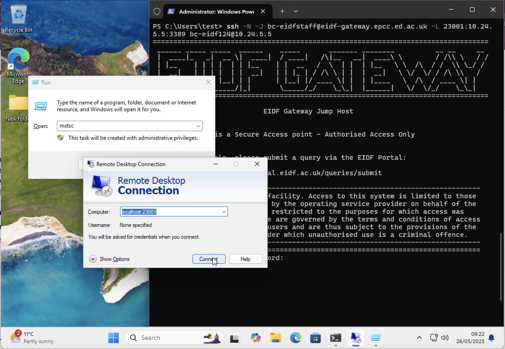
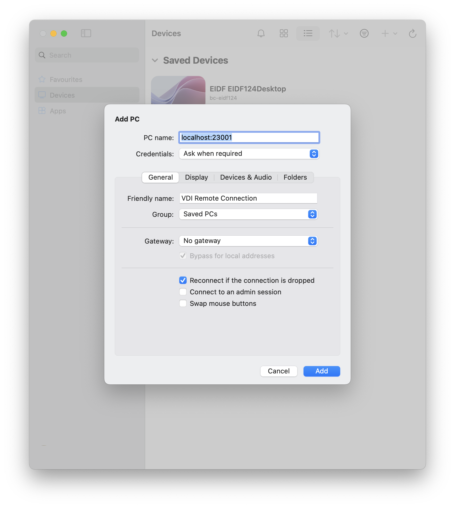
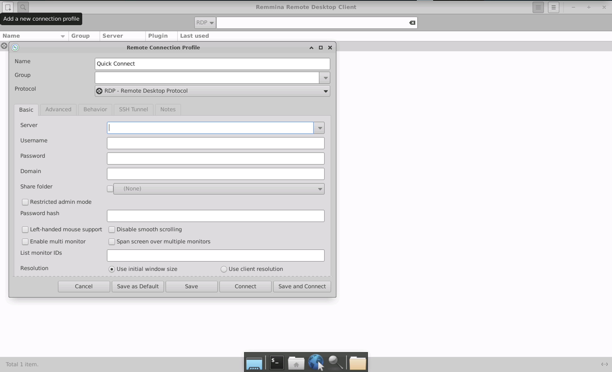
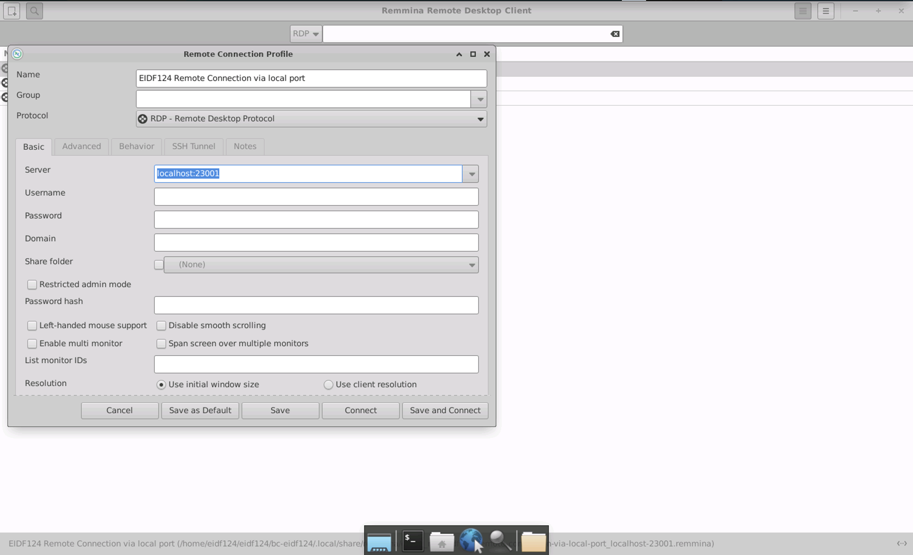

# Accessing Virtual Machines via an RDP Client

## Ensure RDP is running on host machine

```bash
systemctl status xrdp
```

Expecting that the status to contain Active: active (running). Example output:

```bash
~$ systemctl status xrdp 
● xrdp.service - xrdp daemon
     Loaded: loaded (/lib/systemd/system/xrdp.service; enabled; vendor preset: >
     Active: active (running) since ...
       Docs: man:xrdp(8)
             man:xrdp.ini(5)
   Main PID: 701 (xrdp)
   [...]
```

## Setup Port Forwarding on the Client machine

!!! note
    We need to setup port forwarding to get through the EIDF gateway. Whilst some remote desktop viewers support gateways they do not always work (e.g. windows app for macOS does not support ssh keys)

Setup a Port forwarding such that the RDP port on the remote desktop (3389) is forwarded to localhost (in this example we use 23001).

!!! warning "Port on local machine must be unused"
    Ports are usable by one process only as such must check that the port is not in use before doing above, **typically** port 23001 is unused. Checking if a port is in use is client device OS specific

In a terminal or cmd prompt on the client machine run the following command

```shell
ssh -N -J <gateway username>@eidf-gateway.epcc.ed.ac.uk -L 23001:<VDI machine IP>:3389 <VDI username>@<VDI machine IP>
```

You should see the remote desktop gateway message and the terminal will then be attached to the ssh process without allowing input
e.g.

```shell
➜  ~ ssh -N -J bc-eidfstaff@eidf-gateway.epcc.ed.ac.uk -L 23001:10.24.5.5:3389 bc-eidf124@10.24.5.5
==================================================================================
 ______ _____ _____  ______    _____       _______ ________          __ __     __
|  ____|_   _|  __ \|  ____|  / ____|   /\|__   __|  ____\ \        / /\\ \   / /
| |__    | | | |  | | |__    | |  __   /  \  | |  | |__   \ \  /\  / /  \\ \_/ / 
|  __|   | | | |  | |  __|   | | |_ | / /\ \ | |  |  __|   \ \/  \/ / /\ \\   /  
| |____ _| |_| |__| | |      | |__| |/ ____ \| |  | |____   \  /\  / ____ \| |   
|______|_____|_____/|_|       \_____/_/    \_\_|  |______|   \/  \/_/    \_\_|
 
==================================================================================

                              EIDF Gateway Jump Host


              This is a Secure Access point - Authorised Access Only


               For help, please submit a query via the EIDF Portal:

                    https://portal.eidf.ac.uk/queries/submit
     
----------------------------------------------------------------------------------
This is a private computing facility. Access to this system is limited to those
who have been granted access by the operating service provider on behalf of the
issuing authority and use is restricted to the purposes for which access was
granted. All access and usage are governed by the terms and conditions of access
agreed to by all registered users and are thus subject to the provisions of the
Computer Misuse Act, 1990 under which unauthorised use is a criminal offence.
----------------------------------------------------------------------------------
==================================================================================


```

## Install and configure remote desktop viewer

Different distributions have different software solutions for remote desktop connections.

Specific Linux, Mac and Windows based instructions are given in the sections below. If you have your own preferred remote desktop viewing software or cannot use the below instructions for whatever reason then the key details to be configured are:

```text
PC or server name and port (server:port) : localhost:23001
Credentials: We recommend leaving this blank or as 'Ask when required' until you have successfully connected to the machine. If prompted for credentials you will need those which you have for VDI connections, the same as in Guacamole
Protocol: RDP
Friendly Name: <ProjectID> Remote Connection via local port
```

### Windows

[Remote Desktop Connection](https://support.microsoft.com/en-gb/windows/how-to-use-remote-desktop-5fe128d5-8fb1-7a23-3b8a-41e636865e8c) (link from step 2) (preinstalled)

1. Open the Remote Desktop Connection tool (`mstsc` in Run)
2. Input `localhost:<port forwarded to>` e.g. `localhost:23001` as the connection name 
3. Input VDI login at the Login screen

### MacOS

1. Use [Microsoft Windows App](https://learn.microsoft.com/en-us/windows-app/) (app store)
1. Open the Windows App -> Click '+' -> Add PC
1. Input into 'PC Name' the forwarded port on the local machine `localhost:23001` 
1. Also add a 'friendly name' to describe the device being connected to
1. Leave all other options as defaults at this stage
1. Click Add
1. Double click on the newly created PC to connect
1. You will be prompted for the VDI username and password

### Linux

[Remmina](https://remmina.org/) installed via package manager of many distributions.

1. Install and open Remmina
2. Select add new connection profile in the top right for the connection profile dialog to appear 
3. Enter information about the forwarded port in remote viewer on client machine, ensuring that Protocol is set as RDP 
4. Click Save and Connect - You will be able to simply click on the friendly name next time you want to connect to the machine
