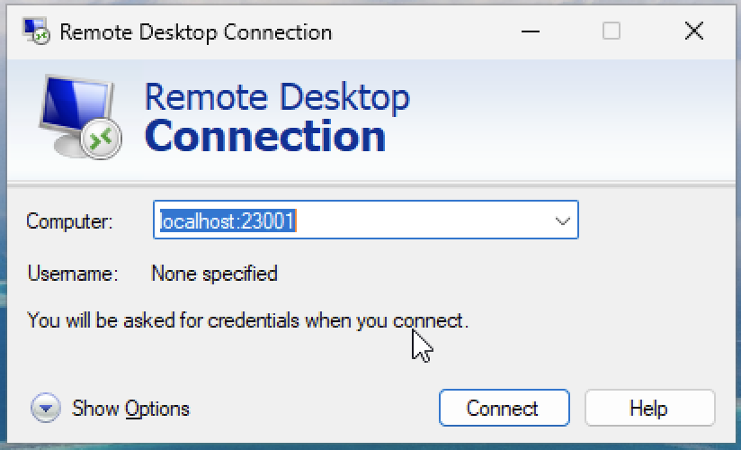

# Accessing Virtual Machines via an RDP Client

!!! warning "Prerequisites"
     It is recommended to connect to the host machine via Guacamole first as this process is simpler see instructions in [Virtual Machines (VMs) and the EIDF Virtual Desktop Interface (VDI)](virtualmachines-vdi.md)

The Guacamole web interface makes it easy to connect to a remote desktop. This page details how to connect with a dedicated remote desktop client application, which can be useful for longer work. Dedicated remote desktop viewer programs allow better support for copy and pasting, file sharing and other features that may not be available on the web interface.

We refer to a **Host** machine as the machine with an RDP server running on it, within EIDF infrastructure this is the Virtual machine.

The **Client** machine is any machine that you are using to connect to the host machine via the RDP protocol and remote desktop viewing software.

!!! warning
     Opening a remote connection means having full access to the host machines as though it was unlocked on your desk. You should not provide access credentials to other users you would not want using the machine or leave your client machine unattended and unlocked whilst connected as this risks the EIDF Virtual Machine being accessed by unauthorized users!

## Ensure RDP is running on the host machine

You can check if the xrdp service is running on the host machine by running the following command in a terminal:

```bash
host-machine$ systemctl status xrdp
```

Expecting the status to contain `Active: active (running)` e.g.

```bash
host-machine$ systemctl status xrdp 
● xrdp.service - xrdp daemon
     Loaded: loaded (/lib/systemd/system/xrdp.service; enabled; vendor preset: )
     Active: active (running) since ...
       Docs: man:xrdp(8)
             man:xrdp.ini(5)
   Main PID: 701 (xrdp)
   [...]
```

If the service is not running it can be (re)started with the following command:

```bash
host-machine$ sudo systemctl restart xrdp
```

## Setup Port Forwarding from the host machine to the client machine

Set up port forwarding so the RDP port on the remote desktop (`3389`) is forwarded to the `localhost` of the client machine you are running the remote desktop viewer on. In this example we use the port `23001`.

!!! warning "Port on the client machine must be unused"
    Ports are usable by one process only as such must use one that is not in use. **Typically** port `23001` is unused. Checking if a port is in use is client device OS-specific

In a terminal or cmd prompt on the client machine run the following command:

```shell
client-machine$ ssh -N -J <gateway username>@eidf-gateway.epcc.ed.ac.uk -L 23001:<VDI machine IP>:3389 <project username>@<VDI machine IP>
```

??? info "SSH command arguments explained"
     In the above command `-J` as usual defines the jump via the EIDF gateway.
     `-N` indicates that the connection should not expect any remote commands to run.
     `-L` specifies the port forwarding with the form `<current machine port>:<IP of machine connecting to>:<port on machine connecting to>`.
     The specific user we are port forwarding with is supplied with the last block `<project username>@<VDI machine IP>`.

You should see the remote desktop gateway message and the terminal will then be attached to the SSH process without allowing input
e.g.

```text
client-machine$ ssh -N -J bc-eidfstaff@eidf-gateway.epcc.ed.ac.uk -L 23001:10.24.5.5:3389 bc-eidf124@10.24.5.5
==================================================================================
 ______ _____ _____  ______    _____       _______ ________          __ __     __
|  ____|_   _|  __ \|  ____|  / ____|   /\|__   __|  ____\ \        / /\\ \   / /
| |__    | | | |  | | |__    | |  __   /  \  | |  | |__   \ \  /\  / /  \\ \_/ / 
|  __|   | | | |  | |  __|   | | |_ | / /\ \ | |  |  __|   \ \/  \/ / /\ \\   /  
| |____ _| |_| |__| | |      | |__| |/ ____ \| |  | |____   \  /\  / ____ \| |   
|______|_____|_____/|_|       \_____/_/    \_\_|  |______|   \/  \/_/    \_\_|
 
==================================================================================

                              EIDF Gateway Jump Host


              This is a Secure Access point - Authorised Access Only


               For help, please submit a query via the EIDF Portal:

                    https://portal.eidf.ac.uk/queries/submit
     
----------------------------------------------------------------------------------
This is a private computing facility. Access to this system is limited to those
who have been granted access by the operating service provider on behalf of the
issuing authority and use is restricted to the purposes for which access was
granted. All access and usage are governed by the terms and conditions of access
agreed to by all registered users and are thus subject to the provisions of the
Computer Misuse Act, 1990 under which unauthorised use is a criminal offence.
----------------------------------------------------------------------------------
==================================================================================

```

!!! note
     Port forwarding is needed to get through the EIDF gateway. Whilst some remote desktop viewers support gateways they do not always work (e.g. the Windows app for macOS does not support SSH keys)

## Install and configure a remote desktop viewer

Different distributions have different software solutions for remote desktop connections.

Instructions specific to the operating system in use are given in the below sections. If you have your own preferred remote desktop viewing software or cannot use the below instructions for whatever reason then the key details to be configured are:

```text
PC or server name and port: localhost:23001
VDI account credentials: We recommend leaving this blank or as 'Ask when 
required' until you have successfully connected to the machine. If prompted for 
credentials you will need those which you have for VDI connections, the same as 
in Guacamole 
Protocol: RDP
Friendly Name: <ProjectID> Remote Connection via local port
```

### Windows

The Microsoft Windows documentation [Remote Desktop Connection](https://support.microsoft.com/en-gb/windows/how-to-use-remote-desktop-5fe128d5-8fb1-7a23-3b8a-41e636865e8c) is relevant from step 2 "_Use Remote Desktop to connect to the PC you set up_" onwards. The Remote Desktop Connection program is preinstalled on Windows machines.

1. Open the 'Remote Desktop Connection' program (`mstsc` in Run)
2. Input `localhost:<port forwarded to>` e.g. `localhost:23001` as the connection name
3. Click 'Connect'
4. Input VDI login credentials once prompted at the login screen

### macOS

These instructions use the [Microsoft Windows App](https://learn.microsoft.com/en-us/windows-app/) a free program available from the [Apple App Store](https://apps.apple.com/us/app/windows-app/id1295203466?mt=12).

1. Open the Windows App -> Click '+' -> Add PC
2. Input into 'PC Name' the forwarded port on the local machine `localhost:<port forwarded to>` e.g. `localhost:23001`
3. Also add a 'friendly name' to describe the device being connected to
4. Leave all other options as defaults at this stage
5. Click Add
6. Double-click on the newly created PC to connect
7. You will be prompted for the VDI username and password

### Linux

The following uses [Remmina](https://remmina.org), a stable Linux RDP client available via most package managers.

1. Install and open Remmina
2. Select "Add a new connection profile" in the top right for the connection profile window to appear
3. Ensure that 'Protocol' is set to RDP
4. In the 'Server' field input the localhost and forwarded port `localhost:<port forwarded to>` e.g. `localhost:23001`
5. Enter a 'Friendly Name' to describe the device being connected to
6. Leave the 'Username' and 'Password' fields blank at this stage. After your first successful connection, save your VDI credentials here for easier connection in the future
7. Click Save and Connect to start the remote desktop connection. You will be able to double-click on the friendly name in the main Remmina pane the next time you want to connect to the machine
