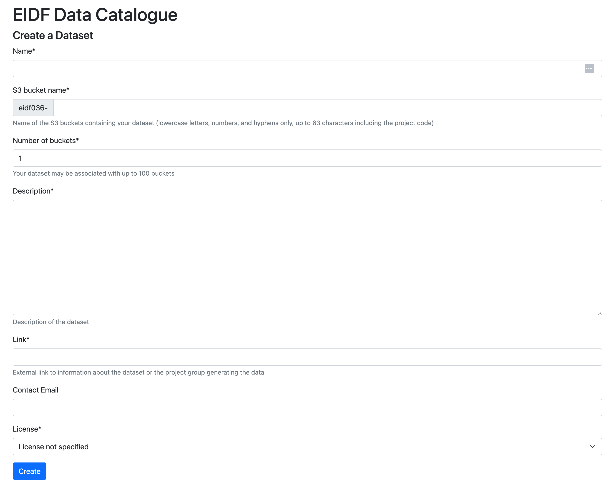

# Data ingest crib sheet

**Version 0.4.20**

This document is changing fairly quickly so please keep an eye on the version number to see if it has changed since you last looked at it.

## Content

* [Assumptions](#assumptions)
* [Applying for a project](#applying-for-a-project)
* [Customising your entry in the EIDF Data Catalogue](#customising-your-entry-in-the-eidf-data-catalogue)
* [Creating a dataset](#creating-a-dataset)
* [Uploading your data](#uploading-your-data)
  * [Data upload](#data-upload)
  * [Download URLs for files in S3](#download-urls-for-files-in-s3)
  * [Metadata format](#metadata-format)
  * [Testing your s3 links and downloading](#testing-your-s3-links-and-downloading)
  * [More on using aws](#more-on-using-aws)
  * [Downloading data with curl](#downloading-data-with-curl)

## Assumptions

Here are some basic assumptions - if these do not match your expectations then please let us know.

* To qualify for the free data publishing service your data must be open and freely available to all. If you want to control access to your data you will have to use the [S3 service](https://epcced.github.io/eidf-docs/services/s3/) instead which is not a free service.
* Let us know what you expect your final data volume to be. If you are going to be generating data additions then let us know what you expect your addition rate will be. 
* If you have any other explicit requirements for your data do let us know.
* EIDF guarantees to the best of its ability to continue its services to at least 31-Jul-2032 and aims to continue beyond 2032.

## Applying for a project

If you do not already have an EPCC SAFE account, you will need to create an account before proceeding:

* https://safe.epcc.ed.ac.uk/

Once you have a SAFE account, go to the EIDF portal and use your SAFE credentials to login.

* https://portal.eidf.ac.uk/

First, apply for an EIDF project. If you already have an existing EIDF project from which you want to do the data publishing you do not need to apply for a new project instead submit your queries via our [EIDF Helpdesk](https://portal.eidf.ac.uk/queries/submit). State that you would like to publish data from your existing project and let us know your project identifier is, e.g. eidfNNN, and the volume of data that you want to publish. Be aware that data publishing is free subject to your data volumes being under a given threshold, we will be in touch if you requirements are higher than this, and that the data is being made freely available.  

If you do not have an existing EIDF project, in the EIDF portal:

* Press on the `Your project applications` link. 
* Press on the `New Application` link and put in an application for us to host your data. 
  * You will be asked to supply a name for your project.
  * A start date (when you hope to start publishing your data).
  * A proposed end date (at the moment you will not be able to go beyond 31-Dec-2032).


For the EIDF Services you require chose the "*ingest data formally into EIDF for long-term hosting*" choice. Note that all the other EIDF services have a [cost](https://edinburgh-international-data-facility.ed.ac.uk/access) so, if you add any other EIDF services a charge will be imposed. The data publishing will have a cost if you go over a threshold - we will get in touch if you pass this threshold.

Be sure to describe the dataset(s) that you wish to ingest. Submit your application. Your application will be reviewed and you will be notified if your project has been approved or rejected - someone may be in touch to clarify points in your application.

## Customising your entry in the EIDF Data Catalogue

When/if your project is approved, an organisation will be created on the EIDF data catalogue (an instance of CKAN version 2.10.4 ([CKAN user documentation](https://docs.ckan.org/en/2.10/user-guide.html))). You can customise your organisation information (we map EIDF projects to CKAN organisations). The EIDF catalogue:

* https://catalogue.eidf.ac.uk/

Login using your SAFE credentials - there is a "Log in" on the top right.

**Note**

* **Do NOT use the CKAN interface to create Datasets** (see below) - the data ingest process creates these for you and associates S3 links with your data. You can provide additional metadata once the Dataset records are in CKAN. Please do not add datasets through the CKAN interface either. Contact us if would like anything removed.

## Creating a dataset

Once your project is approved go to the test portal at this link (only available on the EdLan network):

* https://projects.eidf.ac.uk/testportal/ingest/

Select the project which you want to use to ingest data. The list of `Ingest Datasets` will be empty unless you have already created Datasets.

* Create a Dataset by pressing on the `New` button. You will need to provide the following minimal bits of information:
  * **Name**: The name for your dataset.
  * **S3 Bucket name**: this entry will automatically be populated from your dataset name to create your S3 bucket name. You can customise the name for yourself subject to the constraints specified below the text box by editing the link directly. Note though if you change the dataset name you will overwrite the S3 bucket name link if you have customised it. Your project id at the start you will not be able to change.
  * **Number of buckets**: you may want to distribute your data over a number of S3 buckets if your dataset is big.
  * **Description**: a description of your dataset.
  * **Link**: a link describing your group/contact information.
  * **Contact email**: a contact email to answer queries about your data set (this is optional).
  * **License**: the license under which you will distribute your data.
  
  As in the form example below.



Once you are happy with the content press on the `Create` button. This will be used to create an S3 bucket to which you will migrate your data. 

You can create a Dataset within your organisation (we are mapping EIDF projects to CKAN organisations) on the EIDF Data Catalogue and a data buckets in S3.

You should now be able to click on a link to your dataset to see a copy of the information that you provided. When the the S3 bucket has been created and you have added the data, you can add the S3 link to the catalogue entry. You can supplement your Dataset entry in the EIDF catalogue with additional metadata once you have logged into the data catalogue using your SAFE credentials.

## Uploading your data

Once you have created your S3 bucket. We will provide credentials for uploading your data to the EIDF S3 bucket. You need an AWS client to upload data.

### Data upload

We provide an S3 account with write permissions to the dataset buckets.
As a project manager or Principal Investigator (PI), you can view the access credentials for your S3 account on the project details page. You can also grant other members of your project permission to be able to view these access credentials.

You can use the [`aws` command line client](https://aws.amazon.com/cli/) to upload your data to the bucket. For instance,

```bash
$ aws s3 cp ./jobs s3://mario-test1 --recursive --exclude "*" \
            --include "AI*" --endpoint-url https://s3.eidf.ac.uk
```

The `$` indicates the shell prompt. The command will recursively copy the contents of the `jobs` directory to the `s3://mario-test1` bucket excluding all files other than those that start with AI. The explicit end point is also specified.  

You may want to create a credentials  `~/.aws/credentials` file:

```ini
[default]
aws_access_key_id=<key>
aws_secret_access_key=<secret>
endpoint_url=https://s3.eidf.ac.uk
```

The `endpoint_url` means that you do not have to explicitly specify the URL every time. You will also have to provide your access keys.

You can use an environment variable to specify the end point instead:

```bash
$ export AWS_ENDPOINT_URL=https://s3.eidf.ac.uk
```

or if you are using the windows command prompt use:

```cmd
C:\> set AWS_ENDPOINT_URL=https://s3.eidf.ac.uk
```

or powershell:

```powershell
PS C:\> $Env:AWS_ENDPOINT_URL="https://s3.eidf.ac.uk"
```

You can list the configuration settings - make sure the `access_key` and the `secret_key` have been added:

```bash
$ aws configure list
      Name                    Value             Type    Location
      ----                    -----             ----    --------
   profile                <not set>             None    None
access_key     ****************GF61 shared-credentials-file
secret_key     ****************oPm8 shared-credentials-file
    region                <not set>             None    None
```

You can test your upload (remembering to change the bucket name):

```bash
$ aws s3 ls --summarize --human-readable --recursive s3://mario-test1/
2024-06-13 15:57:00    8.6 KiB AIY369
2024-06-13 15:57:00    8.5 KiB AIY372
...
2024-06-13 15:57:00    9.9 KiB AIY827
2024-06-13 15:57:00    9.0 KiB AIY841

Total Objects: 100
   Total Size: 895.8 KiB
```

If you do:

```bash
$ aws s3 help
```

you will get an overview of the s3 commands available or if you want more information for a particular command you can do:

```bash
$ aws s3 ls help
```

Alternatively, there are many graphical clients that act as a file browser for S3, for example [Cyberduck](https://cyberduck.io) or if you want to view programming language [Ceph S3 API](https://docs.ceph.com/en/latest/radosgw/s3/) interfaces (Ceph is the underlying platform used).

### Download URLs for files in S3

Each file in S3 can be directly accessed and downloaded via a URL. If you open this URL in a browser it will download the file or display the contents, depending on the format (and the configuration of your browser).

So from an S3 link:

```text
s3://eidfXXX-my-dataset/mydatafile.csv
```

You can construct an https link to the data file for the EIDF S3 that would look like:
```
https://s3.eidf.ac.uk/eidfXXX-my-dataset/mydatafile.csv
```
You can also link to a set of files that have a common prefix:
```
https://s3.eidf.ac.uk/eidfXXX-my-dataset?prefix=January2024/
```

This lists all the file names that start with `January2024/`. This way you can collect files together in "folders" and link to a collection rather than individual files.

Or if you wanted to download someone else's S3 bucket, say the s3 bucket:

```text
s3://eidf158-walkingtraveltimemaps/
```

Then you can use the aws client to download the whole dataset to your current directory:

```bash
$ aws s3 cp --recursive s3://eidf158-walkingtraveltimemaps/ . \
            --endpoint-url https://s3.eidf.ac.uk \
            --no-sign-request
```

Note that if you want to to view data that are in other people's buckets you need to add the `--no-sign-request` flag.

### Metadata format

Metadata for resources in your dataset are added directlly through the EIDF Data Catalogue.

Make sure you're logged in to the [EIDF Data Catalogue](https://catalogue.eidf.ac.uk). Open the page of your dataset and click on "Manage" at the top right. Open the "Resources"  tab and press the button "+ Add new resource". Now you can fill in the form and describe your data as you wish. Some entries that are required and these are marked with a red \* in the EIDF data catalogue:
* **Name**: a descriptive name for your dataset.
* **Access URL**: this is a link to a file in S3 or a set of files with a common prefix, that you uploaded as explained above.
* **Description**: a human readable description of your data set.
* **Resource format**: the type of data included in your resource.
* **Unique Identifier**
* **Licence**: the licence under which you are releasing your data.

### Testing your s3 links and downloading

Analytics-ready datasets in EIDF S3 are public and can be viewed in a browser at the links displayed in the catalogue. With an S3 client of your choice you can list and download objects as with any S3 client, and there are no credentials required.

For example, using the [AWS CLI](https://aws.amazon.com/cli/), the following command lists the objects and prefixes in the bucket `<BUCKET_NAME>`, for instance: 

```bash
aws s3 ls s3://eidf158-walkingtraveltimemaps --no-sign-request \
          --endpoint-url https://s3.eidf.ac.uk
```

or using `curl` you can get the bucket listing using:

```bash
curl -X GET "https://s3.eidf.ac.uk/eidf158-walkingtraveltimemaps"
```

You will need the quotes or may have to explicitly escape certain characters if present, e.g. `?` -> `\?`, etc.

### More on using aws

If you want to look at someone else's bucket contents you need to add the `--no-sign-request` otherwise it will not work. For instance, if you want to use the content that Henry Thompson has [published](https://catalogue.eidf.ac.uk/dataset/eidf125-common-crawl-url-index-for-august-2019-with-last-modified-timestamps/resource/7e485f0c-d480-43e9-8cb7-9540a3d3dbc9) in the data catalogue we have the access point:

* https://s3.eidf.ac.uk/eidf125-cc-main-2019-35-augmented-index?prefix=idx

From this we get the end-point https://s3.eidf.ac.uk and the bucket s3://eidf125-cc-main-2019-35-augmented-index so to list the contents we can do:

```bash
$ aws s3 ls --recursive s3://eidf125-cc-main-2019-35-augmented-index \
            --endpoint https://s3.eidf.ac.uk --no-sign-request
```

or you can add the prefix explicitly:

```bash
$aws s3 ls s3://eidf125-cc-main-2019-35-augmented-index/idx/ \
        --endpoint https://s3.eidf.ac.uk --no-sign-request
```

Note that if you do not terminate with the forward slash you will not get the listing of the contents.

### Downloading data with curl

As a concrete example if we look at an existing dataset in the EIDF Data Catalogue:

* https://catalogue.eidf.ac.uk/dataset/eidf125-common-crawl-url-index-for-august-2019-with-last-modified-timestamps

Looking at the `Index shards directory` resource record we get the access/download URL:

* https://s3.eidf.ac.uk/eidf125-cc-main-2019-35-augmented-index?prefix=idx

The presence of a `?` means we need to use quotes for the URL or escape the question mark when running within a shell. We can make the output human-readable using `xmllint`, part of the libxml2-utils package, and reduce the amount of output using `head` to just the first record but if you don't have these utilities you can look at the output produced by clicking on the link above in the EIDF data catalogue. The `-s` argument tells `curl` not to produce additional content. Running this we get:

```bash
curl -sX GET "https://s3.eidf.ac.uk/eidf125-cc-main-2019-35-augmented-index?prefix=idx"\
| xmllint --format - |head -18

<?xml version="1.0" encoding="UTF-8"?>
<ListBucketResult xmlns="http://s3.amazonaws.com/doc/2006-03-01/">
  <Name>eidf125-cc-main-2019-35-augmented-index</Name>
  <Prefix>idx</Prefix>
  <MaxKeys>1000</MaxKeys>
  <IsTruncated>false</IsTruncated>
  <Contents>
    <Key>idx/cdx-00000.gz</Key>
    <LastModified>2024-04-30T15:41:18.976Z</LastModified>
    <ETag>"9df7647798430d78db71afd3ae8c51b5-112"</ETag>
    <Size>938001370</Size>
    <StorageClass>STANDARD</StorageClass>
    <Owner>
      <ID>eidfarch_ard</ID>
      <DisplayName>EIDF Archival ARD owner</DisplayName>
    </Owner>
    <Type>Normal</Type>
  </Contents>
```

So, if we want to download the first file we look in the `Contents` section and the key is `idx/cdx-00000.gz`. In this instance downloading the first file would be done using:

```bash
curl -sX GET \
https://s3.eidf.ac.uk/eidf125-cc-main-2019-35-augmented-index/idx/cdx-00000.gz \
-o cdx-00000.gz
```

The `-o` will write the output to a named file. You can use the above pattern to download content. In this instance this will be `cdx-00000.gz` and you can then start playing with the data.
