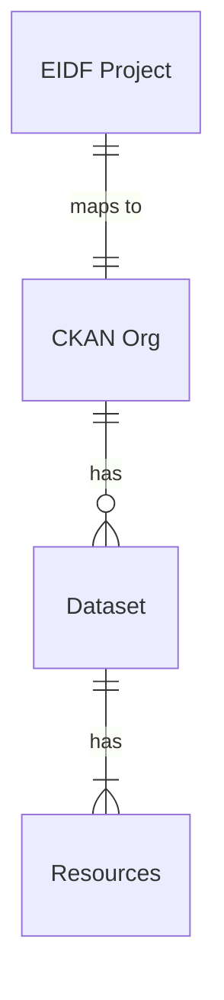

# Use of CKAN as the EIDF Data Catalogue

The EIDF Data Catalogue provides a means for researchers to discover and access your data stored in the EIDF. The EIDF data catalogue is an instance of the *Comprehensive Archive Knowledge Network* ([CKAN](https://ckan.org/)) which is an extensible and widely used open-source data portal for the discovery and distribution of open data. 

Within the EIDF data catalogue:

* Your **EIDF project** is mapped to a **CKAN organisation**. Your organisation can be used to publish your data, control access to the data and provides a means of branding yourself should you wish to do so, e.g. give your organisation a name, provide a human readable description, links to social media and a logo/image representing your organisation.
* Your **CKAN organisation** can have 0 or more **dataset**s associated with it.
  * A  dataset is a collection of data - for example, weather data for a region, the expenditure of a department, or sonar readings from an area of sea. When users search for data, the search results will return the individual datasets that match their search criteria.

* Each **dataset** can have one or more **resource**s associated with it. A dataset contains **resource**s each of which will have:
  * Metadata about the data contained in the resource which makes the dataset discoverable via searches.
  * Access links to the actual data files that the resource represents.

This is schematically summarised in the diagram below.

**Resources** constitutes the granularity at which data files can be accessed or downloaded. A resource must contain at least a minimum set of metadata about the data file, and a link to download the data file.

The EIDF Data Catalogue is located at: https://catalogue.eidf.ac.uk/. 

