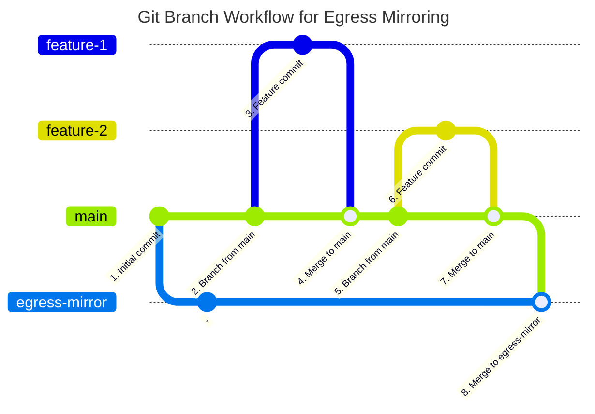

# \[Beta] TRE Code Management and Mirroring Service

!!! warning "Beta Service"
    This service is in early development, and the content of this page may change significantly. Please provide all feedback to your IG team.

The Code Management and Mirroring Service provides Researchers and IG teams with access to a platform similar to GitHub for managing code inside the TRE. If permitted by the IG team, this also supports egress of internal code to external repositories via review & approval by RCs.

A separate instance of the service is available to each TRE tenancy, and each instance is accessible only within the tenancy it is deployed to.

!!! note "Availabilty"
    This service is an add-on to the base tenancy offering, and so may not be available to all TRE users. Please enquire with your IG team to determine if it is available to you.

## Overview

The service is based on the [Gitea](https://about.gitea.com/) collaborative version control system, which offers many of the same features as GitHub and GitLab. Some restrictions, such as the ability to freely create repositories, are in place in order to ensure separation of project data as per IG requirements.

Available features include:

- Software version control
- Pull and push while inside the TRE
- Bug and issue tracking
- Pull Requests
- Code review
- Wikis

This page provides information on accessing and using the service, however is not intended as a guide to Gitea. Please see Gitea's own [documentation][gitea_docs] for general usage information. It is also assumed that users are familiar with git and the use of version control services.

## Access

Access must be requested from your Research Coordinator (RC). On being granted access, you will be provided with the following information:

- Gitea URL
- Username
- Initial Password

Gitea can be accessed from your VM desktop by opening a Web Browser and navigating to the provided URL. After logging in for the first time, you will be prompted to change your password.

Once logged-in, you will be presented with a dashboard showing recent activity in your organization. In Gitea, an "organization" is analagous to a project group, and you will be automatically granted access to the organization matching your TRE project identifier.

## Request a Repository

To request the creation of a repository in your organization, contact your RC and let them know the desired name and external mirror repository, if applicable. The external repository must be empty, as any existing content will be overwritten by the mirroring process.

Once created, your repository will be visible from your Gitea dashboard or under the "Explore" tab.

!!! note "Repository Permissions"
    All members of an organization (TRE project) have full read/write access to each of its repositories, regardless of who requested its creation. This is the intended behaviour and will not be changed e.g., to restrict repository access to a subset of a TRE project's members. This is equivalent to the files in each `/safe_data/<project_id>` directory being accessible to all project members.

Multiple repositories may be created under each organization.

## Clone a Repository

SSH access is not enabled, so HTTPS must be used to clone repositories.

When running `git clone`, `git pull`, and `git push`, you will be prompted for your Gitea username and password each time. For convenience, you may wish to generate an access token to avoid re-entering your credentials after the initial clone. To do this:

1. In Gitea, click your profile picture in the top right and then on "Settings"
1. Click "Applications" in the sidebar
1. Create a new token
    1. Enter a descriptive name
    1. Expand "Select permissions" and change "repository" to "Read and Write"
    1. Copy the generated token
1. Clone the repo using the token, for example `git clone https://<token>@<url>/<organization>/<repo>.git`
    1. Note that in the test environment you will have to use "http" instead of "https"

## Request Code Egress

Egress mirroring is achieved through merging of code into a branch named `egress-mirror`. This is pre-created and will contain the same initial commit as the `main` branch.

If enabled, you may submit Pull Requests (PRs) for code to be mirrored to a repository external to the TRE:

1. From the repository page in Gitea, click "Pull Request"
1. Click "New Pull Request"
1. Click "merge into" and select the "egress-mirror" branch. This should cause the page to refresh and show the changes that will be requested
1. Click "New Pull Request"
1. Create the PR
    1. Provide a descriptive title
    1. Describe the changes that are being made, and any notes for reviewers
    1. Click the cog next to "Reviewers" in the right sidebar and select the RCs group for your project (`<project-id>/RCs`)
    1. Click "Create Pull Request"
1. External email notifications are not enabled, so contact your RC via normal channels to make them aware of the PR

By default, PRs require approval from 2 RCs. Once approved and merged, the code changes will be automatically mirrored to the external repository.

!!! note "Squashed Commits"
    By default, all commits in a PR are "squashed" into a single commit on the mirror branch. This is to help ensure that any intermediate history containing potentially unwanted changes are not accidentally mirrored to the external repository.

### Branching Workflow

It is permitted for other branches and PRs to be created, to support standard software development practices. We suggest the following branching workflow, which uses feature branches and a periodic merge of main into the mirror branch.

## Further Reading and Help

- The [Gitea docs][gitea_docs] are the best reference for using this service
- Contact your IG team if you require and help accessing or using the service

<!-- Links -->

[gitea_docs]: https://docs.gitea.com/
