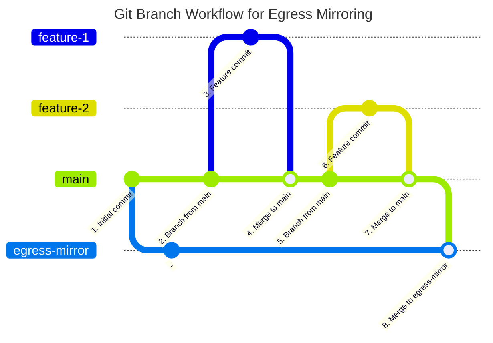

# \[Beta] TRE Code Management and Mirroring Service

!!! warning "Beta Service"
    This service is in early development, and the content of this page may change significantly. Please provide all feedback to your IG team.

The Code Management and Mirroring Service provides Researchers and IG teams with access to a platform similar to GitHub for managing code inside the TRE. If permitted by the IG team, this also supports egress of internal code to external repositories via review & approval by RCs.

A separate instance of the service is available to each TRE tenancy, and each instance is accessible only within the tenancy it is deployed to.

!!! note "Availabilty"
    This service is an add-on to the base tenancy offering, and so may not be available to all TRE users. Please enquire with your IG team to determine if it is available to you.

## Overview

The service is based on the [Gitea](https://about.gitea.com/) collaborative version control system, which offers many of the same features as GitHub and GitLab. Some restrictions, such as the ability to freely create repositories, are in place in order to ensure separation of project data as per IG requirements.

Available features include:

- Software version control
- Pull and push while inside the TRE
- Bug and issue tracking
- Pull Requests
- Code review
- Wikis

This guide provides information on accessing and using the service, however, it is not intended as a guide to Git or Gitea. We suggest the following resources as learning material:

- The [Version Control with Git](https://swcarpentry.github.io/git-novice/) workshop by The Carpentries. In particular, you must have the ability to work with git repos and branches
- Gitea's [documentation][gitea_docs] for general usage information

## Access

Access must be requested from your Research Coordinator (RC). On being granted access, you will be provided with the following information:

- Gitea URL
- Username
- Initial Password

Gitea can be accessed from your VM desktop by opening a Web Browser and navigating to the provided URL. After logging in for the first time, you will be prompted to change your password.

Once logged-in, you will be presented with a dashboard showing recent activity in your organization. In Gitea, an "organization" is analagous to a project group, and you will be automatically granted access to the organization matching your TRE project identifier.

!!! danger
    If you are part of multiple projects in the TRE, you will have multiple VM accounts and potentially multiple Gitea accounts. If this is the case, you must ensure that you only access the corresponding Gitea account for the project you are currently working in. Failing to follow this may be considered a breach by the IG team.

## Request a Repository

Each Gitea organization may contain one or more code repositories. You will be able to work with all existing project repositories as soon as you are granted access to the service.

To request the creation of a new repository, contact your RC and let them know the desired name. Once it has been created, your repository will be visible from your Gitea dashboard or under the "Explore" tab.

!!! note "Repository Permissions"
    All members of an organization (TRE project) have full read/write access to each of its repositories, regardless of who requested its creation. This is the intended behaviour and will not be changed e.g., to restrict repository access to a subset of a TRE project's members. This is equivalent to the files in each `/safe_data/<project_id>` directory being accessible to all project members.

Multiple repositories may be created under each organization.

## Clone a Repository

You can create and edit files in project repositories directly in the web interface. However, it usually is easier to clone the repository to the VM filesystem and work with it there. You can set this up by cloning the repository:

1. Go to the main page of the repository in Gitea
1. Click the blue `<> Code` button
1. Copy the HTTP URL
1. Open a terminal window on the desktop (usually under Applications -> Terminal Emulator)
1. Change into the directory where you wish to clone the repository to
1. Type `git clone <url>`, pasting the URL you copied from the website
1. Type your Gitea username and password

The repository should now be cloned into your workspace.

When running further git commands, you will be prompted for your Gitea username and password each time. For convenience, you may wish to generate an access token to avoid re-entering your credentials after the initial clone. To do this:

1. In Gitea, click your profile picture in the top right and then on "Settings"
1. Click "Applications" in the sidebar
1. Create a new token
    1. Enter a descriptive name
    1. Expand "Select permissions" and change "repository" to "Read and Write"
    1. Copy the generated token
1. In a terminal, change directory into the cloned repository and update your cloned repository to use the token. For example `git remote set-url origin http://<token>@<url>/<organization>/<repo>.git`

## Request Setup of Egress Mirroring for a Repository

If permitted by the IG team, a repository may be setup so that changes merged into a special branch are automatically mirrored to another repository. This branch can only be merged into by RCs. This is called "egress mirroring".

To add egress mirroring to an existing TRE repository, an target repository must first be created as the target for the mirror. The target repository must be empty, as any existing content will be overwritten by the mirroring process.

!!! note "Internal Mirroring"
    The target of the egress mirror may be another repo in the same Gitea instance. This may, for example, allow one project to share code with another project without code leaving the TRE. In this situation, the RC review is still in place so as to ensure all code movement between projects is checked.

    **In this case, you must request the creation of the target repository from your RC instead of following the steps below.**

Once the target repository has been created, you must generate an access token allowing write access to the repo. Examine the documentation of the target platform (e.g., Gitea, GitLab, GitHub) to determine how to do this. As an example, in GitLab this can be achieved by:

1. On the repository page, navigate to "Settings" -> "Access Tokens"
1. Click "Add new token"
1. On the next page
    1. Enter a name e.g., "tre-mirror"
    1. Clear the expiration date
    1. Set the token's role to "maintainer"
    1. Check "write_repository"
    1. Click "Create project access token"
1. Copy the generated token, and ensure you save it as it will not be displayed again

Next, contact your RC to ask for egress mirroring, providing the TRE repository name, the URL to the target repository, and the access token.

Once this is complete, there a branch named `egress-mirror` will be present in the TRE repository.

## Request Code Egress (Pull Requests)

Once egress mirroring has been configured for a repository, it is performed by merging code into a branch named `egress-mirror`.

In order to do this, you must submit a Pull Request (PR) for code to be mirrored to the target repository:

1. From the source repository page in Gitea, click "Pull Request"
1. Click "New Pull Request"
1. Click "merge into" and select the "egress-mirror" branch. This should cause the page to refresh and show the changes that will be requested
1. Click "New Pull Request"
1. Create the PR
    1. Provide a descriptive title
    1. Describe the changes that are being made, and any notes for reviewers
    1. Click the cog icon next to "Reviewers" in the right sidebar and select the RCs group for your project (`<project-id>/RCs`)
    1. Click "Create Pull Request"
1. External email notifications are not enabled, so you must contact your RC via normal channels to make them aware of the PR

By default, PRs require approval from 2 RCs. Once approved and merged, changes are automatically synchronised to the target repository every 5 minutes.

!!! note "Squashed Commits"
    By default, all commits in a PR are "squashed" into a single commit on the mirror branch. This is to help ensure that any intermediate history containing potentially unwanted changes are not accidentally mirrored to the target repository.

### Branching Workflow

It is permitted for other branches and PRs to be created, to support standard software development practices. Only the `egress-mirror` branch is restricted. You may wish to use the following branching workflow, which contains feature branches and a periodic merge of main into the mirror branch.

## Request an Ingress Mirror

To request the creation of a repository which automatically mirrors an external repository into the TRE, contact your RC and let them know:

- The URL of the external repository
- An access token which has read access to the repository

Once created, the internal mirror will be regularly updated from the `main` branch of the external reposioty.

## Further Reading and Help

- The [Gitea docs][gitea_docs] are the best reference for using this service
- Contact your IG team if you require and help accessing or using the service

<!-- Links -->

[gitea_docs]: https://docs.gitea.com/category/usage
