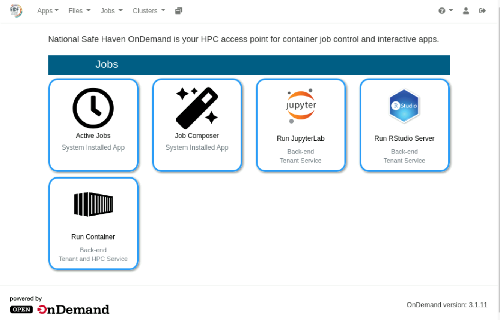

# About the TRE Open OnDemand service

The TRE Open OnDemand service is a web portal that runs within a safe haven. The service allows users to log into compute resources available within a safe haven, and to submit tasks to these compute resources.

The service provides a number of apps that allow for researchers' containers to be executed via the TRE Container Execution Service as well as providing apps supporting the execution of standard containers with useful services such as JupyterLab and RStudio Server.

{: class="border-img center"} *Open OnDemand portal front page*

To quickly get started with the TRE Open OnDemand Service (hereon referred to as Open OnDemand for brevity):

* [Access Open OnDemand](access.md).
* Follow [Getting started Open OnDemand](getting-started.md) to walk through the key points of the serviuce and using it to run containers via the TRE Container Execution Service.
