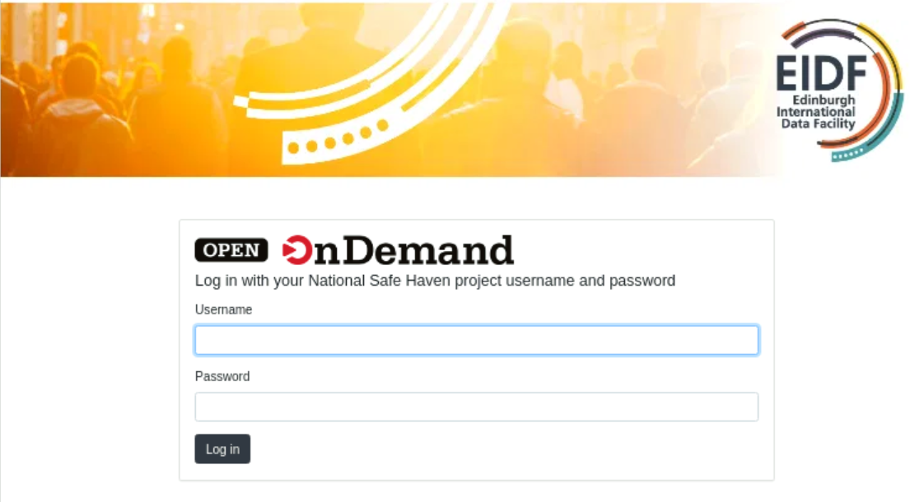

# Access Open OnDemand

Open OnDemand is accessed by running a browser on a VM within your safe haven.

## Access Open OnDemand within your safe haven

To access Open OnDemand:

1. Start a remote desktop (RDP) session with a VM within your safe haven, as described in [Safe Haven Service Access](../../safe-haven-access/).
1. Start a web browser within your safe haven VM.
1. Enter the Open OnDemand URL for your safe haven:
    * National Safe Haven, `https://nsh-ondemand.nsh.loc`
    * ODAP, `https://odp-ondemand.nsh.loc`
    * Smart Data Foundry, `https://smartdf-ondemand.nsh.loc`
    * DataLoch, `https://dap-ondemand.nsh.loc`
1. If using Falkon and an SSL Certificate Error! dialog appears with text 'Would you like to make an exception for this certificate?', then:
    * Click **Yes**. It is OK to ignore this error in this specific case, as you are within your safe haven within the TRE, contacting a Safe Haven Services service also running within your safe haven. This error arises as, at time of writing, the certificates for the TRE services have not been installed on your VM.
1. If using Firefox and a Warning: Potential Security Risk Ahead page appears with text 'Error code: SEC_ERROR_UNKNOWN_ISSUER', then
    1. Click **Advanced...**
    1. Click **Accept the Risk and Continue**. It is OK to accept this risk in this specific case, as you are within your safe haven within the TRE, contacting a Safe Haven Services service also running within your safe haven. This warning arises as, at time of writing, the certificates for the TRE services have not been installed on your VM.
1. The Open OnDemand log in page will appear.

    {: class="border-img center"} *Open OnDemand log in page*

1. Enter your project username and password. These are the same username and password that you used when logging into your safe haven VM.
1. Click **Log in**
1. [Open OnDemand](./portal.md) will open.

### Troubleshooting: Bad Request

If you see a page with text:

> Your browser sent a request that this server could not understand.

then revisit the URL and try to log in again. This can arise if there is information in your browser cache from a previous Open OnDemand session.

### Troubleshooting: Cannot access Open OnDemand

'For any other problems logging into Open OnDemand, first double-check your username and password. If you still have no success, then please contact your Research Coordinator (or equivalent).
