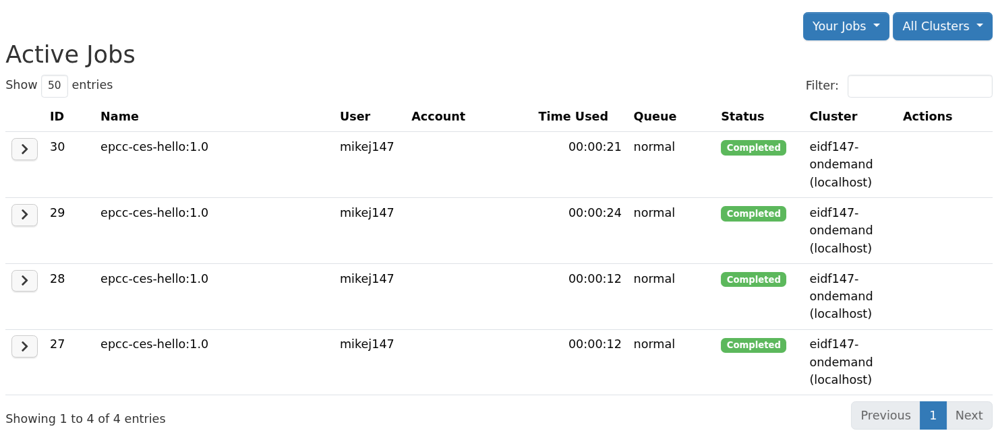
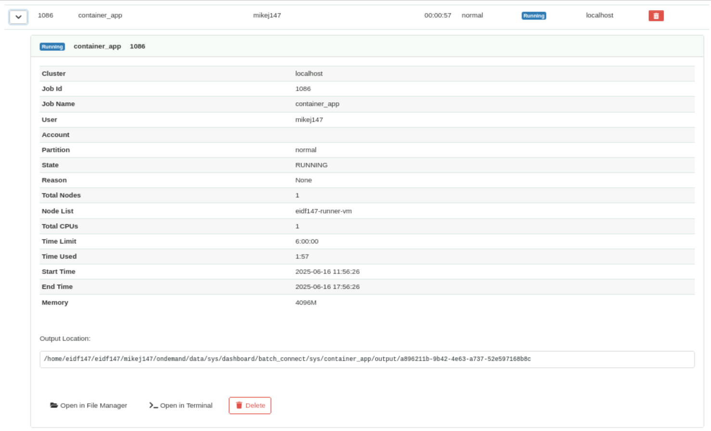

# Active Jobs

Active Jobs is an app that allows you to see which of your jobs have been submitted, are running, or have completed.

The Active Jobs app shows a table of running and recently completed jobs.

---

## Jobs table

The job name is a job name set when the job is created and used by the job scheduler. Job names are app-specific and job scheduler-specific.

The job ID is a unique job ID created by the job scheduler, when you submitted the job.

{: class="border-img center"} *The Active Jobs app job table*

!!! Note

    The job name is an app-specific job scheduler-specific job name. For jobs created using the [Project Manager](project-manager.md) and run via Slurm, the job name is the value of the job launcher's 'Job Name' parameter, or, if using Slurm directives, the Slurm `--job-name` parameter (as set by `#SBATCH --job-name=...` in the job file).

!!! Note

    The job ID is not the same as the session ID used for interactive apps or the project manager ID used by the Project Manager. Rather, the job ID is created by the job scheduler.

    Each job created by an app has both an app ID and a job scheduler job ID

The job status can be one of: 'Queued', 'Running', 'Hold', 'Suspend', 'Completed', 'Undetermined'.

!!! Note

    The job status does **not** display whether a job that is 'Completed' did so with success or failure. Whether a job succeeded or failed can be seen in the job details for the job.

---

## Job details

To see details about a job, click the **>** button, by the job of interest.

The 'Output Location' is the location of the project directory (for jobs created by the [Project Manager](project-manager.md)) or the job context directory for the job (for jobs created by interactive apps) on the Open OnDemand VM.

{: class="border-img center"} *Job details within the Active Jobs app*

---

## Open File Manager to project or job context directory

Click **Open in File Manager** to open the [File Manager](../files.md) pointing at the project directory (for jobs created by the [Project Manager](project-manager.md)) or the job context directory for the job (for jobs created by interactive apps) on the Open OnDemand VM.

---

## Log into to back-end on which job is running

Click **Open in Terminal** to log into the back-end on which the currently selected job was run. Once logged in, your current directory will be changed to match the project directory (for jobs created by the [Project Manager](project-manager.md) or the job context directory for the job (for jobs created by interactive apps) on the Open OnDemand VM.

---

## Cancel a job

Click the **Delete Job** (red trashcan icon) by the job in the job table or click **Delete** in the job details to cancel (delete) a running job.

{: class="border-img center"} ***Delete Job** button*
