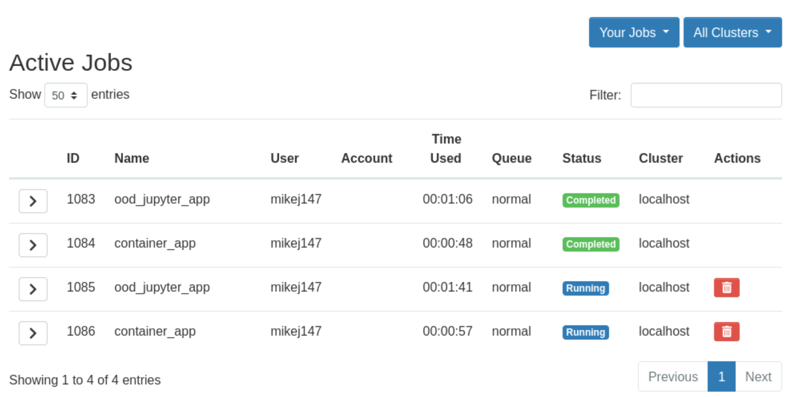

# Active Jobs

[Active Jobs](apps/active-jobs.md) is an Open OnDemand app that allows you to see which of your jobs have been submitted, are running, or have completed.

The Active Jobs app shows a table of running and recently completed jobs.

---

## Jobs table

The job ID is a unique job ID created by the job scheduler, when you submitted the job.

{: class="border-img center"} *The Active Jobs app job table*

!!! Note

    Unfortunately, the job ID is not the same as the session ID for an app created by Open OnDemand. Rather, the job ID is created by the job scheduler.

    Each job created by an app has both an Open OnDemand session ID and a job scheduler job ID.

The job status can be one of: 'Queued', 'Running', 'Hold', 'Suspend', 'Completed', 'Undetermined'.

!!! Note

    The job status does not display whether a job that is 'Completed' did so with success or failure. Whether a job succeeded or failed can be seen in the job details for the job.

---

## Job details

To see details about a job, click the **>** button, by the job of interest.

The 'Output Location' is the location of the job context directory for the job on the Open OnDemand VM.

{: class="border-img center"} *Job details within the Active Jobs app*

---

## Open File Manager to job context directory

Click **Open in File Manager** to open the [File Manager](../files.md) pointing at the job context directory for the job on the Open OnDemand VM.

---

## Log into to back-end on which job is running

Click **Open in Terminal** to log into the back-end on which the currently selected job will be run. Once logged in, your current directory will be changed to match the job context directory.

---

## Cancel a job

Click the **Delete Job** (red trashcan icon) by the job in the job table or click **Delete** in the job details to cancel (delete) a running job.

{: class="border-img center"} ***Delete Job** button*
