# Getting started

The Open OnDemand service is a web service that runs within a safe haven. The service provides apps that allow you to run compute and data-related tasks and packages on compute resources available to your safe haven. Here, we introduce by means of a walkthrough, Open OnDemand and its apps.

First, some Open OnDemand terminology. A compute resource upon which tasks can be run is called a **back-end**, or, in some parts of Open OnDemand, a **cluster**. Each run of a task on a back-end is called a **job**. An Open OnDemand component that allows you to run jobs, or other useful functions, is called an **app**.

This walkthrough is centred around three apps:

* [Greetings](apps/greetings-app.md) is a 'getting started' app that writes a greetings file on a back-end.
* [Active Jobs](apps/active-jobs.md) allows you to see which of your jobs have been submitted, are running, or have completed.
* [Run JupyterLab](apps/jupyter-app.md) runs an interactive JupyterLab service on a back-end. Please be reassured that for this 'getting started' guide no Python knowledge is assumed or required!
* [Run Batch Container](apps/batch-container-app.md) runs a software container on a back-end. This app is designed to run batch containers, those that perform some computational or data-related task without human interaction when they are running.

!!! Note

    TODO Update images on this page to match the text and apps.

---

## Your Open OnDemand VM home directory and back-ends

For most back-ends, your home directory is common to both the Open OnDemand VM and the back-ends so your directories and files on the Open OnDemand VM, and changes to these, are reflected on the back-ends and vice-versa.

You may have access to back-ends where your home directory is not common to both the Open OnDemand VM and the back-end i.e., you have unsynched, separate, home directories on each VM. Currently, the back-ends where home directories are not common to both the Open OnDemand VM and the back-ends are as follows:

* Superdome Flex, shs-sdf01.nsh.loc.

To use such back-ends, you need to do some set up to allow Open OnDemand to automatically copy job files from the Open OnDemand VM to your chosen back-end when you submit a job. For future reference, how to do this is described in [Enable automated copy of job files to a back-end](jobs.md#enable-automated-copy-of-job-files-to-a-back-end).

Your project data files, in a project-specific directory under `/safe_data`, are **not** available on the Open OnDemand VM.

---

## Run the Greetings app

The [Greetings](apps/greetings-app.md) app is a 'getting started' app that writes a greetings file on a back-end.

Click the 'Greetings' app on the Open OnDemand home page.

The 'Greetings' app form will open.

### Review the Greetings app form

Read the form entries in conjunction with the explanations below and make the suggested changes:

* **Cluster**: A back-end (cluster) within your safe haven on which to run the app. Back-end-specific short-names are used in the drop-down list. If there is only one back-end available to you then this form field won't be shown.
    * Select the 'desktop' VM on which you are running the browser in which you are using Open OnDemand.
* **Greetings file destination**: Where to write the greetings file to. Select one of:

    * '/safe_data/PROJECT/': If selected, then the app will write a greetings file, `YYYYMMDD-HHMMSS-USER-greetings.txt` into your 'safe data' directory on the back-end.

        Your 'safe data' directory is chosen to be the first `/safe_data/PROJECT` subdirectory found where you are a member of a either user group called `PROJECT` or called `PREFIX-PROJECT`. For example, if there is a `/safe_data/yourproject` directory and you are a member of a `yourproject` or `someprefix-yourproject` user group, then `/safe_data/yourproject` is your 'safe data' directory into which the greetings file is written. If no such directory can be found, then the app will fail.

    * '$HOME': If selected, then the app will write a greetings file, `YYYYMMDD-HHMMSS-USER-greetings.txt` into your home directory on the back-end.
    * Leave this value as-is.

### Launch the Greetings app job

Click **Launch**.

Open OnDemand submits the job for the app to a **job scheduler** which schedules the job onto the back-end based upon the resources - the number of CPUs/cores and amount of memory - requested for your job in the app form. Your job is then queued until sufficient resources are available on the selected back-end to run your job. This will depend upon:

* Resources available on your selected back-end.
* Extent to which jobs currently running on the back-end are using the back-end's resources.
* Resources requested by your job.
* Jobs from yourself and others already in the queue for the back-end.

When a job is submitted, a runtime is also requested. If a job takes longer than this runtime, then it is cancelled. The default runtime is 6 hours.

For this app, the number of CPUs/cores is set to 1 and the amount of memory to 1K. Other apps will require you to select the number of CPUs/cores and memory for the app.

### View the job card and job status

Open OnDemand will show an app **job card** with information about the app's job including:

* Job status (on the top right of the job card): initially 'Queued'.
* 'Created at': The time the job was submitted.
* 'Time Requested': The runtime requested for the job.
* 'Session ID': An auto-generated value which is used as the name of a job-specific directory with files created by Open OnDemand to run the app's job plus any log files created when the job runs. This **job context directory** is described shortly. On the job card, the session ID is a link to open a File Manager pointing at this job context directory.
* App-specific information, which includes values from the app form. This app has none.

When the job starts, the Job status on the job card will update to 'Starting' and 'Time Requested' will switch to 'Time Remaining', the time your job has left to run before it is cancelled by the job scheduler.

When the Job status updates to 'Running', a **Host** link will appear on the job card. This is the back-end on which the job is now running. A message of form 'Writing file FILE on HOST' will also appear on the job card.

All going well, the job should complete quickly.

When the job completes, the Job status on the job card will update to 'Completed'. A message of form 'Wrote file FILE on HOST' will also appear on the job card.

### View the greetings file

The greetings file includes your user name, the back-end host name and the date and time. For example:

```text
Greetings!

Greetings to youruser
from
some-vm.nsh.loc
at
2026-06-09 10:09:10
```

When you ran the app, you requested that a **Greetings file destination** of '/safe_data/PROJECT/' be used. As mentioned earlier, `/safe_data` is not available on the Open OnDemand VM so to view this file you will need to:

1. Select **Clusters** menu, back-end **Shell Access** option, to log into the back-end.
1. View the greetings file:

     ```bash
     ls /safe_data/PROJECT/
     cat /safe_data/PROJECT/YYYYMMDD-HHMMSS-USER-greetings.txt
     ```

     For example:

     ```bash
     ls /safe_data/yourproject
     cat /safe_data/yourproject/20260609-100910-youruser-greetings.txt
     ```

As you have accessed Open OnDemand from your 'desktop' VM, you could also access the file directly on your 'desktop' VM, but we used the back-end **Shell Access** option to introduce this feature of Open OnDemand.

### View the app's job context directory and its log file

Within your home directory on the Open OnDemand VM, Open OnDemand creates an `ondemand` directory. This is where Open OnDemand stores information about your current session and previous sessions.

Every time a job is created by an app, Open OnDemand creates the job files that the app needs for it to run within a job-specific **job context directory** in an app-specific directory under your `ondemand` directory.

As mentioned earlier, for most back-ends, your home directory is common to both the Open OnDemand VM and the back-ends. But, for back-ends where your home directory is not common to both the Open OnDemand VM and the back-end, Open OnDemand will automatically copy job files from the Open OnDemand VM to your chosen back-end when you submit a job.

When the app's job runs, it creates a log file in the job context directory on the back-end. This log file includes information from the app itself plus any outputs from any commands run by the app. If an app does not run as expected, or does not run at all, it can be useful to check the log file for hints as to what may have went wrong. For this app, its log file is named `output.log`.

As mentioned earlier, for most back-ends, your home directory is common to both the Open OnDemand VM and the back-ends so any files created within your home directory on a back-end will be available on the Open OnDemand VM, and vice-versa.

View the log file via the Open OnDemand File Manager:

1. Click the **Session ID** link in the job card to open the File Manager, pointing at the job context directory for the job on the Open OnDemand VM.
1. Click on the log file, `output.log`.

For back-ends where your home directory is not common to both the Open OnDemand VM and the back-end, the File Manager cannot be used. An alternative to the File Manager is to log in to the back-end and view the files there, which can be done for any back-end.

View the log file within the back-end:

1. Select **Clusters** menu, back-end **Shell Access** option to log into the back-end.
1. Change into the job context directory for the job on the back-end and show the log file where `SESSION_ID` can be seen on the **Session ID** link on the job card:

    ```bash
    cd ondemand/data/sys/dashboard/batch_connect/sys/greetings_app/output/SESSION_ID/
    ```

    For example:

    ```bash
    cd  ondemand/data/sys/dashboard/batch_connect/sys/greetings_app/output/07224a60-266b-4c04-8293-6a10411cf8cb/
    ```

1. View the log file:

    ```bash
    cat output.log
    ```

### Clean up after running the Greetings app

Please remove the file produced by the app from your 'safe data' directory. You can do this as follows:

1. Select **Clusters** menu, back-end **Shell Access** option to log into the back-end.
1. Delete the file. For example:

    ```console
    rm /safe_data/yourproject/20260609-100910-youruser-greetings.txt
    ```

---

## Run the Active Jobs app

[Active Jobs](apps/active-jobs.md) allows you to see which of your jobs have been submitted, are running, or have completed.

Click the 'Active Jobs' app on the Open OnDemand home page.

The Active Jobs app will open to show a table of running and recently completed jobs.

You will see a 'greetings_app' entry for your app's job.

Your job will have a status of 'Completed'.

Each job has a unique **job ID** created by the job scheduler when you submitted the job. Unfortunately, the job ID is not the same as the session ID for an app created by Open OnDemand. Rather, the job ID is created by the job scheduler. Each job created by an app has both an Open OnDemand session ID and a job scheduler job ID.

{: class="border-img center"}
*Active Jobs app jobs list*

To see more details about the job, click the **>** button, by the job.

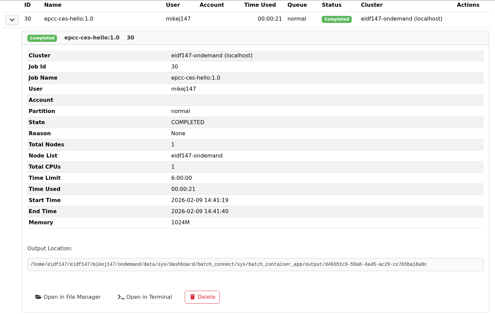{: class="border-img center"}
*Active Jobs app showing details of completed Greetings app job*

If any app does not run promptly, but is in a 'Queued' state, then the Active Jobs app can provide you with information on other jobs that are running and for which you may have to wait until one or more have completed before your app's job runs.

---

## Run the Run JupyterLab app

[Run JupyterLab](apps/jupyter-app.md) is an app that runs JupyterLab on a back-end within your safe haven. JupyterLab runs within an isolated environment (within a software container).

Click the 'Run JupyterLab' app on the Open OnDemand home page.

The Run JupyterLab app form will open.

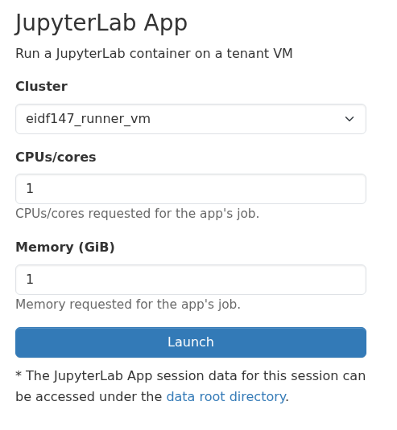{: class="border-img center"}
*Excerpt of Run JupyterLab app form*

For **Cluster**, select the 'desktop' VM on which you are running the browser in which you are using Open OnDemand. If there is only one back-end available to you then this form field won't be shown.

Leave the other settings as-is.

### Launch the Run JupyterLab app job

Click **Launch**.

Open OnDemand submits the job for the app to the job scheduler.

Open OnDemand will show an app job card with information about the app's job including:

* Job status (on the top right of the job card): initially 'Queued'.
* 'Created at': The time the job was submitted.
* 'Time Requested': The runtime requested for the job which defaults to 6 hours.
* 'Session ID': An auto-generated value which is used as the name of the job context directory with files created by Open OnDemand to run the app's job plus any log files created when the job runs. On the job card, the session ID is a link to open a File Manager pointing at this job context directory.
* App-specific information, which includes values from the app form:
    * 'Connection timeout (s)': when the app's job starts running, the app will then wait for JupyterLab to become available. If this does not occur within this app-specific period, then the app's job will cancel itself.
    * 'CPUs/cores': The value you selected on the app form.
    * 'Memory (GiB)' The value you selected on the app form.

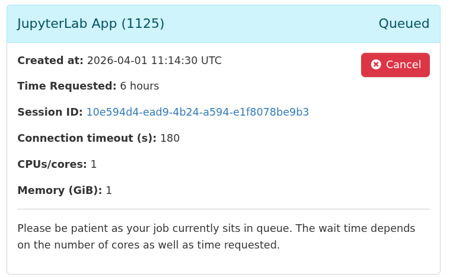{: class="border-img center"}
*Run JupyterLab app job card showing job status as 'Queued'*

When the job starts, the Job status on the job card will update to 'Starting' and 'Time Requested' will switch to 'Time Remaining', the time your job has left to run before it is cancelled by the job scheduler.

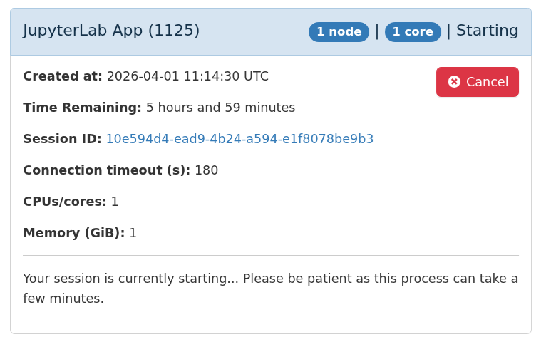{: class="border-img center"}
*Run JupyterLab app job card showing job status as 'Starting'*

When the Job status updates to 'Running', a **Host** link will appear on the job card, which allows you to log in to the back-end on which the job, and so JupyterLab, is now running.

A **Connect to JupyterLab** button will appear. JupyterLab is now ready for use.

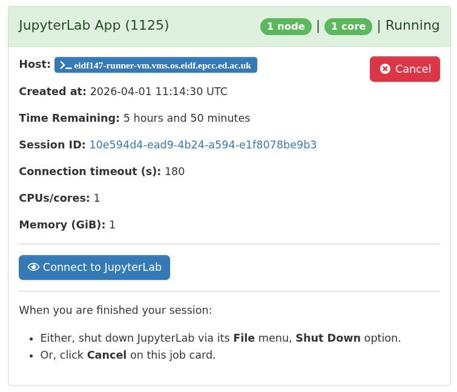{: class="border-img center"}
*Run JupyterLab app job card showing job status as 'Running'*

Click **Connect to JupyterLab**. A new browser tab will open with JupyterLab.

You may wonder why you were not prompted for a username and password. JupyterLab is protected with an auto-generated password and the **Connect to JupyterLab** button is configured to log you in automatically using this password.

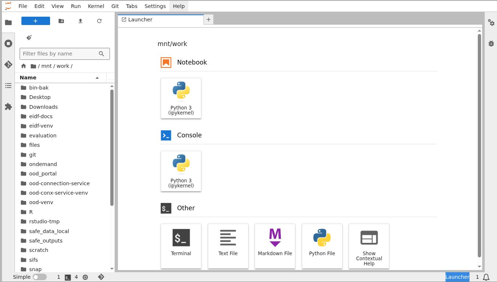{: class="border-img center"}
*JupyterLab*

### Sharing files between the back-end and JupyterLab and persisting state between app runs

JupyterLab runs within an isolated environment (within a software container) on a back-end. Within JupyterLab you will have access to your home directory on the back-end.

Your 'safe data' directory will also mounted within JupyterLab, at the path `/safe_data`. Your 'safe data'
directory is inferred as follows:

* Your 'safe data' directory is chosen to be the first `/safe_data/PROJECT` subdirectory found where you are a member of a either user group called `PROJECT` or called `PREFIX-PROJECT`. For example, if there is a `/safe_data/yourproject` directory and you are a member of a `yourproject` or `someprefix-yourproject` user group, then `/safe_data/yourproject` is your 'safe data' directory that is mounted at `/safe_data` within JupyterLab. If no such directory can be found, then the app will fail.
* However, if there is a `safe_data` directory in the your home directory (i.e., `$HOME/safe_data`) on the back-end, then that is chosen as your 'safe data' directory that is available mounted at `/safe_data` within JupyterLab.

Any files you create within your home directory or `/safe_data` in JupyterLab will be available in your home directory or `/safe_data/PROJECT` (or `$HOME/safe_data`, if applicable) on the back-end, and vice-versa.

You can create any Python scripts, notebooks, configuration files, virtual environments or download any Python packages into directories within your home directory so that they are available the next time you run the app.

!!! Warning

    Any files created outside of your home directory or `/safe_data` are **deleted** when the app stops.

### Create and run a Jupyter Notebook

Create a Jupyter Notebook:

1. Within JupyterLab, click the **Python 3** icon within the 'Notebook' section of the 'Launcher' tab.
1. A Jupyter Notebook, named 'Untitled.ipynb', will appear.

As this has been saved in your home directory within JupyterLab, it will be available in your home directory on the back-end. If you look at your home directory you should now see the `Untitled.ipynb` notebook there.

Rename the notebook:

1. Right-click the notebook title, 'Untitled.ipynb'.
1. Select **Rename Notebook...**.
1. Enter **New Name**: `sine-wave.ipynb`.
1. Click **Rename**.

You can save changes to your notebook at any time via CTRL+S or the 'disk' icon at the top of the notebook.

Within the first notebook cell, enter the following Python code, which creates data for a sine wave and plots the sine wave:

```python
import os
import pwd
import matplotlib.pyplot as plt
import numpy as np
import pandas as pd

# 360 degrees is 2*PI radians so define 4*360 degrees
# i.e. 4*2*PI radians for four sine waves.
x = np.arange(0, 4 * (2 * np.pi), 0.1)
y = np.sin(x)

dataset = pd.DataFrame({'time': x, 'amplitude': y},
                       columns=['time', 'amplitude'])
dataset.plot(title='Sine wave',
             x='time',
             y='amplitude',
             grid=True)
```

Click Shift + Enter to run the code. A plot should appear.

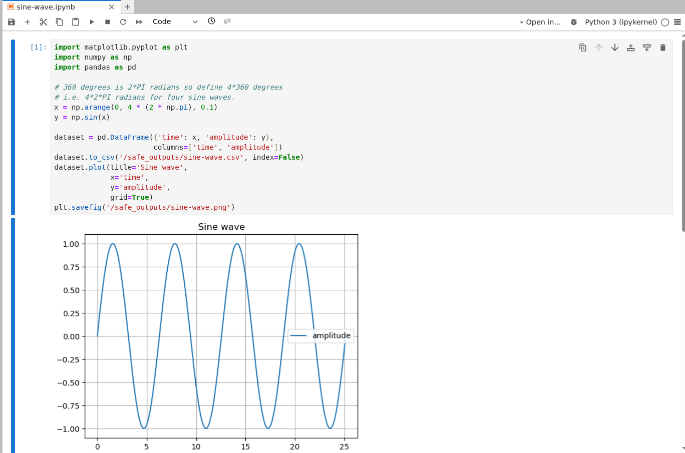{: class="border-img center"}
*Jupyter Notebook with Python code and a sine wave*

In the field under the plot, add the following code to save the sine wave data and the plot:

```python
user = pwd.getpwuid(os.getuid()).pw_name
dataset.to_csv(f'/safe_data/{user}-sine-wave.csv', index=False)
plt.savefig(f'/safe_data/{user}-sine-wave.png')
```

Click Shift + Enter to run the code.

The Python code saves the data file and plot to the `/safe_data` directory, which, as described earlier, is a mount of your 'safe data' directory i.e., `/safe_data/PROJECT`. If you look at your 'safe data' directory you should now see the files:

```text
youruser-sine-wave.csv
youruser-sine-wave.png
```

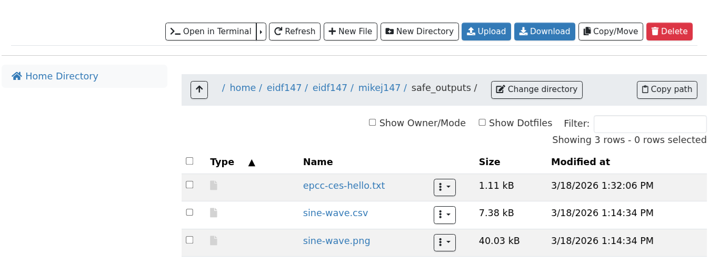{: class="border-img center"}
*File Manager showing `safe_data` directory contents after Python code is run in Run JupyterLab app*

### Look at the Run JupyterLab app job in the Active Jobs app

Click the 'Active Jobs' app on the Open OnDemand home page.

You will see a 'jupyter_app' entry for your app's job. All Run JupyterLab app jobs have this name.

You will also see a unique job ID for this job.

Your job will have a status of 'Running'.

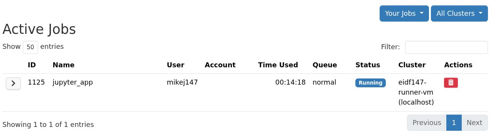{: class="border-img center"}
*Active Jobs app showing running Run JupyterLab app job*

To see more details about the job, click the **>** button, by the job.

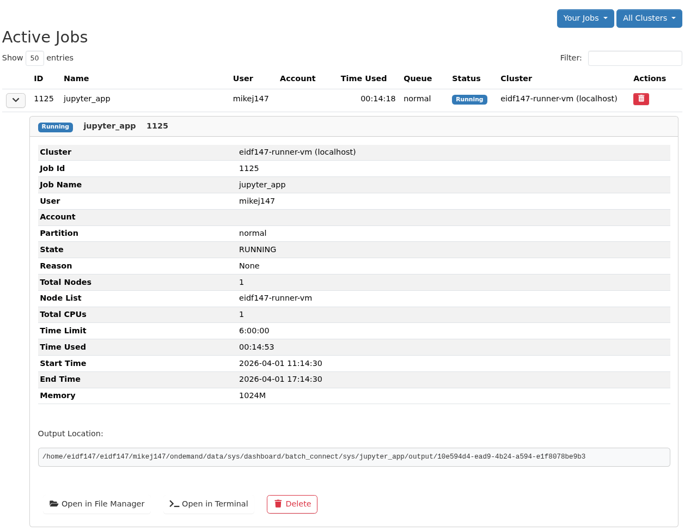{: class="border-img center"}
*Active Jobs app showing details of running Run JupyterLab app job*

### Finish your Run JupyterLab app job

You can end your job by as follows:

* Either, shut down JupyterLab via the **File** menu, **Shut Down** option.
* Or, click **Cancel** on the app's job card.

The Job status on the job card will update to 'Completed'.

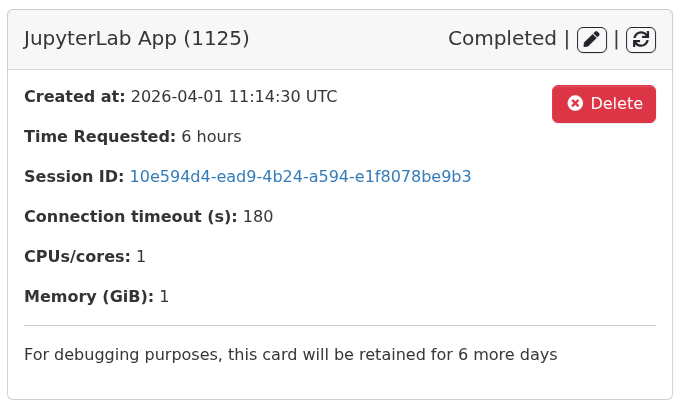{: class="border-img center"}
*Run JupyterLab app job card showing job status as 'Completed'*

Click the 'Active Jobs' app on the Open OnDemand home page.

Your job will now have a status of 'Completed'.

### Clean up after running Run JupyterLab app

Please remove the sine wave files from your 'safe data' directory. You can do this in one of two ways.

1. From within a JupyterLab 'Terminal' window. For example:

    ```console
    rm /safe_data/youruser-sine-wave.csv
    rm /safe_data/youruser-sine-wave.png
    ```

1. From within Open OnDemand:

    1. Select **Clusters** menu, back-end **Shell Access** option to log into the back-end.
    1. Delete the files. For example:

        ```console
        rm /safe_data/yourproject/youruser-sine-wave.csv
        rm /safe_data/yourproject/youruser-sine-wave.png
        ```

---

## Run the Run Batch Container app

[Run Batch Container](apps/batch-container-app.md) runs a batch container on a back-end. By **batch container** we mean a container that performs some computational or data-related task without human interaction when it is running.

Click the 'Run Batch Container' app on the Open OnDemand home page.

The 'Run Batch Container' app form will open.

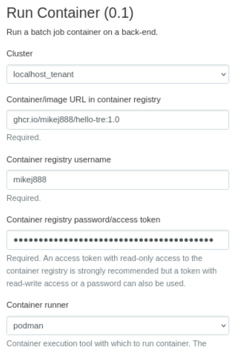{: class="border-img center"}
*Excerpt of Run Batch Container app form*

### Review the Run Batch Container app form

The app form is prepopulated with the configuration to pull and run a 'hello' container. When run, the container prints a greeting and a listing of the contents of your 'safe data' directory.

Read the form entries in conjunction with the explanations below and make the suggested changes:

* **Cluster**: A back-end (cluster) within your safe haven on which to run the app. Back-end-specific short-names are used in the drop-down list. If there is only one back-end available to you then this form field won't be shown.
    * Select the 'desktop' VM on which you are running the browser in which you are using Open OnDemand.
* **Container/image URL in container registry**: URL specifying both the container to run and the container registry from which it is to be pulled.
    * Leave this value as-is to use the `git.ecdf.ed.ac.uk/tre-container-execution-service/containers/epcc-ces-hello:2.1` container, hereon termed `epcc-ces-hello`.
* **Container registry username**: A container registry username is required.
    * Leave this value as-is.
* **Container registry access token**: An access token associated with the username is required. Using an access token that grants **read-only** access to the container registry is **strongly recommended**.
    * Leave this value as-is, the access token provides read-only access to pull the container.
* **Container runner**: Container runner - 'podman' or 'apptainer' - with which to run the container.
    * Leave this value as-is i.e., 'podman', as this is available on all back-ends.
* **Container name** (Podman only): Name to be given to the container when it is run. Your job will fail if there is already a running container with that name. If omitted, then the default container name is `CONTAINER_NAME-SESSION_ID`, where `CONTAINER_NAME` is derived from the image name (if the image name is `my-container:2.1` then `CONTAINER_NAME` is `my-container`) and `SESSION_ID` is a unique session identifier for the app's job.
    * Leave this value as-is.
* **CPUs/cores**: CPUs/cores requested for the app's job. To run jobs via Open OnDemand requires you to select the resources you think your job will need, including the number of CPUs/cores.
    * Leave this value as-is as the all back-ends can provide the default number of cores, and the `epcc-ces-hello` container does not need any more.
* **Memory (GiB)**: Memory requested for the app's job.
    * Leave this value as-is as the all back-ends can provide the default memory, and the `epcc-ces-hello` container does not need any more.
* **Use GPU?**: Request that the container use a GPU. This option is only shown for back-ends that have a GPU.
    * Leave this value as-is, as the `epcc-ces-hello` container does not require a GPU.
* **Container runner command-line arguments**: Command-line arguments to pass to the chosen container runner to control its behaviour.
    * Leave this value as-is, as the container does not require any such options to be set.
* **Environment variables**: Environment variables to be set within the container when it runs.
    * Each line should define one environment variable and value, each in the form, `ENVIRONMENT_VARIABLE=value`.
    * The `epcc-ces-hello` container looks for a `GREETING` environment variable. If set, then the container will print the variable's value as a greeting. If undefined, then the greeting is `Hello`.
    * Enter:

        ```text
        GREETING=Hello there
        ```

* **Container-specific command-line arguments**: Container-specific command-line arguments to be passed to the container when it is run. The `epcc-ces-hello` container supports two container-specific arguments:
    * A `-d|--doze INTEGER` argument which causes the container to doze (pause or sleep) for that number of seconds. If undefined, then the container does not doze. If undefined, then the default is 0 seconds.
    * A `-n|--name STRING` argument which causes the container to print a greeting with that name. If undefined, then the name is `user`.
    * The app provides values for these that override the container's defaults, requesting a doze of 5 seconds and providing your username as a name:

        ```text
        -d 5
        -n ${USER}
        ```

### Launch the Run Batch Container app job

Click **Launch**.

Open OnDemand will show an app **job card** with information about the app's job including:

* Job status (on the top right of the job card): initially 'Queued'.
* 'Created at': The time the job was submitted.
* 'Time Requested': The runtime requested for the job.
* 'Session ID': An auto-generated value which is used as the name of a job-specific directory with files created by Open OnDemand to run the app's job plus any log files created when the job runs. This **job context directory** is described shortly. On the job card, the session ID is a link to open a File Manager pointing at this job context directory.
* App-specific information, which includes values from the app form:
    * 'Container/image URL in container registry': The value you selected on the app form.
    * 'Container runner': The value you selected on the app form.
    * 'CPUs/cores': The value you selected on the app form.
    * 'Memory (GiB)' The value you selected on the app form.

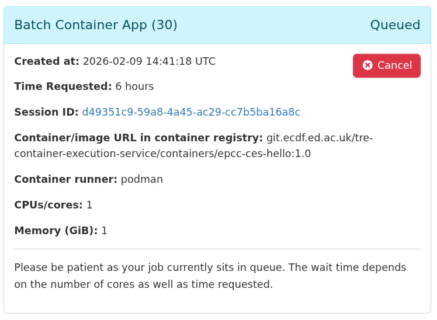{: class="border-img center"}
*Run Batch Container app job card showing job status as 'Queued'*

When the job starts, the Job status on the job card will update to 'Starting' and 'Time Requested' will switch to 'Time Remaining', the time your job has left to run before it is cancelled by the job scheduler.

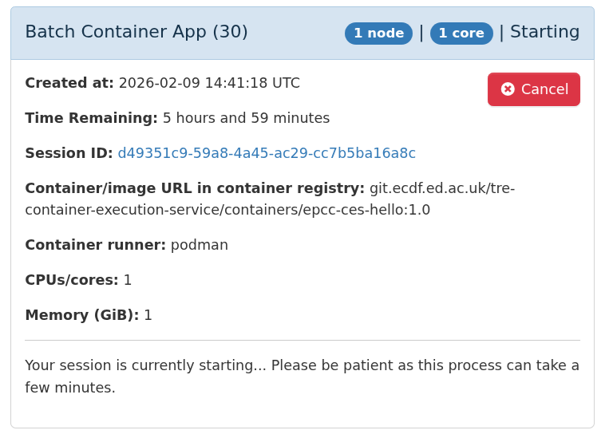{: class="border-img center"}
*Run Batch Container app job card showing job status as 'Starting'*

When the Job status updates to 'Running', a **Host** link will appear on the job card. This is the back-end on which the job, and so the `epcc-ces-hello` container, is now running. A message of form 'Container epcc-ces-hello-SESSION_ID is now running. Please wait until the container completes.' will also appear on the job card.

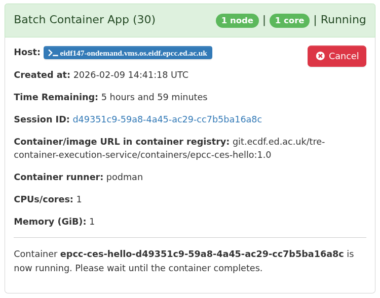{: class="border-img center"}
*Run Batch Container app job card showing job status as 'Running'*

All going well, the container, and its job, should complete quickly.

The Job status on the job card will update to 'Completed'.

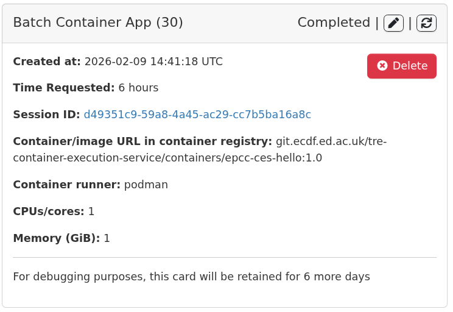{: class="border-img center"}
*Run Batch Container app job card showing job status as 'Completed'*

### Sharing files between the back-end and the container

When the app runs, your 'safe data' directory is mounted within the container, at the path `/safe_data`. Your 'safe data' directory is inferred as follows:

* Your 'safe data' directory is chosen to be the first `/safe_data/PROJECT` subdirectory found where you are a member of a either user group called `PROJECT` or called `PREFIX-PROJECT`. For example, if there is a `/safe_data/yourproject` directory and you are a member of a `yourproject` or `someprefix-yourproject` user group, then `/safe_data/yourproject` is your 'safe data' directory that is mounted at `/safe_data` within the container. If no such directory can be found, then the app will fail.
* However, if there is a `safe_data` directory in the your home directory (i.e., `$HOME/safe_data`) on the back-end, then that is chosen as your 'safe data' directory that is available mounted at `/safe_data` within the container.

You can mount additional existing directories or files within the container via the **Container runner command-line arguments** field in the form by using Apptainer or Podman-specific command-line arguments to mount the directories or files.

Together, these mounts (and, additional, app-specific mounts) provide various means by which data, configuration files, scripts and code can be shared between the back-end on which the container is running and the environment within the container itself. Creating or editing a file within any of these directories on the back-end means that the changes will be available within the container, and vice-versa.

Apps that do not run containers will typically be able to access to any files available to you on a back-end regardless of their location.

### View the file created by the container

When the `epcc-ces-hello` container is run, it writes a file `YYYYMMDD-HHMMSS-USER-epcc-ces-hello.txt` into `/safe_data` within the container, and so into `/safe_data/PROJECT` on the back-end. This file includes a greeting, your user name, the container name, the date and time and a listing of the contents of `/safe_data` within the container i.e., `/safe_data/PROJECT` on the back-end. For example, a file `20260609-085646-youruser-epcc-ces-hello.txt` could contain:

```text
Greetings!

Greetings to youruser
from
epcc-ces-hello
at
2026-06-09 08:56:46

Your '/safe_data' directory includes the following files:

20260609-085646-youruser-epcc-ces-hello.txt
README
analyse_ae.R
analyse_ae.Rmd
analyse_ae.ipynb
analyse_ae.py
config
deepfake
yourproject
postgres_data_test
tmp
weekly_ae_activity_20260201.csv
```

View the file created by the container. As mentioned earlier, `/safe_data` is not available on the Open OnDemand VM so to view this file you will need to:

1. Select **Clusters** menu, back-end **Shell Access** option, to log into the back-end.
1. View the file created by the container:

     ```bash
     ls /safe_data/PROJECT/
     cat /safe_data/PROJECT/YYYYMMDD-HHMMSS-USER-epcc-ces-hello.txt
     ```

     For example:

     ```bash
     ls /safe_data/yourproject
     cat /safe_data/yourproject/20260609-085646-youruser-epcc-ces-hello.txt
     ```

### Look at the Run Batch Container app job in the Active Jobs app

Click the 'Active Jobs' app on the Open OnDemand home page.

You will see an 'epcc-ces-hello:2.1' entry for your app's job. Run Batch Container app jobs are named using the container/image name cited in the container/image URL.

Your job will have a status of 'Completed'.

To see more details about the job, click the **>** button, by the job.

{: class="border-img center"}
*Active Jobs app showing details of completed Run Batch Container app job*

### Clean up after running Run Batch Container app

Please remove the file produced by the container from your 'safe data' directory. You can do this as follows:

1. Select **Clusters** menu, back-end **Shell Access** option to log into the back-end.
1. Delete the file. For example:

    ```console
    rm /safe_data/yourproject/20260609-085646-youruser-epcc-ces-hello.txt
    ```

---

## More information

The following pages provide detailed information about all aspects of Open OnDemand introduced in this walkthrough:

* [About jobs](jobs.md)
* [View and run apps](apps.md)
* [Browse and manage files](files.md)
* [Log into back-ends](ssh.md)
