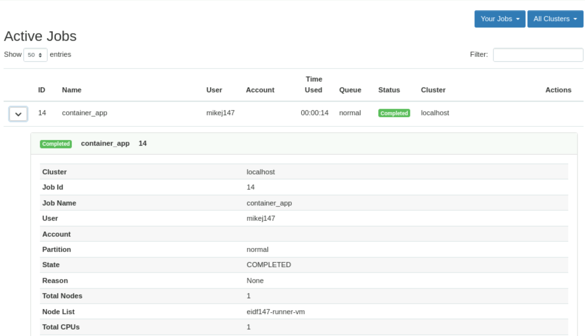

# Getting started

The Open OnDemand service is a web service that runs within a safe haven. The service provides apps that allow you to run compute and data-related tasks and packages on compute resources available to your safe haven. Here, we introduce by means of a walkthrough, Open OnDemand and its apps.

First, some Open OnDemand terminology. A compute resource upon which tasks can be run is called a **back-end**, or, in some parts of Open OnDemand, a **cluster**. Each run of a task on a back-end is called a **job**. An Open OnDemand component that allows you to run jobs, or other useful functions, is called an **app**.

This walkthrough is centred around three apps:

* [Run Batch Container](apps/batch-container-app.md) runs a software container on a back-end. This app is designed to run batch containers, those that perform some computational or data-related task without human interaction when they are running.
* [Run JupyterLab Container](apps/jupyter-app.md) runs an interactive JupyterLab service, within a container, on a back-end. Please be reassured that for this 'getting started' guide no Python knowledge is assumed or required!
* [Active Jobs](apps/active-jobs.md) allows you to see which of your jobs have been submitted, are running, or have completed.

---

## Where Open OnDemand stores your information - your `ondemand` directory

Within your home directory on the Open OnDemand VM, Open OnDemand creates an `ondemand` directory. This is where Open OnDemand stores information about your current session and previous sessions.

Every time a job is created by an app, Open OnDemand creates the job files the app needs for it to run, and log files when it is running, within a job-specific **job context directory** in an app-specific directory.

For most back-ends, your home directory is common to both the Open OnDemand VM and the back-ends so your directories and files on the Open OnDemand VM, and changes to these, are reflected on the back-ends and vice-versa.

However, you may have access to back-ends where your home directory is not common to both the Open OnDemand VM and the back-end i.e., you have unsynched, separate, home directories on each VM. Currently, the back-ends where home directories are not common to both the Open OnDemand VM and the back-ends are as follows:

* Superdome Flex, shs-sdf01.nsh.loc.
* All DataLoch VMs.

To use such back-ends, you need to do some set up to allow Open OnDemand to automatically copy job files from within your `ondemand` directory to your chosen back-end when you submit a job.

As Superdome Flex is not used in this walkthrough, this set up **only** needs to be done by users of the **DataLoch safe haven** who should now follow the instructions in [Enable automated copy of job files to a back-end](jobs.md#enable-automated-copy-of-job-files-to-a-back-end) to enable this for the 'desktop' VM on which you are running the browser in which you are using Open OnDemand, before returning to this page.

---

## Run the Run Batch Container app

[Run Batch Container](apps/batch-container-app.md) runs a batch container on a back-end. By **batch container** we mean a container that performs some computational or data-related task without human interaction when it is running.

Click the 'Run Batch Container' app on the Open OnDemand home page.

The 'Run Batch Container' app form will open.

{: class="border-img center"}
*Excerpt of Run Batch Container app form*

### Review and complete the Run Batch Container app form

The app form is prepopulated with the configuration to pull and run a 'hello world' container. When run, the container logs a greeting and information about directories mounted into the container.

Read the form entries in conjunction with the explanations below and make the suggested changes:

* **Cluster**: A back-end (cluster) within your safe haven on which to run the container. Back-end-specific short-names are used in the drop-down list. If there is only one back-end available to you then this form field won't be shown.
    * Select the 'desktop' VM on which you are running the browser in which you are using Open OnDemand.
* **Container/image URL in container registry**: URL specifying both the container to run and the container registry from which it is to be pulled.
    * Leave this value as-is to use the `git.ecdf.ed.ac.uk/tre-container-execution-service/containers/epcc-ces-hello:1.0` container, hereon termed `epcc-ces-hello`.
* **Container registry username**: A container registry username is required.
    * Leave this value as-is.
* **Container registry access token**: An access token associated with the username is required. Using an access token that grants **read-only** access to the container registry is **strongly recommended**.
    * Leave this value as-is, the access token provides read-only access to pull the container.
* **Container runner**: Container runner - 'podman' or 'apptainer' - with which to run the container.
    * Leave this value as-is i.e., 'podman', as this is available on all back-ends.
* **Container name** (Podman only): Name to be given to the container when it is run. Your job will fail if there is already a running container with that name. If omitted, then the default container name is `CONTAINER_NAME-SESSION_ID`, where `CONTAINER_NAME` is derived from the image name (if the image name is `my-container:1.0` then `CONTAINER_NAME` is `my-container`) and `SESSION_ID` is a unique session identifier for the app's job.
    * Leave this value as-is.
* **CPUs/cores**: CPUs/cores requested for the app's job. To run jobs via Open OnDemand requires you to select the resources you think your job will need, including the number of CPUs/cores.
    * Leave this value as-is as the all back-ends can provide the default number of cores, and the `epcc-ces-hello` container does not need any more.
* **Memory (GiB)**: Memory requested for the app's job.
    * Leave this value as-is as the all back-ends can provide the default memory, and the `epcc-ces-hello` container does not need any more.
* **Use GPU?**: Request that the container use a GPU. This option is only shown for back-ends that have a GPU.
    * Leave this value as-is, as the `epcc-ces-hello` container does not require a GPU.
* **Container runner command-line arguments**: Command-line arguments to pass to the chosen container runner to control its behaviour.
    * Leave this value as-is, as the container does not require any such options to be set.
* **Environment variables**: Environment variables to be set within the container when it runs.
    * Each line should define one environment variable and value, each in the form, `ENVIRONMENT_VARIABLE=value`.
    * The `epcc-ces-hello` container looks for a `GREETING` environment variable. If set, then the container will print the variable's value as a greeting. If undefined, then the greeting is `Hello`.
    * Enter:

        ```text
        GREETING=Hello there
        ```

* **Container-specific command-line arguments**: Container-specific command-line arguments to be passed to the container when it is run. The `epcc-ces-hello` container supports two container-specific arguments:
    * A `-d|--duration INTEGER` argument which causes the container to sleep (pause) for that number of seconds. If undefined, then the container does not sleep.
    * A `-n|--name STRING` argument which causes the container to print a greeting with that name. If undefined, then the name is `user`.
    * Enter the following to request a sleep of 10 seconds and a greeting with your name:

        ```text
        -d 10
        -n YOUR_FIRST_NAME
        ```

### Launch the Run Batch Container app job

Click **Launch**.

Open OnDemand will create job files for the app's job in a job-specific job context directory in an app-specific directory under your `ondemand` directory.

Open OnDemand submits the job for the app to a **job scheduler** which schedules the job onto the back-end based upon the resources - the number of CPUs/cores and amount of memory - requested for your job in the app form. Your job is then queued until sufficient resources are available on the selected back-end to run your job. This will depend upon:

* Resources available on your selected back-end.
* Extent to which jobs currently running on the back-end are using the back-end's resources.
* Resources requested by your job.
* Jobs from yourself and others already in the queue for the back-end.

When a job is submitted, a runtime is also requested. If a job takes longer than this runtime, then it is cancelled. The default runtime is 6 hours.

Open OnDemand will show an app **job card** with information about the app's job including:

* Job status (on the top right of the job card): initially 'Queued'.
* 'Created at': The time the job was submitted.
* 'Time Requested': The runtime requested for the job.
* 'Session ID': An auto-generated value which is used as the name of the job-specific job context directory. This is a link to open a File Manager pointing at the job context directory.
* App-specific information, which includes values from the app form:
    * 'Container/image URL in container registry': The value you selected on the app form.
    * 'Container runner': The value you selected on the app form.
    * 'CPUs/cores': The value you selected on the app form.
    * 'Memory (GiB)' The value you selected on the app form.

{: class="border-img center"}
*Run Batch Container app job card showing job status as 'Queued'*

When the job starts, the Job status on the job card will update to 'Starting' and 'Time Requested' will switch to 'Time Remaining', the time your job has left to run before it is cancelled by the job scheduler.

{: class="border-img center"}
*Run Batch Container app job card showing job status as 'Starting'*

When the Job status updates to 'Running', a **Host** link will appear on the job card. This is the back-end on which the job, and so the `epcc-ces-hello` container, is now running. A message of form 'Container epcc-ces-hello-SESSION_ID is now running. Please wait until the container completes.' will also appear on the job card.

{: class="border-img center"}
*Run Batch Container app job card showing job status as 'Running'*

All going well, the container, and its job, should complete quickly.

The Job status on the job card will update to 'Completed'.

{: class="border-img center"}
*Run Batch Container app job card showing job status as 'Completed'*

### How containers exchange files with back-ends

When a container is run, three directories on the back-end are always mounted into the container:

| Back-end directory | Container directory | Description |
| ------------------ | ------------------- | ----------- |
| `/safe_data/PROJECT_SUBDIRECTORY` | `/safe_data` | `PROJECT_SUBDIRECTORY` is your project group, inferred from your user groups. If such a  project-specific subdirectory of `/safe_data` is found, then it is mounted into the container (but see below). Any files written into `/safe_data` in the container will be visible to you and and other project members within `/safe_data/PROJECT_SUBDIRECTORY` on the back-end. |
| `$HOME/safe_data` | `/safe_data` | If `$HOME/safe_data` is found, then it is mounted into the container. `$HOME/safe_data` takes precedence over any `/safe_data/PROJECT_SUBDIRECTORY` directory when looking for the directory to mount into the container at `/safe_data`. Any files written into `/safe_data` in the container will be visible to you only within `$HOME/safe_data` on the back-end. |
| `$HOME/safe_outputs/APP_SHORT_NAME/SESSION_ID` | `/safe_outputs` | `APP_SHORT_NAME` is a short-name for an app (e.g., `jupyter` for [Run JupyterLab Container](apps/jupyter-app.md)). `SESSION_ID` is a unique session identifier created when an app is run. This directory is created in your home directory on the back-end when your container runs. The directory persists after the job which created the container ends. |
| `$HOME/scratch/APP_SHORT_NAME/SESSION_ID` | `/scratch` | `APP_SHORT_NAME` and `SESSION_ID` are as above. This directory is also created in your home directory on the back-end when your container runs. This directory exists for the duration of the job which created the container. The `SESSION_ID` sub-directory is **deleted** when the job which created the container ends. It is recommended that this directory be used for temporary files only. |

Together, these mounts (and other app-specific mounts) provide various means by which data, configuration files, scripts and code can be shared between the back-end on which the container is running and the environment within the container itself. Creating or editing a file within any of these directories on the back-end means that the changes will be available within the container, and vice-versa.

!!! Note

    Some apps may mount additional app-specific directories into a container and/or allow you to do so yourself.

When the `epcc-ces-hello` container is run, it writes two files into `/safe_outputs` within the container, and so into a `$HOME/safe_outputs/APP_SHORT_NAME/SESSION_ID` directory on the back-end:

* `safe_data.txt`, which lists a selection of directories and files in the `/safe_data/PROJECT_SUBDIRECTORY` directory that was mounted into the container at `/safe_data`.
* `safe_outputs.txt` which has a `This text is in safe_outputs.txt` message.

### View the container's output files

As mentioned earlier, for most back-ends, your home directory is common to both the Open OnDemand VM and the back-ends so any files created within your home directory on a back-end will be available on the Open OnDemand VM, and vice-versa. This includes the contents of the `safe_outputs/APP_SHORT_NAME/SESSION_ID` and `scratch/APP_SHORT_NAME/SESSION_ID` directories. However, your project data files, in a project-specific directory under `/safe_data` are **not** available on the Open OnDemand VM.

For DataLoch users, your home directory is not common to both the Open OnDemand VM and the back-end, so you cannot use the File Manager to browse files created by the container. However, another way of viewing these files will be described shortly.

View the `safe_outputs/batch_container/SESSION_ID` directory via the Open OnDemand File Manager:

1. Select the **Files** menu, **Home Directory** option to open the File Manager.
1. Click **Home Directory**, to go to your home directory.
1. Click `safe_outputs/batch_container/SESSION_ID` view the directory
1. Click on `safe_data.txt` and `safe_outputs.txt` to view their contents.

{: class="border-img center"}
*File Manager showing outputs directory contents after Run Batch Container app completes*

An alternative to the File Manager is to log in to the back-end and view the files there, which can be done for any back-end.

View the `safe_outputs/batch_container/SESSION_ID` directory within the back-end:

1. Select **Clusters** menu, back-end **Shell Access** option, to log into the back-end.
1. Change into your home directory and view the directory and its files and their contents.

    ```bash
    cd
    ls safe_outputs/batch_container/SESSION_ID/
    cat safe_outputs/batch_container/SESSION_ID/safe_data.txt
    cat safe_outputs/batch_container/SESSION_ID/safe_outputs.txt
    ```

As you have accessed Open OnDemand from your 'desktop' VM, you could also access the files directly on your 'desktop' VM, but we used the back-end **Shell Access** option to introduce this feature of Open OnDemand.

### View the app log file within the job context directory

When an app job runs, a log file is created within the job-specific job context directory in an app-specific directory under your `ondemand` directory. This log file includes information from the app itself plus logs captured from the container as it runs. It can be useful to check the log file when debugging.

For the `epcc-ces-hello` container, the logs includes information about the mounts and also a greeting and sleep (pause) information based on the environment variable and container arguments you defined in the app's form.

As for the output files, you can use either the File Manager (non-DataLoch safe haven users only) or log into the back-end (all users) to view the log file.

View the log file via the Open OnDemand File Manager:

1. Click the **Session ID** link in the job card to open the File Manager, pointing at the job context directory for the job on the Open OnDemand VM.

    {: class="border-img center"}
    *File Manager showing log files within Run Batch Container app's job context directory*

1. Click on the log file, `output.log`.

View the log file within the back-end:

1. Select **Clusters** menu, back-end **Shell Access** option to log into the back-end.
1. Change into the job context directory for the job on the back-end and show the log file where `SESSION_ID` can be seen on the **Session ID** link on the job card:

    ```bash
    cd ondemand/data/sys/dashboard/batch_connect/sys/batch_container_app/output/SESSION_ID/
    ```

1. View the log file:

    ```bash
    cat output.log
    ```

For the `epcc-ces-hello` container, the log file includes four types of log information. There is information from the app itself and it sets itself up to run the container. For example:

```text
Mon Feb  9 14:41:19 UTC 2026 before.sh: Started before.sh
Mon Feb  9 14:41:29 UTC 2026 before.sh: JOB_FOLDER: /home/eidf147/eidf147/mikej147/ondemand/data/sys/dashboard/batch_connect/sys/batch_container_app/output/d49351c9-59a8-4a45-ac29-cc7b5ba16a8c
...
Mon Feb  9 14:41:30 UTC 2026 script.sh: Running ces-run podman ...
Running: ...
```

This is followed by information from the container itself about your user name within the container and the directories mounted into the container. For example:

```text
Hello!

Your container is now running.

Your user 'id' within the container is: uid=0(root) gid=0(root) groups=0(root).

Check mounted directories, ownership, permissions, file system type:
/safe_data: nobody (65534) root(0) drwxrws--- ext2/ext3
/scratch: root (0) root(0) drwxr-xr-x ext2/ext3
/safe_outputs: root (0) root(0) drwxr-xr-x ext2/ext3

Check read/write access to mounted directories

List /safe_data contents and write to /safe_outputs/safe_data_files.out
Check write to /safe_outputs
Contents of /safe_outputs/safe_outputs.txt:
This text is in safe_outputs.txt
Check write to /scratch
Contents of /scratch/scratch.txt:
This text is in scratch.txt

Look for optional 'GREETING' environment variable
Found optional 'GREETING' environment variable with value: Hello there

Parse command-line arguments
Number of arguments: 4
Arguments (one per line):
    -d
    10
    -n
    Mike
```

For some containers run via Podman, including `epcc-ces-hello`, you are the 'root' user within the container but **only** within the container. This is why the files in the mounts belong to a 'root' or 'nobody' user and 'root' group when accessed from **within** the container. Any files you create in the mounted directories will be owned by your own user, and user group, on the back-end. You can check this yourself by inspecting the file ownership of the files within `safe_outputs/batch_container/SESSION_ID`.

Returning to the log file, there is information from the container itself about your user name within the container and the directories mounted into the container, including a message created using the value of the `GREETING` environment variable and the `-n` container argument, messages indicating that the container is sleeping for the duration specified by the `-d` container argument, and a farewell message, again using the `-n` container argument. For example:

```text
Hello there Mike!

Sleeping for 10 seconds...
1
2
3
4
5
6
7
8
9
10
...and awake!

Goodbye Mike!
```

Finally, the log file includes information from the app itself as it completes. For example:

```text
Mon Feb  9 14:41:40 UTC 2026 script.sh: Finished script.sh
Cleaning up...
```

---

## Run the Active Jobs app

[Active Jobs](apps/active-jobs.md) allows you to see which of your jobs have been submitted, are running, or have completed.

Click the 'Active Jobs' app on the Open OnDemand home page.

The Active Jobs app will open to show a table of running and recently completed jobs.

You will see an 'epcc-ces-hello:1.0' entry for your app's job. Run Batch Container app jobs are named using the container/image name cited in the container/image URL.

Your job will have a status of 'Completed'.

Each job has a unique **job ID** created by the job scheduler when you submitted the job. Unfortunately, the job ID is not the same as the session ID for an app created by Open OnDemand. Rather, the job ID is created by the job scheduler. Each job created by an app has both an Open OnDemand session ID and a job scheduler job ID.

{: class="border-img center"}
*Active Jobs app jobs list*

To see more details about the job, click the **>** button, by the job.

{: class="border-img center"}
*Active Jobs app showing details of completed Run Batch Container app job*

If any app does not run promptly, but is in a 'Queued' state, then the Active Jobs app can provide you with information on other jobs that are running and for which you may have to wait until one or more have completed before your app's job runs.

---

## Run the Run JupyterLab Container app

[Run JupyterLab Container](apps/jupyter-app.md) runs an interactive JupyterLab service, within a container, on a back-end.

Click the 'Run JupyterLab Container' app on the Open OnDemand home page.

The Run JupyterLab Container app form will open.

{: class="border-img center"}
*Excerpt of Run JupyterLab Container app form*

For **Cluster**, select the 'desktop' VM on which you are running the browser in which you are using Open OnDemand. If there is only one back-end available to you then this form field won't be shown.

Leave the other settings as-is.

### Launch the Run JupyterLab Container app job

Click **Launch**.

Again, Open OnDemand will create job files for the app in a job-specific job context directory in an app-specific directory under your `ondemand` directory and then submits the job for the app to the job scheduler.

Again, Open OnDemand will show an app job card with information about the app's job including:

* Job status (on the top right of the job card): initially 'Queued'.
* 'Created at': The time the job was submitted.
* 'Time Requested': The runtime requested for the job which defaults to 6 hours.
* 'Session ID': An auto-generated value which is used as the name of the job-specific job context directory. This is a link to open a File Manager pointing at the job context directory.
* App-specific information, which includes values from the app form:
    * 'Connection timeout (s)': when the app's job starts running, the app will then wait for JupyterLab to become available. If this does not occur within this app-specific period, then the app's job will cancel itself.
    * 'CPUs/cores': The value you selected on the app form.
    * 'Memory (GiB)' The value you selected on the app form.

{: class="border-img center"}
*Run JupyterLab Container app job card showing job status as 'Queued'*

When the job starts, the Job status on the job card will update to 'Starting' and 'Time Requested' will switch to 'Time Remaining', the time your job has left to run before it is cancelled by the job scheduler.

{: class="border-img center"}
*Run JupyterLab Container app job card showing job status as 'Starting'*

When the Job status updates to 'Running', a **Host** link will appear on the job card, which allows you to log in to the back-end on which the
job, and so JupyterLab, is now running.

A **Connect to JupyterLab** button will appear. JupyterLab is now ready for use.

A 'JupyterLab is running in Podman container epcc-ces-jupyter-SESSION_ID' message will also appear.

{: class="border-img center"}
*Run JupyterLab Container app job card showing job status as 'Running'*

Click **Connect to JupyterLab**. A new browser tab will open with JupyterLab.

You may wonder why you were not prompted for a username and password. JupyterLab runs within the container as a 'root' user. The 'root' user is within the context of the container **only**. JupyterLab is protected with an auto-generated password. The **Connect to JupyterLab** button is configured to log you into JupyterLab using this password automatically.

{: class="border-img center"}
*JupyterLab*

### Use JupyterLab to explore how directories on a back-end are mounted into a container

We can use JupyterLab to further explore how directories on a back-end are mounted into a container.

Click the **Host** link to log into the back-end on which the job, and JupyterLab container, is running.

Now, within JupyterLab, click the **Terminal** icon within the 'Launcher' tab. This opens up a command-line session within JupyterLab.

Now run the following:

```bash
ls /safe_data/
```

You will see the contents of your `/safe_data/PROJECT_SUBDIRECTORY` on the back-end.

{: class="border-img center"}
*Viewing mounted directories within JupyterLab*

Check this by running, in your Open OnDemand command-line session with the back-end:

```bash
ls /safe_data/PROJECT_SUBDIRECTORY/
```

The same files and subdirectories should be listed.

Now, within the JupyterLab Terminal, create a file in each directory (`touch` creates an empty file):

```bash
touch /scratch/hello-from-jupyterlab-to-scratch.txt
touch /safe_outputs/hello-from-jupyterlab-to-outputs.txt
```

List the contents of the `scratch` and `safe_outputs` and directories:

```bash
ls -1 scratch/jupyter/SESSION_ID
ls -1 safe_outputs/jupyter/SESSION_ID
```

You should see the above files:

```bash
hello-from-jupyterlab-to-scratch.txt
hello-from-jupyterlab-to-outputs.txt
```

Now, within your Open OnDemand command-line session with the back-end, create files in these directories:

```bash
touch scratch/jupyter/SESSION_ID/hello-from-scratch-to-jupyterlab.txt
touch safe_outputs/jupyter/SESSION_ID/hello-from-outputs-to-jupyterlab.txt
```

Then, within the JupyterLab Terminal, list the contents of the corresponding `/scratch` directory and you should see the files you created on the back-end plus those you created within JupyterLab:

```bash
ls -1 /scratch/
```

```bash
hello-from-jupyterlab-to-scratch.txt
hello-from-scratch-to-jupyterlab.txt
```

And similarly for `/safe_outputs`:

```bash
ls -1 /safe_outputs/
```

```bash
hello-from-jupyterlab-to-outputs.txt
hello-from-outputs-to-jupyterlab.txt
```

Hopefully, this demonstrates how the mounted directories provides a means for data, configuration files, scripts and code to be shared between the back-end on which a container is running and the environment within the container itself.

As a reminder, `safe_outputs/jupyter/SESSION_ID` will persist after the job which created the container ends but the `SESSION_ID` subdirectory in `scratch/jupyter` will be deleted.

### Revisit the Active Jobs app

Click the 'Active Jobs' app on the Open OnDemand home page.

You will see a 'jupyter_app' entry for your app's job. All Run JupyterLab Container app jobs have this name.

You will also see a unique job ID for this job.

Your job will have a status of 'Running'.

{: class="border-img center"}
*Active Jobs app showing running Run JupyterLab Container app job*

To see more details about the job, click the **>** button, by the job.

{: class="border-img center"}
*Active Jobs app showing details of running Run JupyterLab Container app job*

### Finish your Run JupyterLab Container app job

You can end your job by as follows:

* Either, shut down JupyterLab via the **File** menu, **Shut Down** option.
* Or, click **Cancel** on the app's job card.

The Job status on the job card will update to 'Completed'.

{: class="border-img center"}
*Run JupyterLab Container app job card showing job status as 'Completed'*

Click the 'Active Jobs' app on the Open OnDemand home page.

Your job will now have a status of 'Completed'.

---

## Use `$HOME/safe_data`

As mentioned, if `$HOME/safe_data` exists in your home directory on the back-end, then that is mounted into a container. Otherwise, a subdirectory of `/safe_data` corresponding to your project (and inferred from your user group) is mounted, if such a subdirectory can be found.

Using the File Manager, or via a session on the back-end accessed from within Open OnDemand, or on the 'desktop' VM from which you accessed Open OnDemand, create a `$HOME/safe_data` directory and then create some files in it. For example:

```bash
mkdir $HOME/safe_data/
touch $HOME/safe_data/a.txt
touch $HOME/safe_data/b.txt
touch $HOME/safe_data/c.txt
```

Rerun the Run JupyterLab Container app and, again, once JupyterLab has started, click the **Terminal** icon within the 'Launcher' tab.

List the contents of `/safe_data`:

```bash
ls -1 /safe_data/
```

and you should see the files you created:

```bash
a.txt
b.txt
c.txt
```

Remember to delete `$HOME/safe_data` when you are done.

---

## More information

The following pages provide detailed information about all aspects of Open OnDemand introduced in this walkthrough:

* [Run jobs](jobs.md)
* [Run containers](containers.md)
* [View and run apps](apps.md)
* [Browse and manage files](files.md)
* [Log into back-ends](ssh.md)
