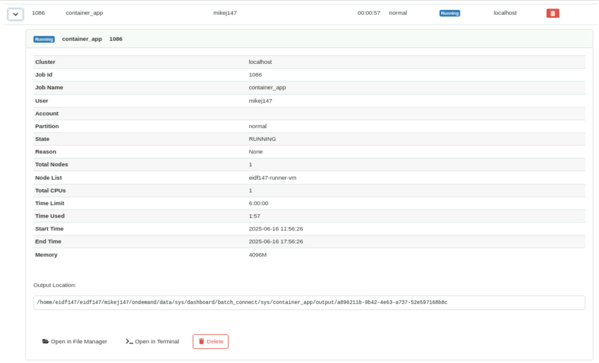

# Getting started with Open OnDemand

Open OnDemand allows you to run compute and data-related tasks on compute resources available within your safe haven. Here, we'll introduce you to the key concepts behind, features of, and information about, using the TRE Open OnDemand service to run containers via the TRE Container Execution Service on compute resources available to your safe haven.

First some Open OnDemand terminology. A compute resource upon which tasks can be run is called a **back-end** or **cluster**. Each run of a task on a back-end is called a **job**. Open OnDemand components that allow you to run jobs, or other useful functions, are called **apps**.

Within the TRE Open OnDemand service, apps are provided to run containers on back-ends. This walkthrough is centred around three apps:

* [Run Container](./apps/container-app.md) allows you to run a batch container on a back-end. By **batch container** we mean those that perform some computational or data-related task without human interaction.
* [Run JupyterLab](./apps/jupyter-app.md) allows you to run a JupyterLab container on a back-end, which creates an interactive JupyterLab service you can use. Please be reassured that no Python knowledge is assumed or required!
* [Active Jobs](./apps/active-jobs.md) allows you to see which of your jobs have been submitted, are running, or have completed.

---

## Your `ondemand` directory

Within your home directory on the Open OnDemand VM, Open OnDemand creates an `ondemand` directory. This is where Open OnDemand stores information about your current session and previous sessions.

Every time a job is created by an app, Open OnDemand creates the job files for the app in a job-specific **job context directory** in an app-specific directory.

For most back-ends, your home directory is common to both the Open OnDemand VM and the back-ends so your directories and files on the Open OnDemand VM, and changes to these, are reflected on the back-ends and vice-versa.

However, you may have access to back-ends where your home directory is not common to both the Open OnDemand VM and the back-end i.e., you have unsynched, separate, home directories on each VM. To use such back-ends, you need to do some set up to allow Open OnDemand to automatically copy your `ondemand` directory, and so your job files, to the back-end when you submit a job.

For the back-ends used by this walkthrough this only needs to be done by users of the **DataLoch safe haven** only. Users of **other safe havens** can **skip to the next section**, [Run the 'Run Container' app](#run-the-run-container-app) below.

To use a DataLoch VM to run Open OnDemand apps, please follow the instructions in [Enable copy of `ondemand` directory to a back-end](./jobs.md#enable-automated-copy-of-ondemand-directory-to-a-back-end), then return to this page.

---

## Run the 'Run Container' app

[Run Container](./apps/container-app.md) allows you to run a batch container on a back-end. By **batch container** we mean those that perform some computational or data-related task without human interaction.

Click the 'Run Container' app on the Open OnDemand portal.

The 'Run Container' app form will open.

### Review and complete the 'Run Container' app form

The app form is prepopulated with the configuration to pull and run a 'hello TRE' container, `ghcr.io/mikej888/hello-tre:1.0` (the cited credentials provide read-only access to pull the container). When run, the container logs a greeting and information about folders mounted into the container.

Read the form entries in conjunction with the explanations below and make the suggested changes:

* **Cluster** describes the back-end (cluster) within your safe haven on which to run the container. Back-end short-names are used in the drop-down list and safe haven-specific back-ends include the text 'tenant'.
    * Select a 'desktop' back-end to which you know you have access. For DataLoch safe haven users, select the back-end for which you enabled copy of the `ondemand` directory to in [Your `ondemand` directory](#your-ondemand-directory) above.
* **Container/image URL in container registry** cites both the container registry and container to run.
    * Leave this value as-is, to use the `hello-tre` container.
* **Container registry username** is a username to access the container registry.
    * Leave this value as-is.
* **Container registry password/access token** is an access token with read-only access to the container registry.
    * Leave this value as-is.
* **Container runner** is the container execution tool with which to run container on the back-end.
    * Leave this value as-is i.e., 'podman', which is available on all back-ends.
* **Container name** is the name to be given to the container when it is run. If omitted, then the container image name is used e.g., `hello-tre`. Your user name and a timestamp will be added as a suffix to the name when the container is run.
    * Leave this value as-is.
* **Cores** is the number of cores/CPUs requested for this job. To run jobs via Open OnDemand needs you to select the resources you think your job will need, including the number of cores/CPUs. Your selected back-end (cluster) must have the selected number of cores/CPUs available.
    * Leave this value as-is as the all back-ends can provide the default number of cores, and the `hello-tre` container does not need any more.
* **Memory in GiB** is the memory requested for this job. Your selected back-end (cluster) must have the selected memory available.
    * Leave this value as-is as the all back-ends can provide the default memory, and the `hello-tre` container does not need any more.
* **Use GPU?** requests that the container use a GPU. If selected, then the selected back-end must have GPUs available.
    * Leave this value as-is, as the container does not require a GPU.
* **Command-line options to pass to container runner** are Podman- or Apptainer-specific options to control the container runner's behaviour.
    * Leave this value as-is, as the container does not require any such options to be set.
* **Environment variables to pass to container** are environment variable passed on by the container runner and set within the container when it runs. The `hello-tre` container looks for a `HELLO_TRE` environment variable. If set, then the container to print the variable's value as a greeting. If undefined, then the greeting is `Hello`.
    * Enter:

        ```text
        HELLO_TRE=Hello there
        ```

* **Arguments to pass to container** are container-specific arguments to be passed directly to the container when it runs. The `hello-tre` container supports two container-specific arguments:
    * A `-d|--duration INTEGER` argument will cause the container to sleep (pause) for that number of seconds. If undefined, then the container does not sleep.
    * A `-n|--name STRING` argument will cause the container to print a greeting with that name. If undefined, then the name is `user`.
    * Enter:

        ```text
        -d 10
        -n PUT_YOUR_FIRST_NAME_HERE
        ```

### Launch the 'Run Container' app job

Click **Launch**.

Open OnDemand will create job files for the app in a job-specific job context directory in an app-specific directory under your `ondemand` directory.

Open OnDemand will show an app **job card** with information about the app's job including:

* Job status (on the top right of the job card): One of 'Queued', 'Starting', 'Running', 'Held', 'Suspended', 'Completed', 'Undetermined'.
* 'Host': For 'Running' jobs, the back-end on which the job is running.
* 'Created at': For 'Queued' jobs, the time the job was submitted.
* 'Time Requested': For 'Queued' jobs, the runtime requested for the job.
* 'Time Remaining': For 'Starting' and 'Running' jobs, the runtime remaining.
* 'Connection timeout': For 'Starting' jobs, the time Open OnDemand will wait after the job has started running, determined from the job scheduler, for the app to send a notification to Open OnDemand.
* App-specific configuration parameters.
* App-specific status information, and, for apps that run containers with interactive web- or GUI-based services, a button to connect to the service.

TODO-elaborate-hone-above-for-container-app

Open OnDemand submits the job for the app to a **job scheduler** which schedules the job onto the back-end based upon the resources - the number of CPUs/cores and amount of memory - requested. Your job is then queued until sufficient resources are available on the selected back-end to run your job. This will depend upon:

* Resources available on your selected back-end.
* Extent to which jobs currently running on the back-end are using the back-end's resources.
* Resources requested by your job.
* Jobs from yourself and others already in the queue.

The Job status on the job card will update through the states 'Queued', and then 'Starting'.

When the Job status updates to 'Running', the `hello-tre` container is now running and a 'Please wait until your job has completed' message will appear on the job card.

All going well, the container, and its job, should complete quickly.

The Job status on the job card will update to 'Completed'.

### View the container's output files

Open OnDemand uses the Container Execution Service tools to run containers. Consequently, containers run via Open OnDemand **must** conform to the requirements of the Container Execution Service. The [TRE Container User Guide](../tre-container-user-guide/introduction.md) contains full details, but, for this walkthrough the key points are that containers need to support thre directories, so that when the container is run, three directories on the back-end can be mounted into the container:

| Back-end directory | Container directory | Description |
| ------------------ | ------------------- | ----------- |
| Project-specific `/safe_data/` subdirectory | `$HOME/safe_data/` OR `/safe_data/PROJECT_SUBDIRECTORY/`| If `$HOME/safe_data/` exists in your home directory on the back-end, then that is mounted. Otherwise, a subdirectory of `/safe_data/` corresponding to your project (and inferred from your user group) is mounted, if such a subdirectory can be
found. |
| `$HOME/outputs-NUMBER` | `/safe_outputs/` | `NUMBER` is a randomly-generated number, for example `outputs-3320888`. This directory is created in your home directory on the back-end. The directory persists after the job which created the container ends. |
| `$HOME/scratch-NUMBER` | `/scratch/` | `NUMBER` is the same as that created for `outputs-NUMBER`, for example `scratch-3320888`. This directory is also created in your home directory on the back-end. This directory exists for theduration of the job which created the container and is then **deleted** when the job which created the container ends. |

Together, these mounts provides a means for data, configuration files and protoype scripts and code to be shared between the back-end on which the container is running and the environment within the container itself. Creating or editing a file within any of these directories on the back-end means that the changes will be available within the container, and vice-versa.

When the `hello-tre` container is run, it writes two files into `/safe_outputs/` within the container, corresponding to `$HOME/outputs-NUMBER` on your home directory on the back-end:

* `safe_data.txt`, with a list of directories and files in the `/safe_data/PROJECT_SUBDIRECTORY` directory mounted into the container at `/safe_data/`
* `safe_outputs.txt`, with a 'This text is in safe_outputs.txt' message.

As mentioned earlier, for most back-ends, your home directory is common to both the Open OnDemand VM and the back-ends so any files created within your home directory on a back-end will also be available on the Open OnDemand VM. Open OnDemand provides a File Manager which allows you to browse files in your home directory on the Open OnDemand VM. This includes the contents of the `outputs-NUMBER` directory.

For DataLoch users, your home directory is not common to both the Open OnDemand VM and the back-end, so you cannot use the File Manager to browse files created by the container. However, another way of viewing these files will be described shortly.

View the `outputs-NUMBER` directory and its files via the Open OnDemand File Manager:

1. Select the **Files** menu, **Home Directory** option to open the File Manager.
1. Click **Home Directory**, to go to your home directory.
1. Click `outputs-NUMBER` view the directory
1. Click on `safe_data.txt` and `safe_outputs.txt` to view their contents.

An alternative to the File Manager is to start an SSH session with the back-end and view the files via that, which can be done for any back-end.

View the `outputs-NUMBER` directory and its files via an SSH session:

1. Select **Clusters** menu, back-end **Shell Access** option, to log into the back-end.
1. Change into your home directory and view the directory and its files and their contents.

    ```bash
    cd
    ls outputs-NUMBER
    cat outputs-NUMBEeR/safe_data.txt
    cat outputs-NUMBER/safe_outputs.txt
    ```

### View the app log file within the job context directory

When a app job runs, a log file is created within the job-specific job context directory in an app-specific directory under your `ondemand` directory. This log file includes information created by the app plus logs captured from the container. For the `hello-tre` container, this includes information about the mounts and also a greeting and sleep (pause) information based on the environment variable and container arguments you defined in the app's form.

TODO-munge-below

On a job's job card, click the **Session ID** link to open the [File Manager](./files.md), pointing at the job context directory for the job on the Open OnDemand VM.

When using a back-end where your home directory is not common to both the Open OnDemand VM and the back-end, then, if your job creates files on the back-end, you will have to log into the back-end to view your files - see [Log into back-ends](./ssh.md).

1. View the log file, `container_app_output-RUNID.log`, for the job (where `RUNID` is a numerical identifier):
    * If you selected a back-end where your home directory is common to both the Open OnDemand VM and the back-end, then:
        1. Click the **Session ID** link in the job card to open the [File Manager](./files.md), pointing at the job context directory for the job on the Open OnDemand VM.
        1. Click on the log file, `container_app_output-RUNID.log`.
    * If you selected a back-end where your home directory is not common to both the Open OnDemand VM and the back-end, then:
        1. Select **Clusters** menu, back-end **Shell Access** option to log into the back-end.
        1. Change into the job context directory for the job on the back-end and show the log file:

        ```bash
        cd ondemand/data/sys/dashboard/batch_connect/sys/container_app/output/SESSION_ID/
        cat container_app_output-RUNID.log
        ```

1. The log file includes:

    * Information about how the container is run:

    ```text
    Fri Jun 13 12:17:44 UTC 2025 before.sh: JOB_FOLDER: $HOME/ondemand/data/sys/dashboard/batch_connect/sys/container_app/output/SESSION_ID
    ...
    Fri Jun 13 12:17:50 UTC 2025 script.sh: Running ces-run podman ...
    Running: /usr/local/bin/ces-pm-run ...
    ```

    * Information from the container itself about your user name within the container and the directories mounted into the container (see [Sharing files between a back-end and a container](./containers.md#sharing-files-between-a-back-end-and-a-container):

    ```
    Hello TRE!

    Your container is now running.

    Your user 'id' within the container is: uid=0(root) gid=0(root) groups=0(root).

    Check mounted directories, ownership, permissions, file system type:
    /safe_data: nobody (65534) root(0) drwxrwx--- nfs
    /scratch: root (0) root(0) drwxr-xr-x ext2/ext3
    /safe_outputs: root (0) root(0) drwxr-xr-x ext2/ext3

    Check read/write access to mounted directories

    List /safe_data contents and write to /safe_outputs/safe_data_files.out
    Check write to /safe_outputs
    Contents of /safe_outputs/safe_outputs.txt:
    This text is in safe_outputs.txt
    Check write to /scratch
    Contents of /scratch/scratch.txt:
    This text is in scratch.txt

    Look for optional 'HELLO_TRE' environment variable
    Found optional 'HELLO_TRE' environment variable with value: Hello there

    Parse command-line arguments
    Number of arguments: 5
    Arguments (one per line):
        -d
        30
        -n
        YOUR_FIRST_NAME
    ```

    * A message created using the value of the `HELLO_TRE` environment variable and the `-n` container argument and messages indicating that the container is sleeping for the duration specified by the `-d` container argument:

    ```
    Hello there YOUR_FIRST_NAME!

    Sleeping for 30 seconds...
    1
    2
    3
    4
    5
    6
    7
    8
    9
    10
    ...and awake!

    For more container examples and ideas, visit:
      https://github.com/EPCCed/tre-container-samples
    Goodbye YOUR_FIRST_NAME!
    Cleaning up...
    ```

---

## Run the 'Active Jobs' app

[Active Jobs](./apps/active-jobs.md) allows you to see which of your jobs have been submitted, are running, or have completed.

Click the 'Active Jobs' app on the Open OnDemand portal.

The 'Active Jobs' app will open to show a table of running and recently completed jobs.

TODO What alse can identify the job?

Each job has a unique job ID created by the job scheduler when you submitted the job.

Unfortunately, the job ID is not the same as the session ID for an app. The latter is an identifier created by Open OnDemand itself. Each job created by an app will have both an Open OnDemand session ID and a Slurm job ID.

You should see details for your job with a status of 'Completed'.

---

## Job details

To see details about a job, click the **>** button, by the job of interest.

The 'Output Location' is the location of the job context directory for the job on the Open OnDemand VM.

{: class="border-img center
"} *Job details within the Active Jobs app*

---

## Open File Manager to job context directory

Click **Open in File Manager** to open the [File Manager](../files.md) pointing at the job context directory for the
 job on the Open OnDemand VM.

---

## Log into to back-end on which job is running

Click **Open in Terminal** to log into the back-end on which the currently selected job will be run. Once logged in,
 your current directory will be changed to match the job context directory.

---

## Cancel a job

Click the **Delete Job** (red trashcan icon) by the job in the job table or click **Delete** in the job details to c
ancel (delete) a running job.

{: class="border-img c
enter"} ***Delete Job** button*

---

## Run the 'Run JupyterLab' app

[Run JupyterLab](./apps/jupyter-app.md) allows you to run a JupyterLab container on a back-end, which creates an interactive JupyterLab service you can use. Please be reassured that no Python knowledge is assumed or required!

Click the 'Run JupyterLab' app on the Open OnDemand portal.

The 'Run JupyterLab' app form will open.

TODO-munge-below

TODO explain why this app's form is shorter.

Complete the following information the app form:

* **Cluster**: The back-end (cluster) within your safe haven on which to run the container. Back-end short-names are used in the drop-down list and safe haven-specific back-ends include the text 'tenant' (see [Back-end (cluster) names](./jobs.md#back-end-cluster-names) for more information).

    !!! Note

        **National Safe Haven users**: If you want to use a 'desktop' back-end, then you must select the 'desktop' you have been granted access to.

* **Container name**: Name to be given to the container when it is run.
    * Your user name and a timestamp will be added as a prefix to the name to prevent name clashes if running multiple containers from the same image. For example, `user-052010544547-my-jupyter`.
    * If omitted, then the container image name is used. For example, `user-052010544552-epcc-ces-jupyter`.
* **Cores (max 28)**: Number of cores/CPUs requested for this job. Your selected back-end (cluster) must have the selected number of cores/CPUs available.
* **Memory in GiB (max 58 GiB)**: Memory requested for this job. Your selected back-end (cluster) must have the selected memory available.

Unlike the 'Run Container app, this app does not allow you to choose the container runner. The container is run using Podman. Some Open OnDemand apps allow you to choose the container runner to use, others will choose this for you.
Click **Launch**.

Open OnDemand will submit a job to your chosen back-end to create and run the container.

The Job status on the job card will update through the states 'Queued', and then 'Starting'.

When the Job status updates to 'Running', the `hello-tre` container is now running and a **Connect to JupyterLab** button will appear.

Click **Connect to JupyterLab**.

### Troubleshooting: Proxy Error

If you click **Connect to JupyterLab** and get:

> Proxy Error
>
> The proxy server received an invalid response from an upstream server.
> The proxy server could not handle the request
>
> Reason: Error reading from remote server
>
> Apache/2.4.52 (Ubuntu) Server at host Port 443

then, this can arise as sometimes there is a lag between the container having started and JupyterLab within the container being ready for connections.

Wait 30 seconds, then refresh the web page, or click the **Connect to JupyterLab** button again.

JupyterLab running in the container is password-protected. The password is auto-generated. The **Connect to JupyterLab** button is configured to log you into the container using this password automatically.

Within JupyterLab, you are the 'root' user and group.

!!! Note

    You are the 'root' user **only** within the context of the container. You will not have 'root' access to the back-end on which the container is running! Any files you create in the directories mounted into the container will be owned by your own user, and user group, on the back-end.

See [Sharing files between a back-end and a container](./containers.md#sharing-files-between-a-back-end-and-a-container)

On a job's job card, click the **Session ID** link to open the [File Manager](./files.md), pointing at the job context directory for the job on the Open OnDemand VM.

!!! Info

    When using a back-end where your home directory is not common to both the Open OnDemand VM and the back-end, then, if your job creates files on the back-end, you will have to log into the back-end to view your files - see [Log into back-ends](./ssh.md).

While the job is running, click the **Host** link to log into to back-end on which the job is running.

TODO Edit safe_outputs/scratch files via Terminal within JupyterLab, see effect via File Manager/SSH.

TODO Edit safe_outputs/scratch files via File Manager/SSH, see effect via Terminal within JupyterLab

If you have a number of `outputs-NUMBER` or `scratch-NUMBER` directories, then use 'Modified at' values in the [File Manager](./files.md) or `ls -l` to identify those corresponding to your most recent job.

Click the 'Active Jobs' app on the Open OnDemand portal.

TODO What alse can identify the job?

You should see details for your job with a status of 'Running' as your job is still underway.

You can end your job by as follows:

Either, log out of JupyterLab via **File**, **Log Out**.

Or, click **Cancel** on a job card.

The Job status on the job card will update to 'Completed'.

Click the 'Active Jobs' app on the Open OnDemand portal.

TODO What alse can identify the job?

You should see details for your job with the status updated to 'Completed'.

---

## TODO

Another thing you can try is to use the File Manager or the command-line to create a `$HOME/safe_data/` directory and then create some files in it. If you rerun the app, this time `outputs-NUMBER/safe_data.txt` will list the files you created. For example, assume `$HOME/safe_data/` was created as follows (with three empty files):

```bash
mkdir $HOME/safe_data/
touch $HOME/safe_data/a.txt
touch $HOME/safe_data/b.txt
touch $HOME/safe_data/c.txt
ls -1 $HOME/safe_data
```

`outputs-NUMBER/safe_data.txt` would have the contents:

```text
/safe_data: root (0) root(0) drwxr-xr-x
/safe_data/a.txt: root (0) root(0) -rw-r--r--
/safe_data/c.txt: root (0) root(0) -rw-r--r--
/safe_data/b.txt: root (0) root(0) -rw-r--r--
```

---

## More information

The following pages provide more detailed information about the aspects of Open OnDemand covered in this walkthrough:

* [Run jobs](./jobs.md)
* [Run containers](./containers.md)
* [View and run apps](./apps.md)
* [Browse and manage files](./files.md)
* [Log into back-ends](./ssh.md)
