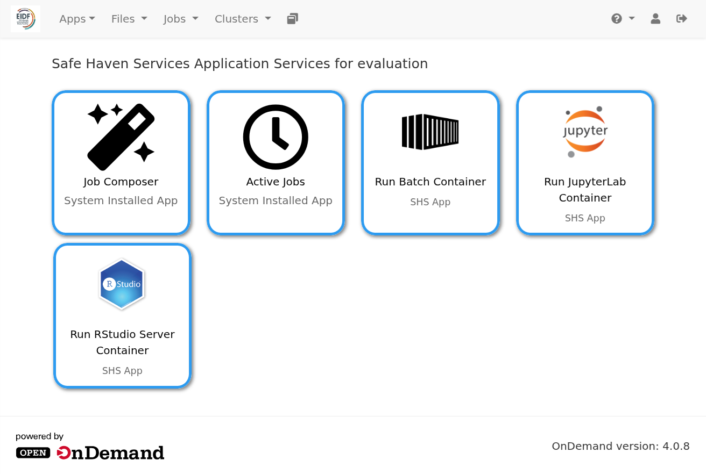

# Open OnDemand home page

---

## Introduction

Open OnDemand's home page provides menus and icons to allow you to access Open OnDemand's features.

{: class="border-img center"} *Open OnDemand home page*

Open OnDemand's features are described on the following pages:

* [Run jobs](jobs.md)
* [Run containers](containers.md)
* [View and access apps](apps.md)
* [Browse and manage files](files.md)
* [Log into back-ends](ssh.md)

General purpose features are described below.

---

## Restart your Open OnDemand session

Select the **Help (?)** menu, **Restart Web Server** option to restart your Open OnDemand session.

{: class="border-img center"} ***Help (?)** menu button*

!!! Info

    Despite its name, this option does not restart the Open OnDemand web server! It restarts your session only. It does not affect other users!

!!! Tip

    If the Open OnDemand service or apps have been updated during your session, then **Restart Web Server** allows you to pick up such changes without having to log out and log back into Open OnDemand,

---

## Display your log in name

Click the **Avatar** (head and shoulders icon) on the menu bar to display your log in name e.g., 'Logged in as some-user'.

{: class="border-img center"} ***Avatar** menu button*

---

## Log out

Click **Log Out** (right arrow icon) on the menu bar to log out of Open OnDemand.

{: class="border-img center"} ***Log Out** menu button*
