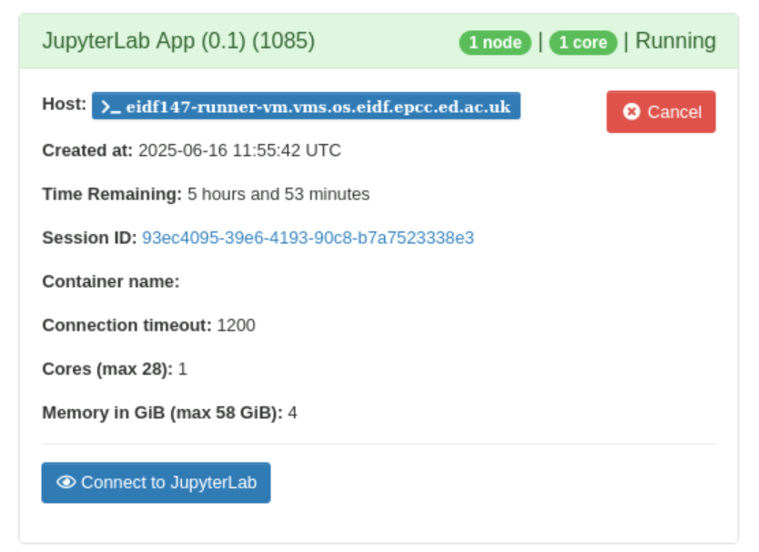

# Run jobs

---

## Introduction

Open OnDemand provides a suite of apps that allows you to run compute and data-related tasks and packages on compute resources available to your safe haven.

Depending on your safe haven, you may also have access to compute resources outwith your safe haven, for example, the Superdome Flex high-performance computing cluster.

This page describes concepts you need to know about how Open OnDemand runs tasks and apps.

---

## Back-ends, clusters, jobs and apps

A compute resource upon which tasks can be run is called a **back-end**, or, in some parts of Open OnDemand, a **cluster**.

Each run of a task on a back-end is called a **job**

An Open OnDemand component that allows you to run jobs, or other useful functions, is called an **app**.

Many apps allow you to run jobs on back-ends. However, other apps perform other useful functions, for example, the [Active Jobs](apps/active-jobs.md) app which allows you to see which of your jobs have been submitted, are running, or have completed.

A subset of apps that run jobs on back-ends are called **interactive apps**. In standard deployments of Open OnDemand interactive apps refer only to apps that run web- or GUI-based services or software. However, within the Safe Haven Services deployment of Open OnDemand, certain apps that run tasks that have no interactive aspect are also classed as 'interactive apps'.

!!! Note

    Open OnDemand's application programming interface for interactive apps is significantly less complex than its interface for non-interactive (in the Open OnDemand sense) apps!

### Back-end (cluster) names

Within Open OnDemand, back-ends are typically referred to via human-readable names. A selection of back-end names includes:

* DataLoch 1234 5678 GPU server
* eDRIS National Safe Haven GPU desktop 01
* ODAP GPU desktop 01
* Smart Data Foundry GPU desktop 01
* Superdome Flex

A convention is adopted whereby safe haven-specific back-ends always cite the safe haven name.

Within some interactive apps, you will see back-ends referred to via 'short-names'. Typically, these short-names are derived from the back-ends' VM names. So, for example, the short-names corresponding to the above back-ends are:

* dap_1234_5678
* nsh_gpu_desktop01
* odp_gpu_desktop01
* smartdf_gpu_desktop01
* shs_sdf01

Within [job cards](#job-cards) on the [My Interactive Sessions](#my-interactive-sessions-page) page, described below, you will see the VM names upon which the jobs for interactive apps are running.

---

## Job scheduling and execution

To run a job, including those created by apps, you need to select the resources - the number of CPUs/cores and amount of memory - you think your job will need.

Open OnDemand then submits the job to a **job scheduler** which schedules the job onto the selected back-end based upon the resources requested. Your job is then queued until sufficient resources are available on the selected back-end to run your job. This will depend upon:

* Resources available on your selected back-end.
* Extent to which jobs currently running on the back-end are using the back-end's resources.
* Resources requested by your job.
* Jobs from yourself and others already in the queue.

!!! Note

    Open OnDemand and the back-ends use the [Slurm](https://slurm.schedmd.com) open source job scheduler and workload manager to schedule and run jobs on back-ends.

    Unless you are using the [Job Composer](apps/job-composer.md) app, you should not have to worry about the details of how Slurm works. Open OnDemand's user interface and apps are designed to hide its details from users.

!!! Tip

    As back-ends are used by multiple users, be considerate to other users, and take care to request only the resources you think your job will need. This helps to ensure fair use for everyone.

!!! Tip

    See [Open OnDemand tips](tips.md) for tips and troubleshooting relating to relating to requesting resources and job queues.

When a job is submitted, a runtime is also requested. If a job takes longer than this runtime, then it is cancelled.

!!! Warning

    Apps run for a maximum of 6 hours.

!!! Warning

    Any running jobs are cancelled during the monthly Safe Haven Services maintenance period.

For interactive apps, Open OnDemand uses the job scheduler to determine when the job has started. Apps that run interactive services (e.g., JupyterLab or RStudio Server) will then wait for the service to become available. If this does not occur within an app-specific period, the **connection timeout**, then the app's job will cancel itself.

!!! Note

    As mentioned above, within the Safe Haven Services deployment of Open OnDemand, certain apps that run tasks that have no interactive aspect are also classed as 'interactive apps', so you may see the connection timeout for these apps too.

---

## Your `ondemand` directory

Within your home directory on the Open OnDemand VM, Open OnDemand creates an `ondemand` directory. This is where Open OnDemand stores information about your current session and previous sessions.

Every time a job is created by an app, Open OnDemand creates the job files for the app in a job-specific **job context directory** in an app-specific directory.

[Job Composer](apps/job-composer.md) app job files are created in a directory:

```bash
$HOME/ondemand/data/sys/myjobs/projects/default/JOB_COMPOSER_ID/
```

where `JOB_COMPOSER_ID` is a unique job ID created by the app. For example:

```bash
$HOME/ondemand/data/sys/myjobs/projects/default/1/
```

An interactive app's job files are created in a directory:

```bash
$HOME/ondemand/data/sys/dashboard/batch_connect/sys/APP_NAME/output/SESSION_ID/
```

where `APP_NAME` is the app name and `SESSION_ID` a unique session identifier. For example,

```bash
$HOME/ondemand/data/sys/dashboard/batch_connect/sys/batch_container_app/output/e0b9deeb-4b9c-43f8-ad3f-1c85074a1485/
```

Open OnDemand caches information within this `ondemand` directory including information on previous jobs and information you last entered within app forms.

!!! Warning

    You can delete the `ondemand` directory - Open OnDemand will recreate it the next time you log in - but your history of previous jobs, and any cached values, will be lost.

!!! Tip

    You may find it useful to delete specific job context subdirectories from the `ondemand` directory if the `ondemand` directory grows to large.

---

## Unsynched home directories

For most back-ends, your home directory is common to both the Open OnDemand VM and the back-ends so your directories and files on the Open OnDemand VM, and changes to these, are reflected on the back-ends and vice-versa.

However, you may have access to back-ends where your home directory is not common to both the Open OnDemand VM and the back-end i.e., you have unsynched, separate, home directories on each VM. Currently, the back-ends where home directories are not common to both the Open OnDemand VM and the back-ends are as follows:

* Superdome Flex, shs-sdf01.nsh.loc.
* All DataLoch VMs.

To use such back-ends, you need to do some set up to allow Open OnDemand to automatically copy job files from within your `ondemand` directory to your chosen back-end when you submit a job. How to enable this is described in the following section on [Enable automated copy of job files to a back-end](#enable-automated-copy-of-job-files-to-a-back-end).

You will also have to log into your chosen back-end to view files created on these back-ends when you run jobs - see [Log into back-ends](ssh.md)

### Enable automated copy of job files to a back-end

To enable Open OnDemand to automatically copy job files from within your `ondemand` directory to a back-end where your home directory is not common to both the Open OnDemand VM and the back-end, you need to set up a passphrase-less SSH key between the Open OnDemand VM and the back-end.

!!! Note

    Setting up SSH keys does **not** need to be done for back-ends where your home directory is common to both on the Open OnDemand VM and the back-ends.

Set up a passphrase-less SSH key between the Open OnDemand VM and the back-end:

1. Select **Clusters** menu, **Open OnDemand host Shell Access** option.
1. A new browser tab with an SSH session to the back-end will appear.
1. When prompted, enter your project username and password.
1. Create a passphrase-less SSH key:

    ```bash
    ssh-keygen -t rsa -b 4096 -C "open-ondemand" -N ""
    ```

1. Copy public key to back-end:

    ```bash
    ssh-copy-id BACK-END-HOSTNAME.nsh.loc
    ```

    Information on the copy will be output:

    ```bash
    /usr/bin/ssh-copy-id: INFO: Source of key(s) to be installed: "/home/user/.ssh/id_rsa.pub"
    /usr/bin/ssh-copy-id: INFO: attempting to log in with the new key(s), to filter out any that are already installed
    /usr/bin/ssh-copy-id: INFO: 1 key(s) remain to be installed -- if you are prompted now it is to install the new keys
    (user@BACK-END-HOSTNAME.nsh.loc) Password:
    ```

1. When prompted, enter your project username and password. The key will then be added to the back-end:

    ```bash
    Number of key(s) added: 1

    Now try logging into the machine, with:   "ssh 'BACK-END-HOSTNAME.nsh.loc'"

    and check to make sure that only the key(s) you wanted were added.
    ```

1. Check passphrase-less access to back-end:

    ```bash
    ssh BACK-END-HOSTNAME.nsh.loc hostname
    ```

    For example:

    ```bash
    BACK-END-HOSTNAME.nsh.loc hostname
    ```

1. You should not be prompted for a passphrase or password.

---

## What happens when a job is submitted

Briefly, when a job is submitted, the following occurs:

1. Open OnDemand creates a job context directory under your `ondemand` directory.
    * For the [Job Composer](apps/job-composer.md) app:

    ```bash
    ondemand/data/sys/myjobs/projects/default/JOB_COMPOSER_ID/
    ```

    * For interactive apps:

    ```bash
    ondemand/data/sys/dashboard/batch_connect/sys/APP_NAME/output/SESSION_ID/
    ```

1. Open OnDemand submits the job to the job scheduler to run the job on your chosen back-end.
    * A job scheduler preprocessing step is used to create a log file in an `ondemand/logs/slurm` directory.
    * For back-ends where your home directory is not common to both both the Open OnDemand VM and the back-end, a job scheduler preprocessing step automatically copies your job files from within your `ondemand` directory to the back-end. The relative directory structure from the `ondemand` directory to the job files directory is preserved by the copy.
1. The job scheduler queues your job, pending processing and memory resources on the back-end becoming available. The job status will be 'Queued'.
1. When resources become available on the back-end, your job runs:
    * For jobs created via the [Job Composer](apps/job-composer.md) app, the job status will be 'Running'.
    * For jobs created via interactive apps, the job status will be 'Starting' and, when a notification is received from the running app by Open OnDemand, the job status will switch to 'Running'.
1. Your job will complete. The job status will be 'Completed'.

!!! Note

    The job status does **not** display whether a job that is 'Completed' did so with success or failure. Whether a job succeeded or failed can be seen in the job details for the job which can be seen via the [Active Jobs](apps/active-jobs.md) app.

---

## Browse and manage jobs

You can browse and manage jobs via the [Active Jobs](apps/active-jobs.md) app.

For an interactive app's job, you can also use the [My Interactive Sessions](#my-interactive-sessions-page) page, which provides more app-specific information.

---

## My Interactive Sessions page

Click **My Interactive Sessions** (overlaid squares icon) on the menu bar to open the My Interactive Sessions page.

{: class="border-img center"} ***My Interactive Sessions** menu button*

The My Interactive Sessions page shows app-specific jobs that have been submitted, are running, or have completed. Each job has a job card.

!!! Note

    Only information for jobs for interactive apps is shown. Information on jobs submitted via the [Job Composer](apps/job-composer.md) app are shown on that app's own page.

### Job cards

When an interactive app's job is submitted, a **job card** is created and shown with information about the app's job including:

* Job status (on the top right of the job card): One of 'Queued', 'Starting', 'Running', 'Held', 'Suspended', 'Completed', 'Undetermined'.
* 'Host': For 'Running' jobs, the back-end on which the job is running.
* 'Created at': For 'Queued' jobs, the time the job was submitted.
* 'Time Requested': For 'Queued' jobs, the runtime requested for the job.
* 'Time Remaining': For 'Starting' and 'Running' jobs, the runtime remaining.
* App-specific information, which includes values from the app form.
    * For some apps, this will include the 'Connection timeout'.
* App-specific status information, and, for apps that run interactive web- or GUI-based services, a button to connect to the service.

{: class="border-img center"} *Example job card for the Run Batch Container app*

{: class="border-img center"} *Example job card for the Run JupyterLab app*

!!! Note

    The job status does **not** display whether a job that is 'Completed' did so with success or failure. Whether a job succeeded or failed can be seen in the job details for the job which can be seen via the [Active Jobs](apps/active-jobs.md) app.

### Log in to back-end on which job is running

For 'Running' jobs, click the **Host** link to log into the back-end on which the job is running.

### Open File Manager to job context directory

Click the **Session ID** link to open the [File Manager](files.md), pointing at the job context directory for the job on the Open OnDemand VM.

!!! Note

    When using a back-end where your home directory is not common to both the Open OnDemand VM and the back-end, then, if your job creates files on the back-end, you will have to log into the back-end to view your files.

### Cancel a job

Click **Cancel** on a job card to cancel a running job.

### Relaunch a job

Click **Relaunch Job** (circling arrows icon) on a job card to relaunch a previously cancelled or completed job. A new session ID, and new set of job files, using the same configuration as for the previous run of the app, will be created.

{: class="border-img center"} ***Relaunch Job** button*

### Delete a job card

Click **Delete** on a job card to delete the job card.

!!! Note

    Deleting a job card does **not** delete the associated job context directory from the `ondemand` directory.

---

## Log files

### Job scheduler log files

When a job is submitted to a back-end, a log file is created within an `ondemand/logs/slurm` directory within your home directory on the Open OnDemand VM.

Log files have name `sbatch-YYYYMMDD-HHMMSS_OPEN_ONDEMAND_CLUSTER_NAME`. For example, `sbatch-20240807-082901-nsh_gpu_desktop01`.

An example of the contents of a log file is as follows:

```text
# Open OnDemand back-end: OPEN_ONDEMAND_CLUSTER_NAME
# Time: YYYY-MM-DD HH:MM:SS
# Process: PROCESS-ID
# Open OnDemand server environment
...values environment variables in current Open OnDemand environment...
# sbatch arguments from Open OnDemand
...arguments passed from Open OnDemand to 'sbatch' command which runs job...
```

!!! Note

    You should not have to concern yourself with the contents of these log files but they might prove useful if you need help with troubleshooting issues with running jobs via Open OnDemand.

!!! Tip

    You can safely delete these log files, if they're taking up too much space.

### App log files

When an app job runs, a log file is created within the job-specific job context directory in an app-specific directory under your `ondemand` directory. This log file includes information from the app itself plus logs captured from any scripts, services, containers, or other processes spawned by the app as these run.

It can be useful to check the log file when debugging.

Depending on the app implementation, the log file may include a job ID, a unique job ID created by the job scheduler, when you submitted the job.

!!! Note

    The job ID is not the same as the session ID used for interactive apps or the job composer ID used by the Job Composer. Rather, the job ID is created by the job scheduler.

    Each job created by an app has both an app ID and a job scheduler job ID.
