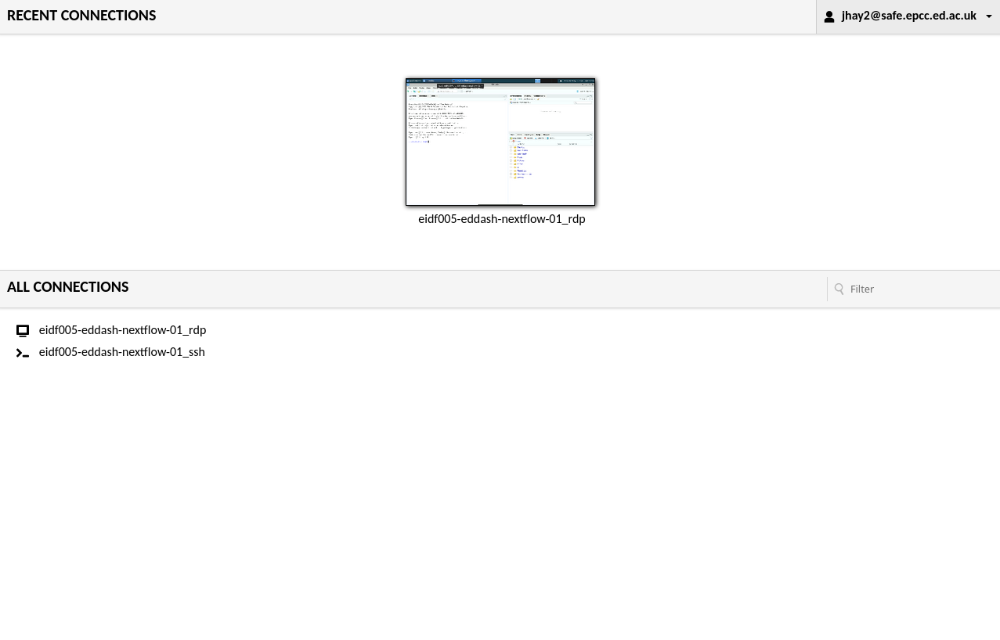
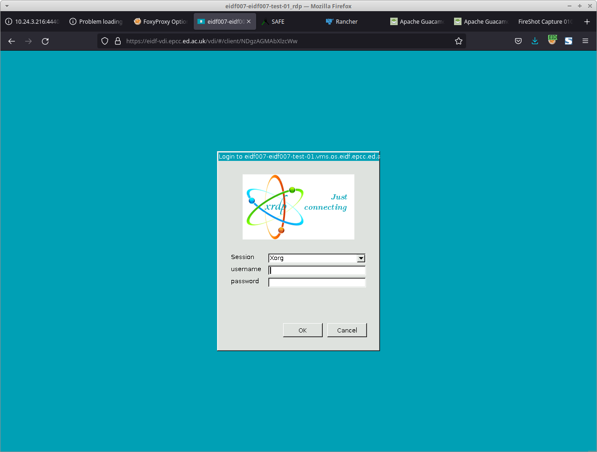

# Safe Haven Services Access

## Safe Haven Network Access Controls

The TRE Safe Haven services are protected against open, global access by IPv4 source address filtering. These network access controls ensure that connections are permitted only from Safe Haven controller partner networks and collaborating research institutions.

Network access controls for each Safe Haven are managed by the Safe Haven service controllers who instruct EPCC to add and remove the IPv4 addresses allowed to connect to the service gateway.

!!! note "Requirement"
      Users must connect to the Safe Haven service by first connecting to their institution or corporate VPN. If the institution or corporate VPN is not already allowed to access the Safe Haven service, research coordinators will ask researchers to provide an IP range to be added to the allow list.

Safe Haven services are accessed from a registered network connection address using a browser. The service URL will be "[https://shs.epcc.ed.ac.uk/<service\>](https://shs.epcc.ed.ac.uk/<service\>)" where `<service>` is the Safe Haven service name.

## Safe Haven Login

The Safe Haven login process has three stages:

1. Multi-factor authentication
1. Remote Desktop Gateway login
1. Project Desktop login

Researchers who are active in many research projects and in more than one Safe Haven will need to pay attention to the service they connect to, the project desktop they login to, and the accounts and identities they are using.

### 1. Multi-Factor Authentication

The first step in the process prompts the user for a Safe Haven username and then for a session PIN code sent via SMS text to the mobile number registered for the username.

Valid PIN code entry allows the user access to all of the Safe Haven service remote desktop gateways for up to 24 hours without entry of a new PIN code. A user who has successfully entered a PIN code once can access `shs.epcc.ed.ac.uk/haven1` and `shs.epcc.ed.ac.uk/haven2` without repeating PIN code identity verification.

When a valid PIN code is accepted, the user is prompted to accept the service use terms and conditions.

!!! note "Requirement"
      As part of the user registration process, research coordinators will ask users to provide their mobile numbers for Multi-Factor Authentication setup.

### 2. Remote Desktop Gateway login

The second step in the access process is for the user to login to the Safe Haven service Remote Desktop Gateway so that a project Desktop connection can be chosen. The user is prompted for a Safe Haven service account identity.

   
   *VDI Safe Haven Service Login Page*

Safe Haven accounts are managed by the Safe Haven IG controller and research project co-ordination teams.

### 3. Project Desktop login

The third stage in the process is to select the virtual connection from those available on the account's home page. An example home page is shown below offering two connection options to the same virtual machine. Remote desktop connections will have an `_rdp` suffix and SSH terminal connections have an `_ssh` suffix. The most recently used connections are shown as screen thumbnails at the top of the page and all the connections available to the user are shown in a tree list below this.

   
   *VM connections available home page*

The remote desktop gateway software used in the Safe Haven services in the TRE is the Apache Guacamole web application. Users new to this application can [find the user manual here](https://guacamole.apache.org/doc/gug/using-guacamole.html). It is recommended that users read this short guide, but note that the data sharing features such as copy and paste, connection sharing, and file transfers are disabled on all connections in the TRE Safe Havens.

A remote desktop or SSH connection is used to access data provided for a specific research project. If a researcher is working on multiple projects within a Safe Haven they can only login to one project at a time. Some connections may allow the user to login to any project and some connections will only allow the user to login into one specific project. This depends on project IG restrictions specified by the Safe Haven and project controllers.

Project desktop accounts are managed by the Safe Haven IG controller and research project co-ordination teams.

#### First Time Login and Account Password Changes

!!! warning "Account Password Changes"
    Note that first time account login cannot be through RDP as a password change is required. Password reset logins must be SSH terminal sessions as password changes can only be made through SSH connections.

#### Connecting to a Remote SSH Session

When a VM SSH connection is selected, the browser screen becomes a text terminal. The user is prompted to "Login as: " with a project account name, and then prompted for the account password. This connection type is equivalent to a standard xterm SSH session.

!!! warning "Symbols and shortcuts"
    Note that Apache Guacamole translates keyboard input from your browser to the remote desktops. Sometimes this mapping is not compatible due to a difference in operating systems or keyboard layouts, causing certain symbols and shortcuts to be different. Passwords typed in an SSH terminal are often hidden for privacy reasons. If you are unsure about what you are typing, test this as your username without pressing enter.

#### Connecting to a Remote Desktop Session

Remote desktop connections work best by first placing the browser in Full Screen mode and leaving it in this mode for the entire duration of the Safe Haven session.

When a VM RDP connection is selected the browser screen becomes a remote desktop presenting the login screen shown below.

   
   *VM virtual desktop connection user account login screen*

Once the project account credentials have been accepted, a remote dekstop similar to the one shown below is presented. The default VM environment in the TRE is Ubuntu 22.04 with the Xfce desktop.

   
   *VM virtual desktop*
