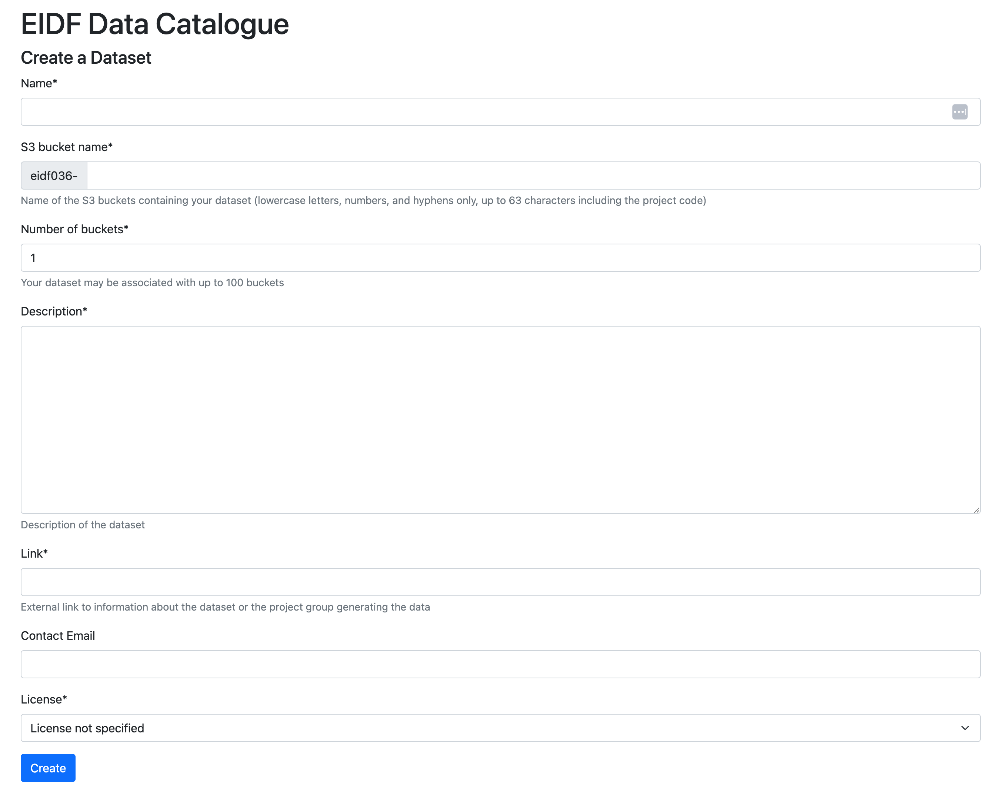

# Data Publishing

## Customising your entry in the EIDF Data Catalogue

When/if your project is approved and you are close to publishing your data, a CKAN organisation will be created in the [EIDF Data Catalogue](https://catalogue.eidf.ac.uk/) for you.

You can login to the EIDF Data Catalogue using your SAFE credentials - there is a "Log in" link on the top right. Find your organisation and then you can customise it by clicking on the "Manage" button on the top-right, e.g. you can provide a more friendly name than the EIDF project number, you can provide a description for your organisation, provide a logo or image representing your organisation and associate metadata pairs to aid discovery.
Customising your organisation will make it more attractive to those that may want to use your data and will also aid in discovery.

## Creating your dataset(s)

!!! warning "**Do NOT use the CKAN interface to create Datasets**"
    The EIDF Portal creates these for you and associates S3 buckets with your data. You can provide additional metadata once the Dataset records are in CKAN. Please do not add datasets through the CKAN interface either. Contact us if would like anything removed.

Once your project is approved go to your project in the EIDF portal at this link:

* [https://projects.eidf.ac.uk/ingest/](https://projects.eidf.ac.uk/ingest/)

Select the project which you want to use to ingest data. The list of `Ingest Datasets` will be empty unless you have already created Datasets.

Create a Dataset by pressing on the `New` button. You will need to provide the following minimal bits of information:

* **Name**: The name for your dataset.
* **S3 Bucket name**: this entry will automatically be populated from your dataset name to create your S3 bucket name. You can customise the name for yourself subject to the constraints specified below the text box by editing the link directly. Note though if you change the dataset name you will overwrite the S3 bucket name link if you have customised it. Your project id at the start you will not be able to change.
* **Number of buckets**: you may want to distribute your data over a number of S3 buckets if your dataset is big or structured into subsets.
* **Description**: a description of your dataset.
* **Link**: a link describing your group/contact information.
* **Contact email**: a contact email to answer queries about your data set (this is optional).
* **License**: the license under which you will distribute your data.

An example of the form is given below.

Once you are happy with the content press on the `Create` button. This will be used to create the requested number of S3 buckets to which you will be able copy your data.

You should now be able to click on a link to your dataset to see a copy of the information that you provided. You can supplement your Dataset entry in the EIDF catalogue with additional metadata once you have logged into the data catalogue using your SAFE credentials.

## Data upload

Having created an S3 bucket please consult the [S3 tutorial section](../s3/tutorial.md) to get an overview of the commands you will require to upload your data to S3.

Note that versioning is enabled for data publishing S3 buckets.
Versioning preserves existing files that are overwritten or deleted and
allows to retrieve and restore every version of every file in an S3 bucket.

When you have added your data in S3, you can add the data S3 link to the catalogue dataset as a resource.

## Metadata format

Metadata for resources in your dataset are added directly through the EIDF Data Catalogue.

Make sure you're logged in to the [EIDF Data Catalogue](https://catalogue.eidf.ac.uk). Open the page of your dataset and click on "Manage" at the top right. Open the "Resources"  tab and press the button "+ Add new resource". Now you can fill in the form and describe your data as you wish. Some entries that are required and these are marked with a red "\*" in the EIDF Data Catalogue:

* **Name**: a descriptive name for your dataset.
* **Access URL**: this is a link to a file in S3 or a set of files with a common prefix, that you uploaded as explained above.
* **Description**: a human readable description of your data set.
* **Resource format**: the type of data included in your resource.
* **Unique Identifier**
* **Licence**: the licence under which you are releasing your data.

!!! note
     If it is not going to be immediately obvious to a third party as to how your data may be used then please do provide a link to some documentation showing people how to unpack/use your data. Not everyone who may want to use your data may be a domain expert in your field.
