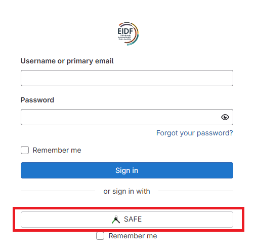

# EIDF Gitlab

EIDF runs a local instance of the popular [Gitlab](https://about.gitlab.com) software for the convenience of users. It can be accessed at [gitlab.eidf.ac.uk](https://gitlab.eidf.ac.uk)

## Login

Login requires a [SAFE](https://safe.epcc.ed.ac.uk) account and you should use the "Signin with SAFE" option as shown below.

!!! warning
    Do not enter your details into the main login fields.

    Users can only use the SAFE sign-in method to access the web interface.

## Usage

We run a current version of the Gitlab software so refer users to the Gitlab provided [documentation](https://docs.gitlab.com/ee/).

Users may make use of gitlab runners, CI/CD pipelines and other enabled features. Access via SSH (i.e. git over ssh) is enabled for this instance.

If you wish an extra feature to be enabled, plus request this [via a support request](https://portal.eidf.ac.uk/queries/submit).

