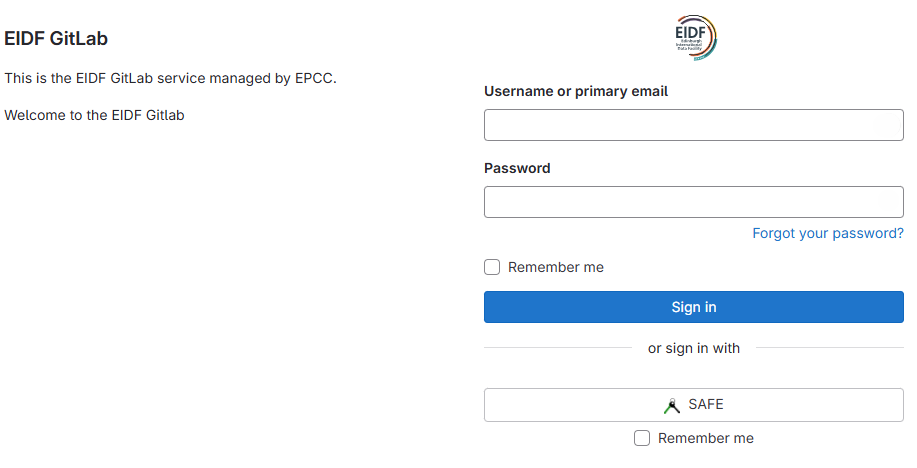
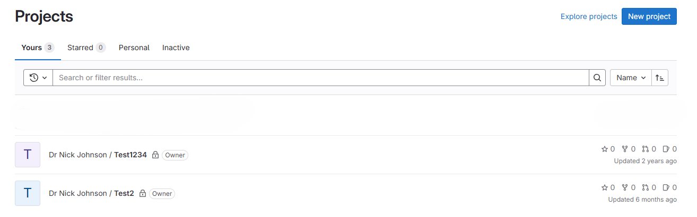
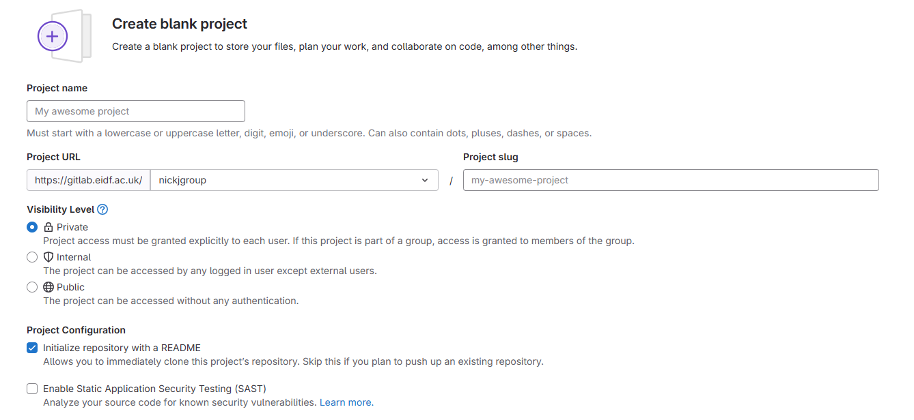
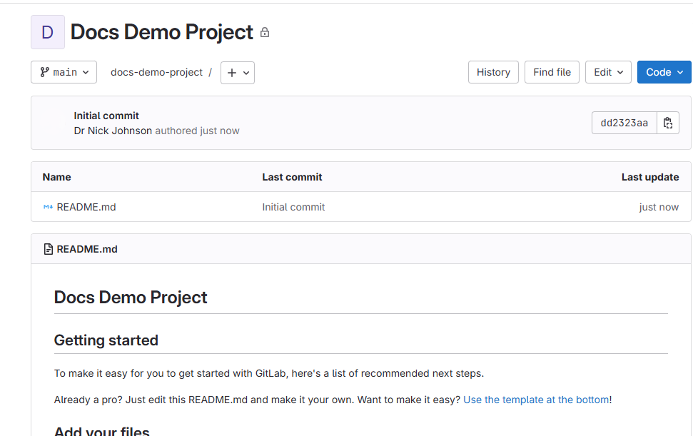
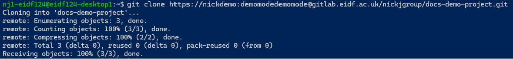

# Quickstart

## Accessing

Access the EIDF gitlab in your browser by opening [https://gitlab.eidf.ac.uk/](https://gitlab.eidf.ac.uk/). You must be a member of an active EIDF project and have a user account to use the EIDF gitlab Service.

Click on "Sign In with SAFE". You will be redirected to the SAFE login page to if you're not logged in already.

## Create New Project

You will be presented with the list of GitLab Projects you currently have access to. Click on "New Project" to create a project.

Selecting "Blank Project" will take to you the project creation screen. You can choose to change the project url to make the new project either a personal one or one owned by a GitLab group.

GitLab offers a variety of options for project, permission and access configurations. Please consult the [GitLab Documentation](https://docs.gitlab.com/ee/user/) for specifics.

## Clone repository

To clone a repository, click on the "Code" button to get the https-based url.

From the command line, you can clone this repository by adding your username and token into the URL between the `https://` and `@gitlab.eidf` parts of the url as shown. Your EIDF GitLab username can easily be found by clicking your profile image near the top left of any GitLab page. The username is the part below your name, without the `@` symbol.

## Limits

EIDF GitLab currently only supports working with repositories via https and tokens. We hope to expand the service to use SSH via SSH keys shortly.
