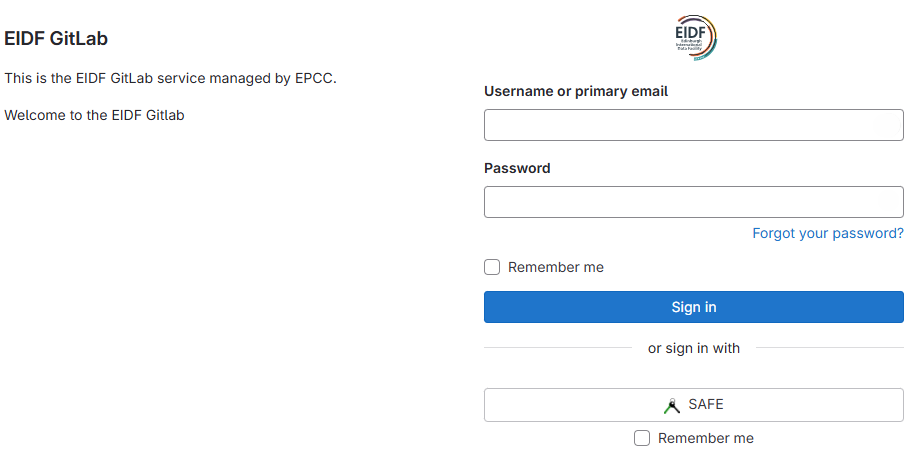
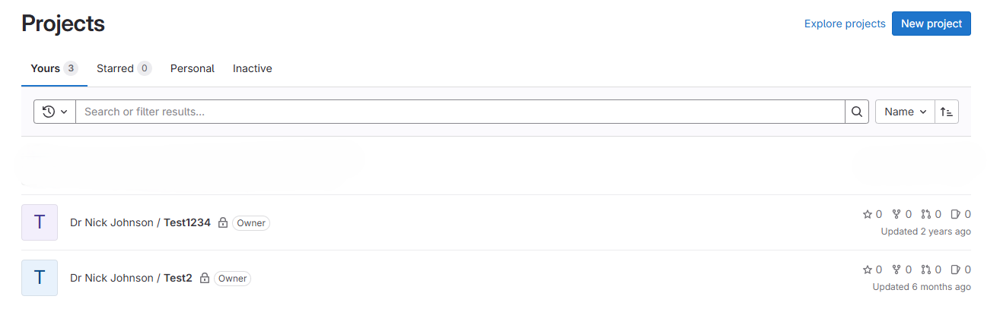
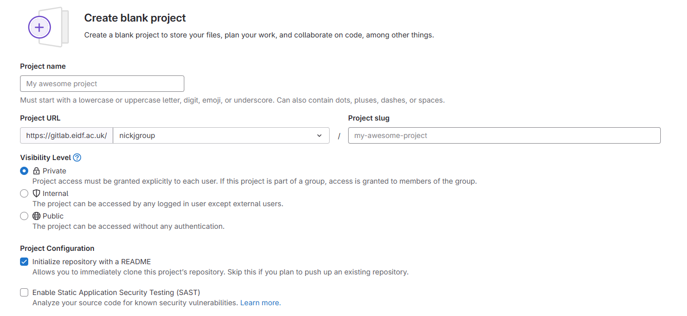
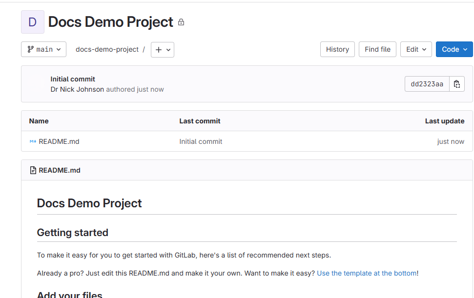
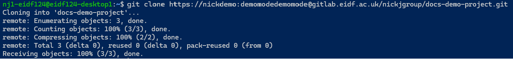

# Quickstart

## Accessing

Access the EIDF GitLab in your browser by opening [https://gitlab.eidf.ac.uk/](https://gitlab.eidf.ac.uk/). You must be a member of an active EIDF project and have a user account to use the EIDF GitLab Service.



Click on "Sign In with SAFE". You will be redirected to the SAFE login page to if you're not logged in already.

## Create New Project

You will be presented with the list of GitLab Projects you currently have access to. Click on "New Project" to create a project.



Selecting "Blank Project" will take to you the project creation screen. You can choose to change the project url to make the new project either a personal one or one owned by a GitLab group.



GitLab offers a variety of options for project, permission and access configurations. Please consult the [GitLab Documentation](https://docs.gitlab.com/ee/user/) for specifics.

## Clone repository via HTTPS

To clone a repository via HTTPS, click on the "Code" button to get the https-based url.



From the command line, you can clone this repository by adding your username and token into the URL between the `https://` and `@gitlab.eidf` parts of the url as shown. Your EIDF GitLab username can easily be found by clicking your profile image near the top left of any GitLab page. The username is the part below your name, without the `@` symbol.



## Clone repository via SSH

To clone a repository using git over SSH, click on the "Code" button to get the git+ssh URL. You will need to have added an SSH key to your account for this method to work.

For a more complete set of documentation relating to adding and using SSH keys with GitLab, see the upstream [GitLab Documentation](https://docs.gitlab.com/user/ssh/)

## CI/CD Examples

A repository containing some common GitLab CI/CD configurations and relevant examples is maintained at [GitLab CI/CD Examples](https://gitlab.eidf.ac.uk/Liz/cicd-examples)

## Building a Container Image with GitLab CI/CD

Automation of building of container images is possible using GitLab CI/CD in the default GitLab Instance runner

Images can be built from a docker file using [BuildKit](https://docs.docker.com/build/buildkit/). This requires users do the following:

### Harbor Integration and the ECIR (Recommended)

It is recommended that users setup Harbor Integration to use the EIDF Container Image Registry (ECIR) as the output location for built images. The ECIR is recommended as it is part of EIDF infrastructure and hence provides speed over external registries as well as a number of built in Security features such as SBOM and security scanning via Trivy.

We assume users have setup an ECIR project and Push Robot which are detailed in ECIR Working with sections [Creating a Project Repository](../registry/working-with.md#creating-a-project-repository) and [Creating Robot Accounts for the Registry](../registry/working-with.md#creating-robot-accounts-for-the-registry) respectively.

Users should follow the [GitLab documentation on Harbor Integration](https://docs.gitlab.com/user/project/integrations/harbor/), making note of the following values to be input:

- Harbor URL: `https://registry.eidf.ac.uk`
- Harbor Project Name: Typically the same as the EIDF project you are working in e.g. `eidf123`
- Username: The username of the Push Robot for your ECIR project, typically has a name like `eidf123-push-robot`
- Password: The secret key of the push robot

## Setting up the CI/CD Pipeline

Include a stage in the .gitlab-ci.yml using the following template, taking special note of replacing parts in `< >` and if not using Harbor integration ensuring the Environment Variables are set correctly:

```.gitlab-ci.yml
build-rootless:
  image:
    name: moby/buildkit:rootless
  stage: build
  variables:
    BUILDKITD_FLAGS: --oci-worker-no-process-sandbox
    REG_IMAGE: "$HARBOR_HOST/$HARBOR_PROJECT/<image-name>:$CI_COMMIT_SHA"
  before_script:
    - mkdir -p ~/.docker
    - echo "{\"auths\":{\"$HARBOR_HOST\":{\"username\":\"$HARBOR_USERNAME\" ,\"password\":\"$HARBOR_PASSWORD\"}}}" > ~/.docker/config.json
  script:
    - |
      buildctl-daemonless.sh build \
        --frontend dockerfile.v0 \
        --local context=. \
        --local dockerfile=<. or dockerfile path to use> \
        --output type=image,name=$REG_IMAGE,push=true
```

This will build an image using the specified dockerfile and push it to the specified registry. The template is lightly adapted from the GitLab documentation on [building and pushing Docker images with BuildKit](https://docs.gitlab.com/ee/ci/docker/using_docker_buildx.html#build-and-push-docker-images-with-buildkit) where more examples and details can be found.
