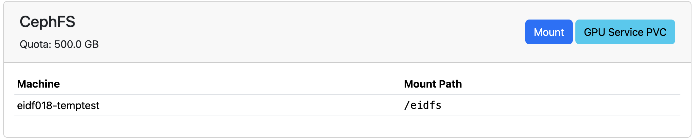
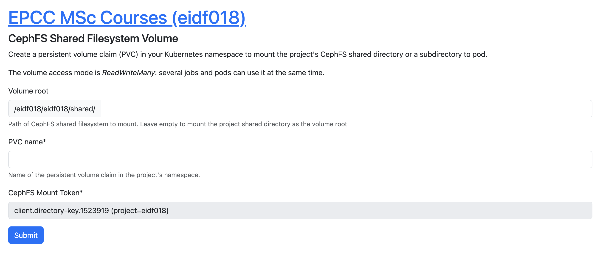
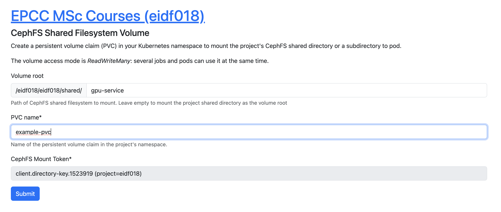

# Shared Filesystem (CephFS) PVCs

The Shared Filesystem (CephFS) allows multiple EIDF services to access the same file system for easier sharing of data and code.

For more information on the Shared Filesystem - please refer to [EIDF Storage Overview - Shared Filesystem (CephFS)](../../storage/overview.md#shared-filesystem-cephfs).

For how to use the Shared Filesystem on Virtual Machines - please refer to [EIDF Shared Filesystem (CephFS)](../virtualmachines/sharedfs.md).

## Accessing the Shared Filesystem (CephFS) on the GPU Service

To access directories in the shared filesystem, a project will need to create static persistent volumes which point to the Shared Filesystem. Creation of these static persistent volumes is done using the EIDF Portal.

!!! important "Portal Creation Operation Only"

    Users cannot create static volumes directly on the service - all static volumes must be created via the EIDF Portal

## Pre-requisites

To mount CephFS in your project namespace:

1. The project must have space allocated on CephFS.
1. A mount key must be created exist. PI's should contact the EIDF helpdesk to have this created.

!!! note
    It is useful to have the shared CephFS space mounted to at least one VM, for managing what directories are created and will be shared as static persistent volumes.

If the pre-requisites are met, PIs and PMs will be able to see the **GPU Service PVC** button under **CephFS Mounts** in the project management page in the EIDF portal.

   {: class="border-img"}
   *GPU Service PVC button displayed in project management page*

## Creating a Static Persistent Volume

To create a static persistent volume, click the **GPU Service PVC** button, the following form will appear:

   {: class="border-img"}
   *GPU Service PVC blank form displayed in portal*

The two parts that the PI or PM will need to complete are:

* Volume Root - this is how much of the shared directory is to be made visible to the GPU Service. If it is left blank, everything in the shared folder for the project will be visible. If there is a specific directory to be made visible, enter the path after shared.
* PVC Name - this is mandatory - this is how project users will be able to use the static persistent volume in their workloads.

!!! important "ReadWriteMany"

    These CephFS static persistent volumes are ReadWriteMany - this means that only one PVC is needed per volume root exposed in a project.

The following image shows an example of a completed static persistent volume form:

   {: class="border-img"}
   *GPU Service PVC Example form displayed in portal*

The filled in fields are as follows:

* Volume Root - a directory called gpu-service in the shared space will be the exposed path in the volume. This means the volume will only show the contents of that directory.
* PVC Name - a PVC called example-pvc will now be available for the project to use in its workloads.

## Using a Static Persistent Volume

Using a static PVC is the same as using a PVC created using `kubectl` with the standard storage class. Below is an example job to mount the PVC created in the last section. To adapt this to your project, update the user queue name and use your PVC name.

``` yaml
apiVersion: batch/v1
kind: Job
metadata:
  generateName: test-ceph-pvc-job-
  labels:
    kueue.x-k8s.io/queue-name: eidf018ns-user-queue
spec:
  completions: 1
  backoffLimit: 1
  ttlSecondsAfterFinished: 1800
  template:
    metadata:
      name: test-ceph-pvc-pod
    spec:
      containers:
      - name: pvcreader
        image: busybox
        args: ["sleep", "infinity"]
        resources:
          requests:
            cpu: 2
            memory: '1Gi'
          limits:
            cpu: 2
            memory: '4Gi'
        volumeMounts:
          - mountPath: /mnt/static
            name: volume
      restartPolicy: Never
      volumes:
        - name: volume
          persistentVolumeClaim:
            claimName: example-pvc
```

Users can work with the contents of the CephFS volume using a VM with the project CephFS filesystem mounted to it. More information on this is available at [EIDF Shared Filesystem (CephFS)](../virtualmachines/sharedfs.md).
