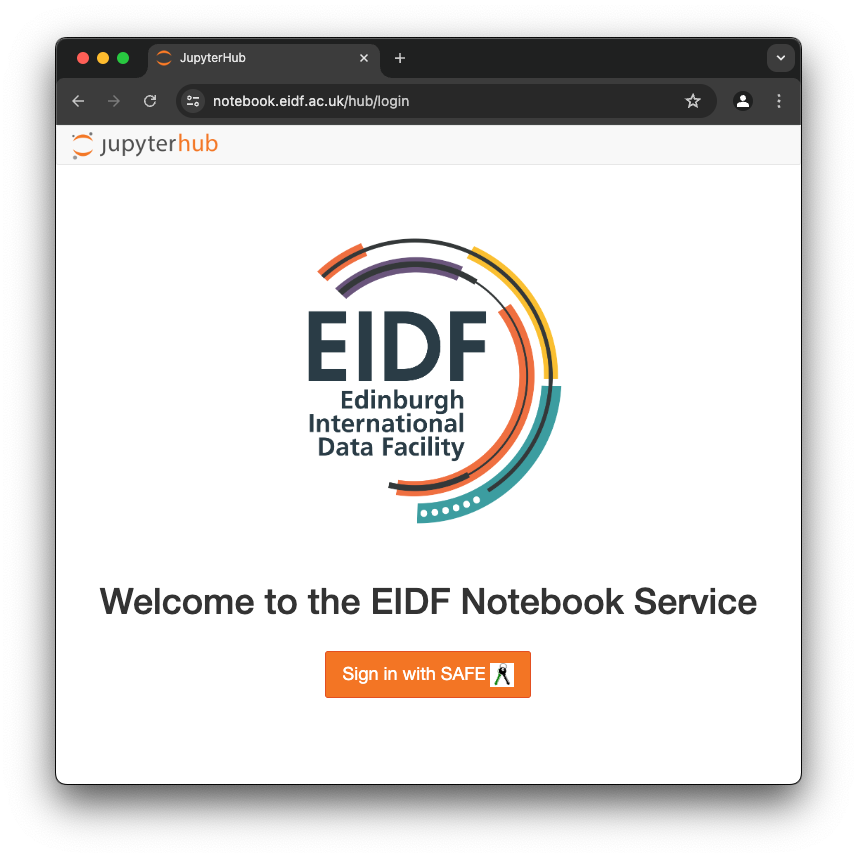

# Quickstart

## Accessing

Access the EIDF Notebooks in your browser by opening [https://notebook.eidf.ac.uk/](https://notebook.eidf.ac.uk/). You must be a member of an active EIDF project and have a user account to use the EIDF Notebook Service.



Click on "Sign In with SAFE". You will be redirected to the SAFE login page.

Log into the SAFE if you're not logged in already.
If you have more than one account you will be presented with the form "Approve Token" and a choice of user accounts for the Notebook Service.
This account is the user in your notebooks and you can share data with your DSC VMs within the same project.

Select the account you would like to use from the dropdown "User Account" at the end of the form. Then press "Accept" to return to the EIDF Notebook Service where you can select a server environment.


Select the environment that you would like to use for your notebooks and press "Start". Now your notebook container will be launched. This may take a little while.


## First Notebook

You will be presented with the JupyterLab dashboard view when the container has started.


The availability of launchers depends on the environment that you selected.

For example launch a Python 3 notebook or an R notebook from the dashboard. You can also launch a terminal session.

## Python packages

Note that Python packages are installed into the system space of your container by default.
However this means that they are not available after a restart of your notebook container which may happen when your session was idle for a while.
We recommend specifying `--user` to install packages into your user directory to preserve installations across sessions.

To install python packages in a notebook use the command:

```jupyter
!pip install <package> --user
```

or run the command in a terminal:

```bash
pip install <package> --user
```

## Data

If your project has a [CephFS](../../storage/overview.md#shared-filesystem-cephfs) allocation the project folder can be mounted to the Notebook Service. Here you can share data with other notebook users in your project, or to other EIDF services such as Virtual Desktops, GPU service, Cirrus and Cerebras.

In the notebook service, users only have access to their project's own CephFS directory. The read and write permissions in the CephFS project folder are those of the user that you selected when logging in to the Notebook service.

Once mounted, the project space is available at the path `/sharedfs` in your notebooks. Please contact the helpdesk if you would like your project space to be mounted.

## Limits

Note that there are limited amounts of memory and cores available per user. Users do not have sudo permissions in the containers so you cannot install any system packages.

Currently there is no access to GPUs. You can submit jobs to the EIDF GPU Service but you cannot run your notebooks on a GPU.
