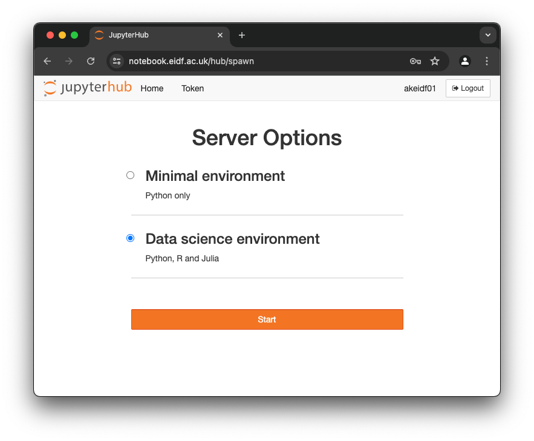
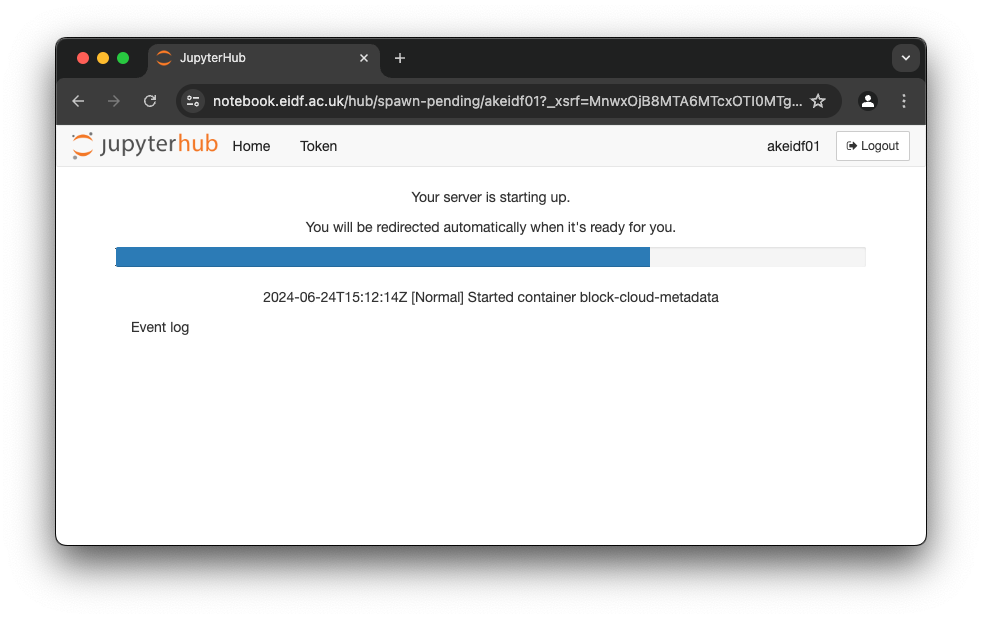

# Quickstart

## Accessing

Log in to the EIDF Notebook Service at [https://notebooks.eidf.ac.uk](https://notebooks.eidf.ac.uk).
Click on "Login with SAFE". You will be redirected to the SAFE login page.

Log into the SAFE if you're not logged in already.
If you have more than one account you will be presented with the form "Approve Token" and a choice of user accounts for the Notebook Service.
This account is the user in your notebooks and you can share data with your DSC VMs within the same project.

Select the account you would like to use from the dropdown "User Account" at the end of the form. Then press "Accept" to return to the EIDF Notebook Service where you can select a server environment.

Select the environment that you would like to use for your notebooks and press "Start". Now your notebook container will be started. This may take a little while.

## First Notebook

You will be presented with the JupyterLab dashboard view when the container has started.

The availability of launchers depends on the environment that you selected.

For example launch a Jupyter notebook to run a Python command or launch RStudio to execute an R script.

## Data

There is a project space mounted in `/project_data`. Here you can exchange data with other members of your project who are using the Notebook Service or a DSC VM. Please contact the helpdesk if you would like to mount this project space on one of your VMs.

## Limits

Note that there are limited amounts of memory and cores available per user and currently no GPUs. You can submit jobs to the EIDF GPU Service but your Jupyter notebooks do not have interactive access to a GPU.
