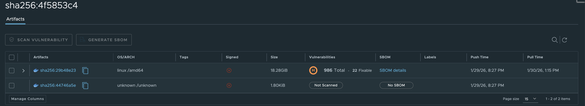

# FAQ

## Known Issues

### Unauthorised error when logging into the registry from Docker

If you have been logged in to the ECIR web UI for a long time (> 5 hours) and you attempt to login to the registry from Docker you may get an error of the form:

```bash
Error response from daemon: Get "https://registry.eidf.ac.uk/v2/": unauthorized:
```

This means the OAUTH token given to your account by the SAFE has expired, to rectify this you should logout from the ECIR web UI and then login again via the SAFE.

You can check the status of your SAFE OAUTH token by visiting [safe.epcc.ed.ac.uk/TransitionServlet/Tokens/](https://safe.epcc.ed.ac.uk/TransitionServlet/Tokens/).

### SBOM says no SBOM (A Missing SBOM)

If you see an image you have uploaded to the registry have no attached SBOM after it has been scanned, like this:

 {: class="border-img"}
   *Missing SBOM Output Report*

Then you will have to click the folder next to the artifact name.

This will open the information up for that artifact, like this:

 {: class="border-img"}
   *Found SBOM Output Report*

Some images when uploaded have additional elements packaged with them, and Harbor attaches the SBOM to the container image rather than the whole package.
