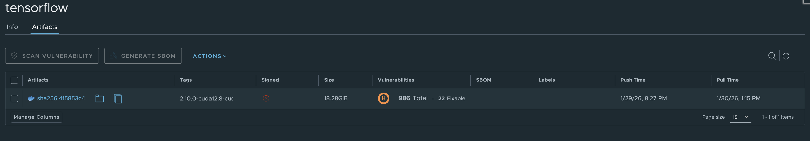
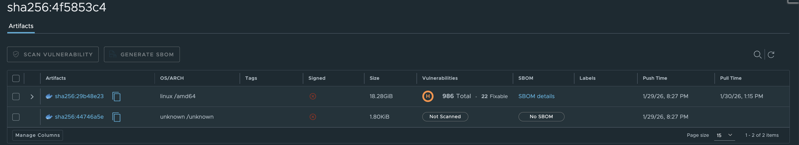

# FAQ about the EIDF Container Image Registry

## What credentials can I use for the registry in an automation?

To access the registry in an automation, you should create a robot account for your project. Robot accounts are service accounts that can be used to access the registry without needing to use your personal credentials. They are configured with specific permissions (e.g., pull-only, push-pull) and have a limited validity period for security purposes.

Instructions for using a robot account can be found in the [Working with the EIDF Container Image Registry](working-with.md#robot-accounts-for-automations-in-the-ecir) documentation.

## My Robot Account credentials have been compromised, what should I do?

If you believe your robot account credentials have been compromised, you should immediately refresh the robot account secret to invalidate the compromised secret. This can be done by a project PI or manager in the Image Registry section of your project. Instructions for refreshing the robot account secret can be found in the [Working with the Registry](working-with.md#robot-accounts-for-automations-in-the-ecir) documentation.

## Known Issues

### Unauthorised error when logging into the registry from Docker

If you have been logged in to the ECIR web UI for a long time (> 5 hours) and you attempt to login to the registry from Docker you may get an error of the form:

```bash
Error response from daemon: Get "https://registry.eidf.ac.uk/v2/": unauthorized:
```

This means the OAUTH token given to your account by the SAFE has expired, to rectify this you should logout from the ECIR web UI and then login again via the SAFE.

You can check the status of your SAFE OAUTH token by visiting [safe.epcc.ed.ac.uk/TransitionServlet/Tokens/](https://safe.epcc.ed.ac.uk/TransitionServlet/Tokens/).

### SBOM says no SBOM (A Missing SBOM)

If you see an image you have uploaded to the registry have no attached SBOM after it has been scanned, like this:

 {: class="border-img"}
   *Missing SBOM Output Report*

Then you will have to click the folder icon next to the artifact name.

This will open the information up for that artifact, like this:

 {: class="border-img"}
   *Found SBOM Output Report*

Some images when uploaded have additional elements packaged with them, and Harbor attaches the SBOM to the container image rather than the whole package.
