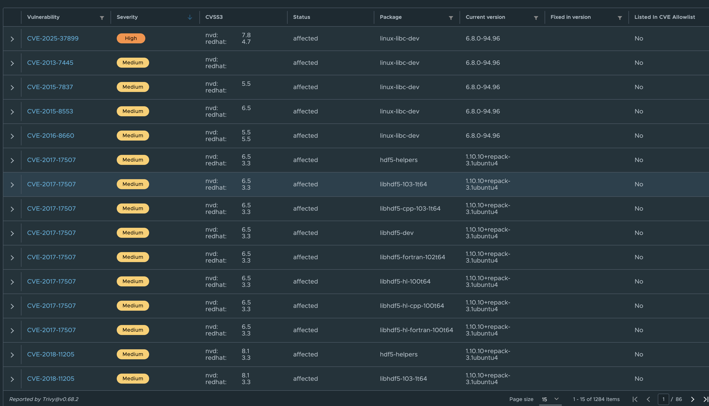
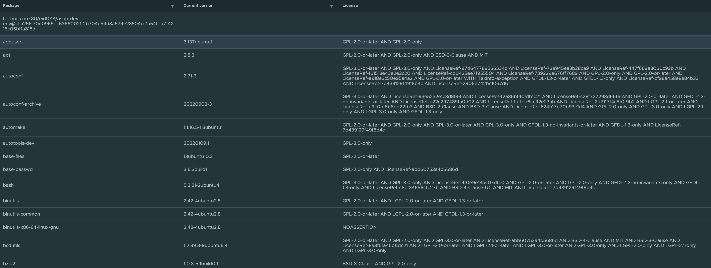

# Overview

EIDF Container Image Registry (ECIR) is an image registry for use in EIDF, EPCC and related services. ECIR uses [Harbor](https://goharbor.io) to provide services for image storage, vulnerability scanning and Software Bill of Materials (SBOM) generation.

## Projects and Public Caches on ECIR

ECIR provides projects with a private space on the service where a project can host multiple container image repositories.

ECIR hosts public cache projects for commonly used images. If you use an image which is commonly pulled from public repositories, using a cache copy can reduce the impact on public services.

Using ECIR for pulling and storing images should help with quick deployment and access control of images for projects. Reducing overhead of EIDF Services pulling repeatedly from external registries.

For information on what projects can use within an ECIR private space and Public Caches, see [ECIR Projects and Caches](./projects.md).

## Working with ECIR

For more information on how to work with ECIR, refer to [Working with ECIR](./working-with.md).

## Features

### Vulnerability scanning by Trivy

All images in the ECIR will be scanned by [Trivy](https://trivy.dev/latest/) by default. A vulnerability report will be available shortly after push to the repositories for all new or updated images.

The report will highlight fixable known issues.

!!! Danger "Not Foolproof"

    Just because Trivy indicates few or no vulnerabilities this does not mean the scanned image is free of security issues, Trivy can only scan for known issues and specific types of security problems.

Projects can request that images with vulnerabilities above a set level are not deployable from the ECIR. This can be set on a project level and through a Helpdesk Request on the [EIDF Portal](https://portal.eidf.ac.uk/queries/submit).

 {: class="border-img"}
   *Example Trivvy Output Report*

### Software Bill of Materials (SBOM)

SBOMs will be automatically generated on push to the ECIR and associated with an image. This will list what is in an image with its version and license information where possible. These can be downloaded for use in other tooling and distribution.

 {: class="border-img"}
   *Example SBOM Output Report*

## FAQ and Known Issues

The FAQ and known issues can be found in the [ECIR FAQ](faq.md).
