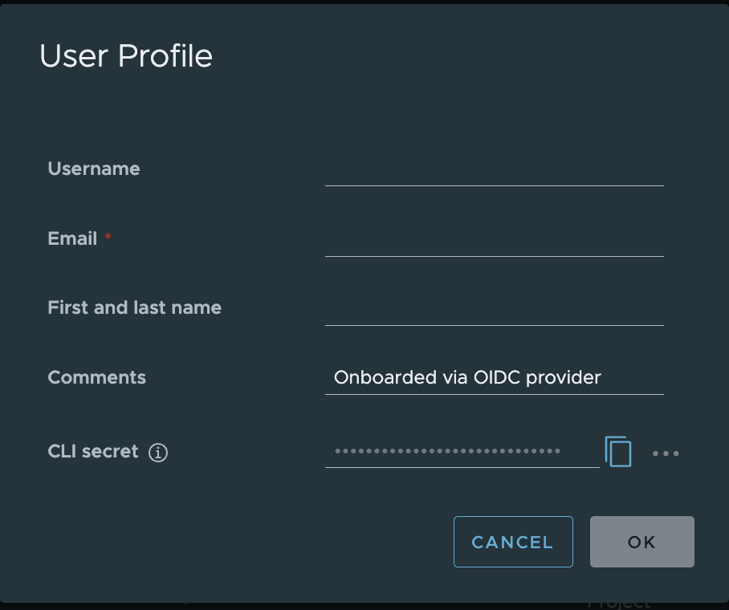
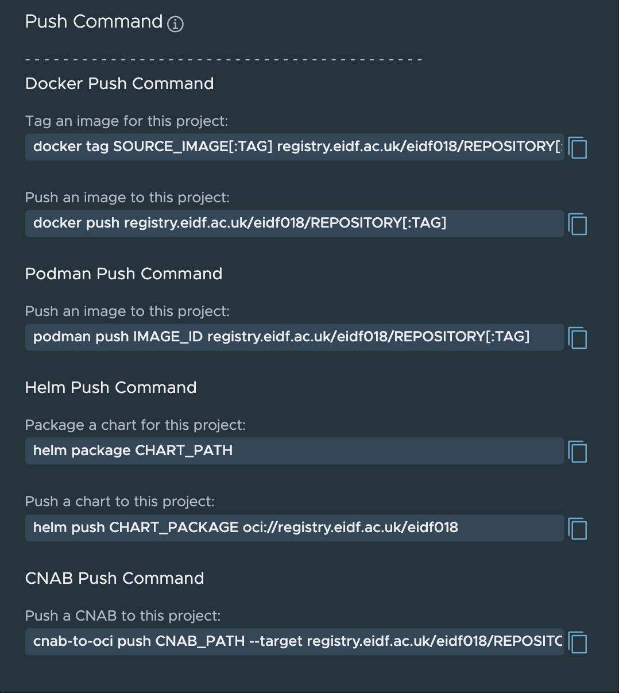

# Working with ECIR

## The Registry Interface and Accounts

EIDF Users can access the registry through their SAFE account.

The registry can be logged into at [https://registry.eidf.ac.uk](https://registry.eidf.ac.uk). If you are not logged into SAFE, the registry will redirect you to SAFE.

User tokens can be accessed from the User Profile from the dropdown under your Username at the top right hand corner of the page. These will be needed to log into the registry from Docker and other container services.

{: class="border-img"}
   *Example User Profile*

See the FAQ section ['Unauthorised' error when logging into the registry from Docker](./faq.md#unauthorised-error-when-logging-into-the-registry-from-docker) for help with token expiry and authorisation issues.

## Push Commands

In your project, there is a PUSH Command option which will give you the command templates for pushing to the Project repositories from different clients.

{: class="border-img"}
   *Example Push Command*

## Repositories

Each repository in a project has a COPY PULL button option once an image/artifact has been selected for Docker and Podman.

Clicking on a tag in a repository will open up the information on the artifact, this can include an overview of the image, vulnerability summary, SBOM and build history.

## Using from the Command Line with Docker

Important: Run these commands on a system that has Docker installed and has access to the ECIR.

To login to the registry from a Docker client, you should use the following:

```bash
docker login registry.eidf.ac.uk
```

If you have previously done this and the credentials are valid, then it will confirm your login.

If you have not logged in, the following prompt will appear:

```bash
Username:
```

You should enter the username (your SAFE preferred username) which appears in the User profile section of the Harbor, ECIR web interface.

```bash
Password:
```

You should copy the CLI Secret from the User Profile into this prompt.

The following should appear, unless you are using a credential helper, which will remove the warning.

```bash
WARNING! Your password will be stored unencrypted in <home directory>/.docker/config.json.
Configure a credential helper to remove this warning. See
https://docs.docker.com/engine/reference/commandline/login/#credentials-store

Login Succeeded
```

From your command line, you can now push and pull images to the registry.

## Kubernetes/GPU Service Access

To pull images from the registry, from private or authenticated projects, you will need to add a secret to the namespace you are using and reference it in your job definition. Note that user tokens have a limited validity period.

If you are regularly using a repository from a project where you are sharing resources, it is recommended to create a robot account with limited read only privileges, this can be requested via a Helpdesk Request for your project.

!!! important "Portal Management"

    There will be new functionality soon added to the EIDF Portal to allow for project users to create read only robot accounts and for PI/Managers to create read/write robot accounts for use in CI/CD pipelines for image building.

This is then treated like a normal user secret when you have the robot credentials.

Secrets can be created in one of two ways, as detailed below, either directly via kubectl from your Docker config.json file, or by creating a YAML file.

More details on Kubernetes secrets can be found in the [Kubernetes documentation](https://kubernetes.io/docs/concepts/configuration/secret/).

### Secret Creation via Docker config.json

!!! Tip
    This section requires that you have logged into ECIR via Docker as described in *[Using from the command line with Docker](#using-from-the-command-line-with-docker)*. It also requires that kubectl is installed.

Running the following command will create a secret `<secret-name>` in your project namespace. This can be used by Kubernetes to pull from your private repositories.

The secret that is created will bundle together authentication information in the passed-in Docker config.json file.

If you have logged in to other registries the bundled secret will include authentications from these registries e.g., DockerHub and the GitHub Container Registry. See the documentation for more details on [Kubernetes secret creation](https://kubernetes.io/docs/reference/kubectl/generated/kubectl_create/kubectl_create_secret_generic/).

```bash
kubectl create secret generic <secret-name> \
    --from-file=.dockerconfigjson=<path/to/.docker/config.json> \
    --type=kubernetes.io/dockerconfigjson -n <your namespace>
```

!!! warning
    Usage of `~` to denote your home directory in the above command does not work.

You can view details of the new secret by running:

```bash
kubectl describe secret <secret-name> -n <your namespace>
```

### Secret Creation via YAML

Important: Run these commands on a system that has kubectl installed and has access to the ECIR.

You do not need to be logged in to Docker to perform this setup, we manually encode our details and pass it to YAML.

Encode your authorisation information into base64 for inclusion in the Kubernetes secret. The CLI Secret value is taken from your User profile in the registry web interface.

{: class="border-img"}
   *User Profile*

```bash
echo '{"auths":{"https://registry.eidf.ac.uk":{"username":"<your username>","password":"<your CLI Secret>"}}}' | base64
```

This will generate a string of characters, it may have line breaks on output, and for the next part, you can remove the line breaks and make it a single line.

```bash
eyJhdXRocyI6eyJodHRwczovL3JlZ2lzdHJ5LmVpZGYuYWMudWsiOnsidXNlcm5hbWUiOiJyb2Jv
dCR0ZXN0X2xpYnJhcnkrZ3B1X2RlZmF1bHQiLCJwYXNzd29yZCI6InZrakRHRzNwSG9lTVc0bEtp
THRTZGt3ZXdlcVlpRDFxc1RPT2cifX19Cg==
```

Create a YAML File with the following information:

```bash
apiVersion: v1
kind: Secret
metadata:
  name: <secret-name>
  namespace: <your project namespace>
type: kubernetes.io/dockerconfigjson
data:
  .dockerconfigjson: >-
     <the output from the encoding process>
```

For example:

```bash
apiVersion: v1
kind: Secret
metadata:
  name: eidfreg
  namespace: eidf000ns
type: kubernetes.io/dockerconfigjson
data:
  .dockerconfigjson: >-
    eyJhdXRocyI6eyJodHRwczovL3JlZ2lzdHJ5LmVpZGYuYWMudWsiOnsidXNlcm5hbWUiOiJyb2JvdCR0ZXN0X2xpYnJhcnkrZ3B1X2RlZmF1bHQiLCJwYXNzd29yZCI6InZrakRHRzNwSG9lTVc0bEtpTHRTZGt3ZXdlcVlpRDFxc1RPT2cifX19Cg==
```

To create the secret run:

```bash
kubectl apply -f <your filename> -n <your namespace>
```

### Using in a Job

Use the image name from the pull command for the repository. For example, this could be `registry.eidf.ac.uk/nvidia-cache/nvidia/k8s/cuda-sample:nbody`, the ECIR cached version of the [NVIDIA sample](https://catalog.ngc.nvidia.com/orgs/nvidia/teams/k8s/containers/cuda-sample): `nvcr.io/nvidia/k8s/cuda-sample:nbody`.

This is an example using an image and secret to access the registry. Replace the appropriate values with your own configuration.

The below example will function without a secret as the image is in a public repository.

``` yaml
apiVersion: batch/v1
kind: Job
metadata:
  generateName: jobtest-
  labels:
    kueue.x-k8s.io/queue-name: <project-namespace>-user-queue
spec:
  completions: 1
  template:
    metadata:
      name: job-test
    spec:
      containers:
        - name: cudasample
          image: registry.eidf.ac.uk/nvidia-cache/nvidia/k8s/cuda-sample:nbody
          args:
            - '-benchmark'
            - '-numbodies=512000'
            - '-fp64'
            - '-fullscreen'
          resources:
            requests:
              cpu: 2
              memory: 1Gi
            limits:
              cpu: 2
              memory: 4Gi
              nvidia.com/gpu: 1
      restartPolicy: Never
      imagePullSecrets:
        - name: <secret-name>
```
