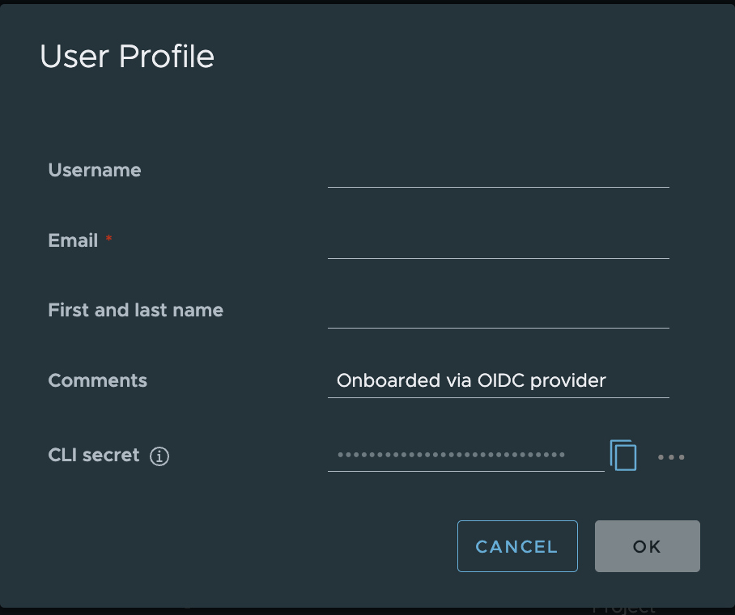
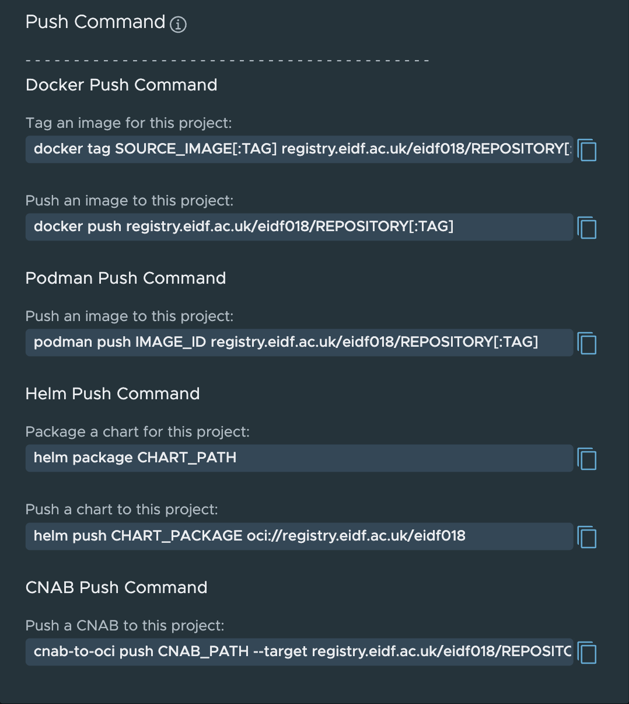

# Working with ECIR

## The Registry Interface and Accounts

EIDF Users can access the registry through their SAFE account.

The registry can be logged into at [https://registry.eidf.ac.uk](https://registry.eidf.ac.uk). If you are not logged into SAFE, the registry will redirect you to SAFE.

User tokens can be accessed from the User Profile from the dropdown under your Username at the top right hand corner of the page. These will be needed to log into the registry from Docker and other container services.

{: class="border-img"}
   *Example User Profile*

See the FAQ section ['Unauthorised' error when logging into the registry from Docker](./faq.md#unauthorised-error-when-logging-into-the-registry-from-docker) for help with token expiry and authorisation issues.

## Creating a Project Repository

Each EIDF project can have a private space on the registry, this is called an Edinburgh Container Image Registry (ECIR) project. An ECIR project can be used to store images and artifacts that are private to the project.

By default new EIDF projects will have an ECIR project created with the same name. If you have an existing project without a registry project, you can request one by contacting the EIDF Service Desk.

## Push Commands

In your project, there is a PUSH Command option which will give you the command templates for pushing to the Project repositories from different clients.

{: class="border-img"}
   *Example Push Command*

## Repositories

Each repository in a project has a COPY PULL button option once an image/artifact has been selected for Docker and Podman.

Clicking on a tag in a repository will open up the information on the artifact, this can include an overview of the image, vulnerability summary, SBOM and build history.

## Robot Accounts for Automations in the ECIR

If you are regularly using a repository from a project where you are sharing resources and need automated, read-only access (for example, pulling images into compute jobs), it is recommended to create a robot account with limited pull-only privileges.

If you also need to publish images (for example, as part of an automated build or CI/CD pipeline), you should instead create a robot account with pull and push (read and write) permissions for the project.

!!! Note

    Project Robot account management is only available to PIs and project administrators. If you are not a PI or project administrator, please contact your PI to request a robot account.

### Creating Robot Accounts for the Registry

Robot accounts can be added by a project administrator as follows:

!!! Note
  
    Only available in the new project interface. If you are using the old project interface, please select "Try new view" in the top right corner of the project page.

1. Navigate to the Image Registry section of your project
1. Select "Add Pull Only Token" or "Add Pull and Push Token" depending on your needs as described above
1. A form will appear which allows you to trigger creation of the robot account, progress of which will be shown in the Image Registry section of your project. You will not be able to add, delete or refresh robot secrets whilst this action is in progress.
1. Once the robot account has been created, you will be able to view the robot account and its secret in the Image Registry section of your project. The secret will be visible whenever you return to this page.

### Refreshing the Token of Robot Accounts

!!! Note
  
    Only available in the new project interface. If you are using the old project interface, please select "Try new view" in the top right corner of the project page.

Robot accounts with pull and push permissions have a default validity period of 30 days after which they will expire and need to be renewed. This is to ensure that access is regularly reviewed and maintained. Should the robot account's credentials be compromised the secret can be refreshed to invalidate the compromised secret preventing its use.

When a robot push pull account is created, it will have a default validity period of 30 days. The expiry date of the robot account is shown in the Image Registry section of a project. When the robot account expires the date will be displayed in red. On expiry the existing robot account's secret will be invalidated and the robot account will need to be refreshed to continue use.

The robot account can be refreshed by a project PI or manager by selecting the "Refresh" button next to the robot account. When the robot account is refreshed a job will run to create a new secret for the robot account. If the robot account is refreshed before the expiry date, the existing secret will be invalidated and only the new secret will be usable to authenticate the robot account to the registry. After the job has completed the new secret will be displayed and the expiry date will be updated. The new secret will need to be used in any jobs or scripts that use the robot account to access the registry.

### Deleting a Robot Account

If a robot account is no longer required it should be deleted to reduce the risk of unauthorised access to your Harbor project.

!!! Note
  
    Only available in the new project interface. If you are using the old project interface, please select "Try new view" in the top right corner of the project page.

 A robot account can be deleted by a project PI or manager by selecting the "Delete" button next to the robot account. When a robot account is deleted, it will no longer be able to access the registry and any existing secrets will be invalidated. If a robot account is deleted in error, a new robot account can be created to replace it.

## Using from the Command Line with Docker

Important: Run these commands on a system that has Docker installed and has access to the ECIR.

To login to the registry from a Docker client, you should use the following:

```bash
docker login registry.eidf.ac.uk
```

If you have previously done this and the credentials are valid, then it will confirm your login.

If you have not logged in, the following prompt will appear:

```bash
Username:
```

You should enter the username (your SAFE preferred username) which appears in the User profile section of the Harbor, ECIR web interface.

```bash
Password:
```

You should copy the CLI Secret from the User Profile into this prompt.

The following should appear, unless you are using a credential helper, which will remove the warning.

```bash
WARNING! Your password will be stored unencrypted in <home directory>/.docker/config.json.
Configure a credential helper to remove this warning. See
https://docs.docker.com/engine/reference/commandline/login/#credentials-store

Login Succeeded
```

To pull images from the registry, from private or authenticated projects, you will need to add a secret to the namespace you are using and reference it in your job definition. Note that user tokens have a limited validity period and therefore, robot accounts are recommended for long-term use. See the section on [Creating a Robot Account](#creating-robot-accounts-for-the-registry) for more details.
From your command line, you can now push and pull images to the registry.

## Kubernetes/GPU Service Access

To pull images from the registry, from private or authenticated projects, you will need to add a secret to the namespace you are using and reference it in your job definition. Note that user tokens have a limited validity period and hence robots are recommended for long term use. See the section on [Creating a Robot Account](#creating-robot-accounts-for-the-registry) for more details.

Secrets can be created in one of two ways, as detailed below, either directly via kubectl from your Docker config.json file, or by creating a YAML file.

More details on Kubernetes secrets can be found in the [Kubernetes documentation](https://kubernetes.io/docs/concepts/configuration/secret/).

### Secret Creation via Docker config.json

!!! Tip
    This section requires that you have logged into ECIR via Docker as described in *[Using from the command line with Docker](#using-from-the-command-line-with-docker)*. It also requires that kubectl is installed.

Running the following command will create a secret `<secret-name>` in your project namespace. This can be used by Kubernetes to pull from your private repositories.

The secret that is created will bundle together authentication information in the passed-in Docker config.json file.

If you have logged in to other registries the bundled secret will include authentications from these registries e.g., DockerHub and the GitHub Container Registry. See the documentation for more details on [Kubernetes secret creation](https://kubernetes.io/docs/reference/kubectl/generated/kubectl_create/kubectl_create_secret_generic/).

```bash
kubectl create secret generic <secret-name> \
    --from-file=.dockerconfigjson=<path/to/.docker/config.json> \
    --type=kubernetes.io/dockerconfigjson -n <your namespace>
```

!!! warning
    Usage of `~` to denote your home directory in the above command does not work.

You can view details of the new secret by running:

```bash
kubectl describe secret <secret-name> -n <your namespace>
```

### Secret Creation via YAML

Important: Run these commands on a system that has kubectl installed and has access to the ECIR.

You do not need to be logged in to Docker to perform this setup, we manually encode our details and pass it to YAML.

Encode your authorisation information into base64 for inclusion in the Kubernetes secret. The CLI Secret value is taken from your User profile in the registry web interface.

{: class="border-img"}
   *User Profile*

```bash
echo '{"auths":{"https://registry.eidf.ac.uk":{"username":"<your username>","password":"<your CLI Secret>"}}}' | base64
```

This will generate a string of characters, it may have line breaks on output, and for the next part, you can remove the line breaks and make it a single line.

```bash
eyJhdXRocyI6eyJodHRwczovL3JlZ2lzdHJ5LmVpZGYuYWMudWsiOnsidXNlcm5hbWUiOiJyb2Jv
dCR0ZXN0X2xpYnJhcnkrZ3B1X2RlZmF1bHQiLCJwYXNzd29yZCI6InZrakRHRzNwSG9lTVc0bEtp
THRTZGt3ZXdlcVlpRDFxc1RPT2cifX19Cg==
```

Create a YAML File with the following information:

```bash
apiVersion: v1
kind: Secret
metadata:
  name: <secret-name>
  namespace: <your project namespace>
type: kubernetes.io/dockerconfigjson
data:
  .dockerconfigjson: >-
     <the output from the encoding process>
```

For example:

```bash
apiVersion: v1
kind: Secret
metadata:
  name: eidfreg
  namespace: eidf000ns
type: kubernetes.io/dockerconfigjson
data:
  .dockerconfigjson: >-
    eyJhdXRocyI6eyJodHRwczovL3JlZ2lzdHJ5LmVpZGYuYWMudWsiOnsidXNlcm5hbWUiOiJyb2JvdCR0ZXN0X2xpYnJhcnkrZ3B1X2RlZmF1bHQiLCJwYXNzd29yZCI6InZrakRHRzNwSG9lTVc0bEtpTHRTZGt3ZXdlcVlpRDFxc1RPT2cifX19Cg==
```

To create the secret run:

```bash
kubectl apply -f <your filename> -n <your namespace>
```

### Using in a Job

Use the image name from the pull command for the repository. For example, this could be `registry.eidf.ac.uk/nvidia-cache/nvidia/k8s/cuda-sample:nbody`, the ECIR cached version of the [NVIDIA sample](https://catalog.ngc.nvidia.com/orgs/nvidia/teams/k8s/containers/cuda-sample): `nvcr.io/nvidia/k8s/cuda-sample:nbody`.

This is an example using an image and secret to access the registry. Replace the appropriate values with your own configuration.

The below example will function without a secret as the image is in a public repository.

``` yaml
apiVersion: batch/v1
kind: Job
metadata:
  generateName: jobtest-
  labels:
    kueue.x-k8s.io/queue-name: <project-namespace>-user-queue
spec:
  completions: 1
  template:
    metadata:
      name: job-test
    spec:
      containers:
        - name: cudasample
          image: registry.eidf.ac.uk/nvidia-cache/nvidia/k8s/cuda-sample:nbody
          args:
            - '-benchmark'
            - '-numbodies=512000'
            - '-fp64'
            - '-fullscreen'
          resources:
            requests:
              cpu: 2
              memory: 1Gi
            limits:
              cpu: 2
              memory: 4Gi
              nvidia.com/gpu: 1
      restartPolicy: Never
      imagePullSecrets:
        - name: <secret-name>
```
