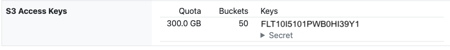

# Overview

The EIDF S3 Service is an object store that offers an interface that is compatible with a subset of the Amazon [Simple Storage Service (S3)](https://docs.aws.amazon.com/s3/) RESTful [S3 API](https://docs.aws.amazon.com/AmazonS3/latest/API).

The EIDF S3 Service is directly accessible from the [EIDF Virtual Machine (VM) Service](../virtualmachines), the [EIDF GPU Service](../gpuservice/index.md) and the [EIDF Ultra2 Service](../ultra2/index.md).

The EIDF S3 Service is also accessible from anywhere in the world via S3-compatible workflows.

## Service Access

To access the EIDF S3 Service, you need to have an EIDF account as described in [EIDF Accounts](../../access/project.md).

Project leads can request an EIDF S3 Service object store allocation for a project via the [EIDF Helpdesk](https://portal.eidf.ac.uk/queries/submit).

## Information required to use the EIDF S3 Service

The EIDF S3 Service endpoint is https://s3.eidf.ac.uk.

To view S3 account names, access keys, secrets, and storage and bucket quotas:

1. On the [Your Projects](https://portal.eidf.ac.uk/project/) page within the EIDF Portal, click your project.
1. Your selected project's page will appear.
1. If using the portal's new project view, click **Your S3 Keys**.
1. The 'S3 Access Keys' section will show a table where each row shoes:
    * **Name**: S3 account name.
    * **Quota**: Maximum amount of storage available to the account.
    * **Buckets**: Maximum number of buckets allowed for the account.
    * **Keys**: Access keys associated with this account, and, via the **Secret** drop-down menu, each key's associated secret.

{: class="border-img"}

!!! Note "S3 access keys and permissions"

    You will only see those access keys, and associated S3 accounts, which your project lead has granted you permission to view.

    If you are a project lead, then you will see all the access keys, for all S3 accounts, for your project.

## Further information

[Tutorial](./tutorial.md): A hands-on introduction to S3 and the EIDF S3 Service.

[Using the EIDF S3 Browser](./s3browser.md): A guide to using the [EIDF S3 Browser](https://portal.eidf.ac.uk/project/s3browser/) which is part of the [EIDF S3 Service](./index.md) and offers a web-based user interface within the EIDF Portal for creating and managing buckets and uploading, downloading and deleting files.

[Manage EIDF S3 Service access](./manage.md): A guide for project leads on requests for EIDF S3 Service object store allocations and management of accounts and access permissions for these allocations.

Amazon [Simple Storage Service (S3)](https://docs.aws.amazon.com/AmazonS3/latest/userguide/Welcome.html): Amazon's own S3 documentation.
