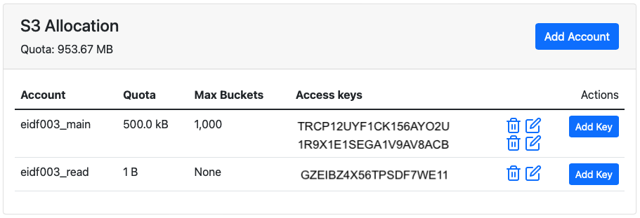

# Manage EIDF S3 Service access

Management of EIDF S3 Service object store allocations, accounts and access permissions is done by project leads.

## Request an S3 allocation

An object store allocation is the storage allocated within the EIDF S3 Service for a specific project.

You can request an EIDF S3 Service object store allocation for your project via the [EIDF Helpdesk](https://portal.eidf.ac.uk/queries/submit).

## Object store accounts

Each S3 bucket, and objects within that bucket, within an object store allocation are owned by an S3 object store account (hereon called an S3 account). S3 accounts can be created by project leads.

Each S3 account has a quota for the maximum storage available to it. The sum of all account quotas is limited by the total storage quota of the object store allocation for the project.

Each S3 account also has a quota for the maximum number of buckets that are allowed for the account.

## View and manage an S3 allocation and accounts

You can view and manage your project's S3 allocation and accounts via the [EIDF Portal](https://portal.eidf.ac.uk/):

1. On the EIDF portal's [Your Projects](https://portal.eidf.ac.uk/project/) page, click your project.
1. Your select project's page will appear.
1. If using portal's default project view, view 'S3 Allocation', else, if using the portal's new project view, click 'S3 Object Storage'.
1. The 'S3 Allocation' (default portal view) or 'S3 Object Storage' (new portal view) section will show the following:
    * **Quota**: Project's object store allocation (portal's default view only).
    * **Accounts allocation**: Project's object store allocation and current usage (portal's new project view only).
    * For each S3 account:
        * **Name**: S3 account name.
        * **Quota**: Maximum amount of storage available to the account.
        * **Max Buckets**: Maximum number of buckets allowed for the account.
        * **Access Keys**: Access keys associated with this account.

{: class="border-img"}

### Create an S3 account

To create an S3 account, within the 'S3 Allocation' (default portal view) or 'S3 Object Storage' (new portal view) section:

1. Click **Add Account** (default project view) or **Create Account** (new project view).
1. Enter:
    * **Account name**: Only letters, numbers, and underscore `_`, are allowed.
    * **Display Name**: Alternative name for display. Spaces are allowed.
    * **Maximum number of buckets allowed**: Select:
        * **None**: If selected, then this account cannot have any buckets.
        * **Unlimited**
        * **Or choose a limit:** If selected, enter the number of buckets in **Number of buckets**.
    * **Quota**: Maximum amount of storage available to this account. Enter both a number and a unit B, kB, MiB (MB), GiB (GB), or TiB (TB). The minimum quota is 1B (1 Byte).
1. Click **Create Account**.

The account will be created along with an access key and associated secret.

!!! Warning "Account quotas and project S3 storage quota"

    You cannot create an account with a quota greater than the project's total S3 storage quota.

It may take a little while for the account to become available.

Refresh the project page to update the list of accounts.

!!! Tip "Using S3 accounts that cannot create buckets for collaboration"

    One could create an S3 account that has the maximum number of buckets set to zero, and with a minimum storage quota of 1B, and so cannot create any buckets. Such an account cannot be used to create buckets for your project. Why might this be useful?

    One scenario is for collaboration with another project which also has buckets hosted within the EIDF S3 Service. Rather than your collaborator giving you an access key and secret, you, instead, give them the name of your S3 account, one that you have created for this purpose only.

    Your collaborator can then apply an S3 policy to one of their buckets to grant your S3 account access to their bucket, for example to read files from or write files to their bucket. You would interact with their bucket using your access key for the S3 account.

    To revoke your access, the collaborator can change their bucket's policy.

    Within your own project, project members who given permission to view the access keys of this S3 account but no others, can interact with your collaborator's bucket but not create any buckets within your own project.

## Access keys

To use the EIDF S3 service, users need an access key and a secret. An S3 account can have zero or more access keys, each with an associated secret.

Buckets created and files uploaded by a user are constrained by maximum number of buckets and maximum amount of storage available to the S3 account associated with the access key used by the user.

### Create an access key and secret

To create an access key for an S3 account, within the 'S3 Allocation' (default portal view) or 'S3 Object Storage' (new portal view) section:

1. Click **Add Key** in the account's table row.
1. An 'Add Access Key' page will appear.
1. Click **Create Access Key**.

The access key will be created along with an associated secret

It may take a little while for the account to become available.

Refresh the project page to update the list of access keys.

### Set access key permissions

You can control which project members are allowed to view each access key and secret within the EIDF Portal.

To grant view permissions for an access key to a project member, within the 'S3 Allocation' (default portal view) or 'S3 Object Storage' (new portal view) section:
 
1. Click on the **Edit** icon next to the key.
1. Select the project members that will have view permissions for this access key.
1. Click **Update Permissions**.

It can take a little while for the permissions update to complete.

!!! Warning "View permissions do not constrain access key and secret usage"

    Anyone who knows an access key and secret will be able to use these with an S3 client to interact with the EIDF S3 Service, regardless of the view permissions on the access key. These permissions apply to the EIDF Portal only.

### Delete an access key

To delete an access key, within the 'S3 Allocation' (default portal view) or 'S3 Object Storage' (new portal view) section:

1. Click on the "bin" icon next to a key.
1. A 'Delete Access Key' dialog will appear.
1. Click **Delete**.
