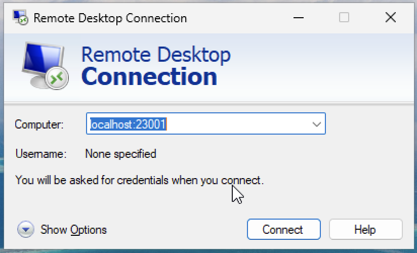
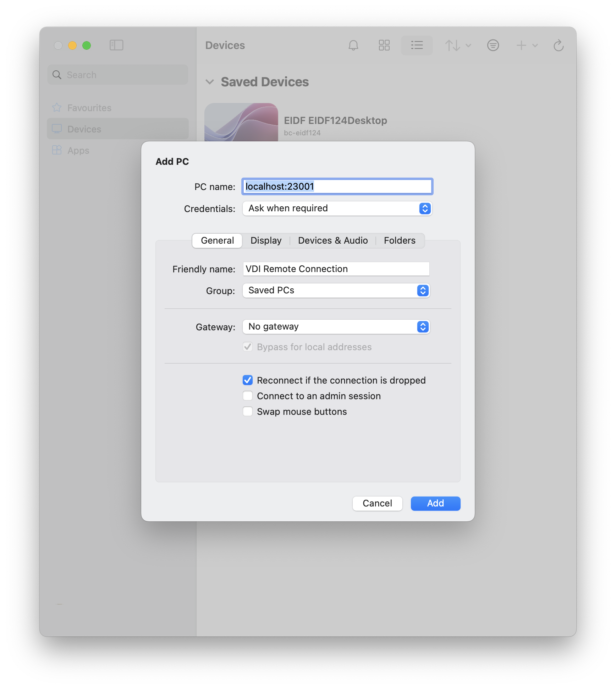
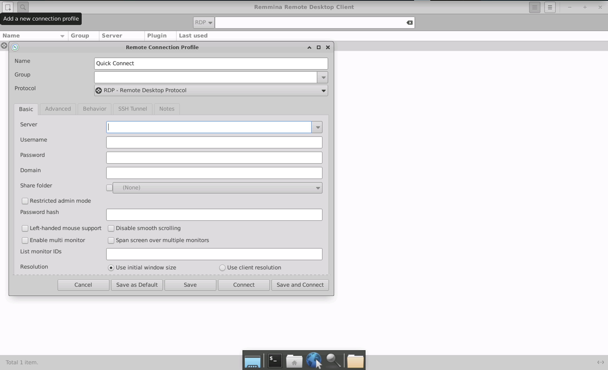
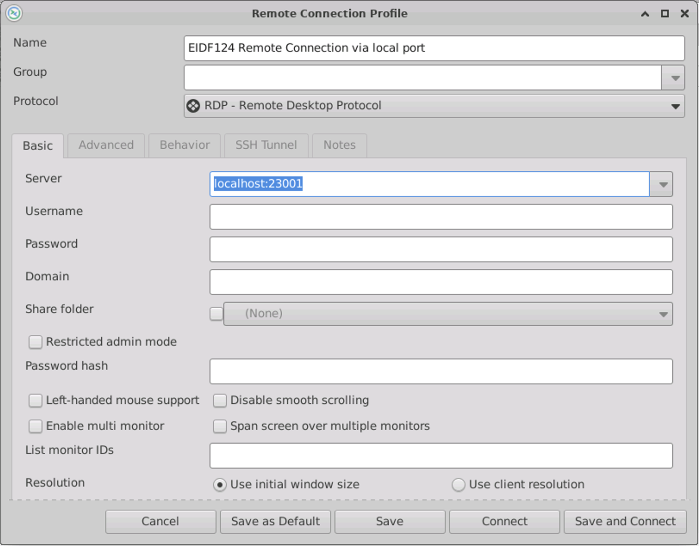

# RDP tunnelling over SSH

RDP tunneling is a technique that relies on SSH to create a secure channel that forwards local traffic to a remote server's RDP port. The content of the local traffic in RDP tunneling includes:

- User Input: Keyboard and mouse actions.
- Display Data: Screen updates and graphical interface data.
- Clipboard Contents: Text or files copied and pasted between the local and remote systems.
- File Transfers: Transferred files if drive redirection is enabled.

By setting up an SSH tunnel, a local port is forwarded to the remote server's RDP port (3389). The RDP client is then connected to `localhost:<local_port>`, ensuring that the RDP session is encrypted.

## SSH Commands

### Steps

1. Jump host (-J): connect first to the eidf_gateway as an intermediary before reaching the target VM. Authentication is achieved using the identity file provided by the host (-i).
1. Local Port Forwarding (-L): Forwards local port 12345 to localhost:3389 on the remote machine, allowing RDP access via localhost:12345.
1. Configure a RDP client (for example 'Windows App') to connect to `localhost:<local_forwarded_port>` instead of directly accessing the remote machine's IP. Then connect on the remote server as 'username'.

### Example

Connect to eidf666 (IP address 10.24.2.224) as user u666

```sh
ssh -J u666@eidf-gateway.epcc.ed.ac.uk -L 23001:localhost:3389 u666@10.24.2.224
```

Defaults like PubkeyAuthentication=yes, PasswordAuthentication=yes, ForwardAgent=yes, ForwardX11=yes, and ForwardX11Trusted=yes are omitted.

Once the connection is established, on Windows App or similar use pc name: `localhost:23001`. When prompted, the username will be 'u666' with corresponding password.

### SSH Configuration

All of the above can also be achieved adding the following to the SSH `.config` file:

```sh
host eidf666_gateway
    Hostname eidf-gateway.epcc.ed.ac.uk
    User u666
    IdentityFile ~/.ssh/eidf666-vm

host eidf666_rdp
    Hostname 10.24.2.224
    User u666
    PubKeyAuthentication yes
    PasswordAuthentication yes
    IdentityFile ~/.ssh/eidf666-vm
    ProxyJump eidf666_gateway
    ServerAliveInterval 900
    ForwardAgent yes
    ForwardX11 yes
    ForwardX11Trusted yes
    LocalForward 23001 localhost:3389
```

Can then use the command 'ssh eidf666_rdp' to create the connection.

## Using RDP Tunnelling to connect to VMs Remote Desktops via a RDP client

The Guacamole web interface makes it easy to connect to a remote desktop. This page details how to connect with a dedicated remote desktop client application, which can be useful for longer work. Dedicated remote desktop viewer programs allow better support for copy and pasting, file sharing and other features that may not be available on the web interface.

!!! warning "Prerequisites"
     It is recommended to connect to the host machine via Guacamole **first** as this process is simpler see instructions in [Virtual Machines (VMs) and the EIDF Virtual Desktop Interface (VDI)](../../access/virtualmachines-vdi.md)

We refer to a **Host** machine as the machine with an RDP server running on it, within EIDF infrastructure this is the Virtual machine.

The **Client** machine is any machine that you are using to connect to the host machine via the RDP protocol and remote desktop viewing software.

!!! warning
     Opening a remote connection means having full access to the host machines as though it was unlocked on your desk. You should not provide access credentials to other users you would not want using the machine or leave your client machine unattended and unlocked whilst connected as this risks the EIDF Virtual Machine being accessed by unauthorized users!

Using RDP tunnelling allows you to connect to a remote desktop machine securely through an SSH tunnel. This is particularly useful when accessing Virtual Desktop Infrastructure (VDI) machines on the EIDF.

!!! note
     Port forwarding is needed to get through the EIDF gateway. Whilst some remote desktop viewers support gateways they do not always support all the required features for connection to the EIDF gateway (e.g. the Windows app for macOS does not support SSH keys)

Instructions specific to the operating system in use are given in the below sections. If you have your own preferred remote desktop viewing software or cannot use the below instructions for whatever reason then the key details to be configured are:

```text
PC or server name and port: localhost:23001
VDI account credentials: We recommend leaving this blank or as 'Ask when
required' until you have successfully connected to the machine. If prompted for
credentials you will need those which you have for VDI connections, the same as
in Guacamole
Protocol: RDP
Friendly Name: <ProjectID> Remote Connection via local port
```

### Windows

The Microsoft Windows documentation [Remote Desktop Connection](https://support.microsoft.com/en-gb/windows/how-to-use-remote-desktop-5fe128d5-8fb1-7a23-3b8a-41e636865e8c) is relevant from step 2 "_Use Remote Desktop to connect to the PC you set up_" onwards. The Remote Desktop Connection program is preinstalled on Windows machines.

1. Open the 'Remote Desktop Connection' program (`mstsc` in Run)
1. Input `localhost:<port forwarded to>` e.g. `localhost:23001` as the connection name
1. Click 'Connect'
1. Input VDI login credentials once prompted at the login screen

### macOS

These instructions use the [Microsoft Windows App](https://learn.microsoft.com/en-us/windows-app/) a free program available from the [Apple App Store](https://apps.apple.com/us/app/windows-app/id1295203466?mt=12).

1. Open the Windows App -> Click '+' -> Add PC
1. Input into 'PC Name' the forwarded port on the local machine `localhost:<port forwarded to>` e.g. `localhost:23001`
1. Also add a 'friendly name' to describe the device being connected to
1. Leave all other options as defaults at this stage
1. Click Add
1. Double-click on the newly created PC to connect
1. You will be prompted for the VDI username and password

### Linux

The following uses [Remmina](https://remmina.org), a stable Linux RDP client available via most package managers.

1. Install and open Remmina
1. Select "Add a new connection profile" in the top right for the connection profile window to appear
1. Ensure that 'Protocol' is set to RDP
1. In the 'Server' field input the localhost and forwarded port `localhost:<port forwarded to>` e.g. `localhost:23001`
1. Enter a 'Friendly Name' to describe the device being connected to
1. Leave the 'Username' and 'Password' fields blank at this stage. After your first successful connection, save your VDI credentials here for easier connection in the future
1. Click Save and Connect to start the remote desktop connection. You will be able to double-click on the friendly name in the main Remmina pane the next time you want to connect to the machine
