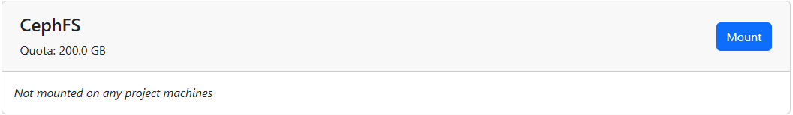
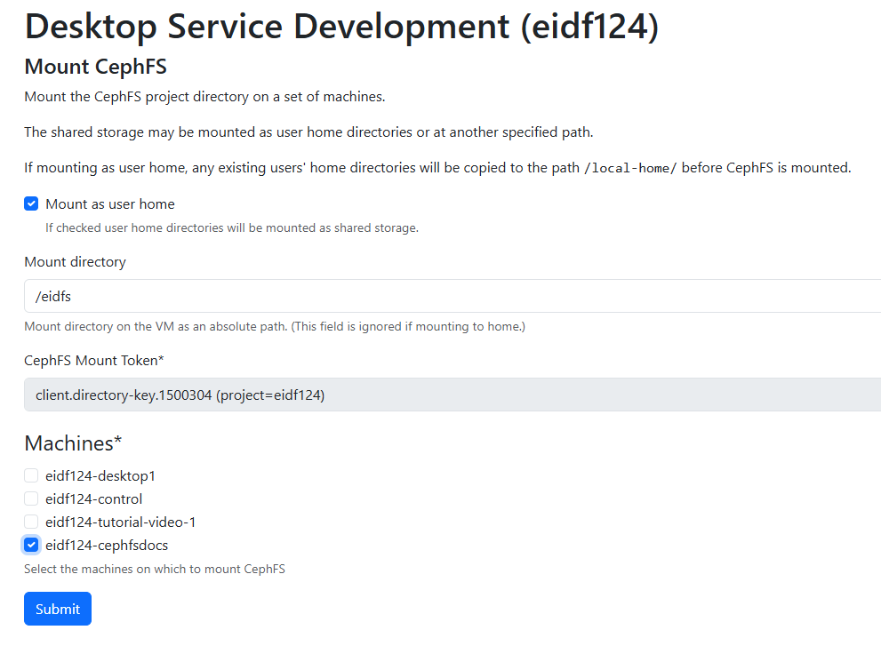

# Shared Filesystem (CephFS)

## Introduction

EIDF allows projects with storage space allocated on our CephFS filesystem to mount that space on different compute resources such as EIDF Virtual Machines Service (VMS).

Mounting is done at a project level, so the whole project CephFS tree is mounted. For users who have used our Cerebras or Cirrus services, the whole of the top-level project directory is mounted, e.g. `/home/eidf124` on Cirrus is the same as `/home/eidf124` on the VM, and users can manipulate files in that directory.

## Pre-requisites

To mount CephFS on a VM:

1. The project must have space allocated on CephFS.
1. A mount key must be created exist. PI's should contact the EIDF helpdesk to have this created.

If both pre-requisites are met, PIs and PMs will be able to see the **Mount** button under **CephFS Mounts** in the project management page in the EIDF portal.

   {: class="border-img"}
   *Mount button displayed in project management page*

## Mounting CephFS on a VM

When CephFS is mounted on a VM, it can become the home directory for users logging into that VM. PIs and PMs can enable this mounting for individual VMs via the management page in the Portal.

!!! warning
    Mounting CephFS on a VM where users have superuser (`sudo`) permissions will allow them to see and manipulate files belonging to other users.

To mount CephFS on a VM:

1. Click the **Mount** button in the project management page under CephFS (see screenshot above).
1. Follow the instructions, selecting either to mount as `/home` or specifying an alternative mount location
1. Select the VMs on which to mount CephFS at the specified location.
1. Click **Submit**

!!! note
    If there is existing data in the VM-local `/home`, it will be moved to `/local-home` before mounting.
    You will have to manually move this data to the mounted home if you wish it accessible by users without superuser permissions.

   {: class="border-img"}
   *Example mounting page for project eidf124*
